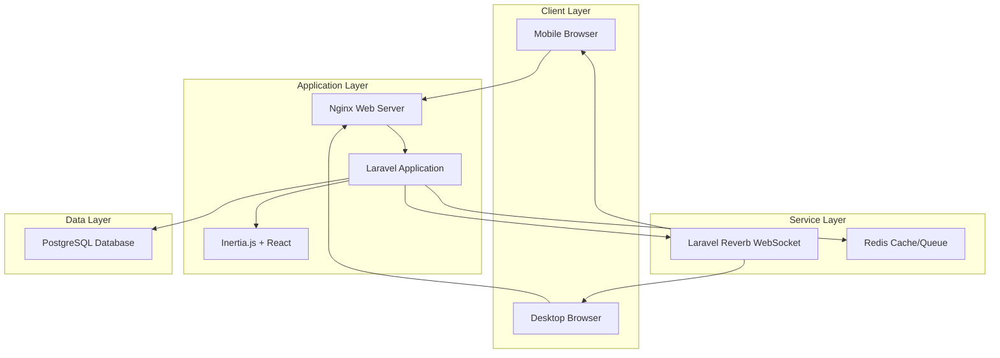
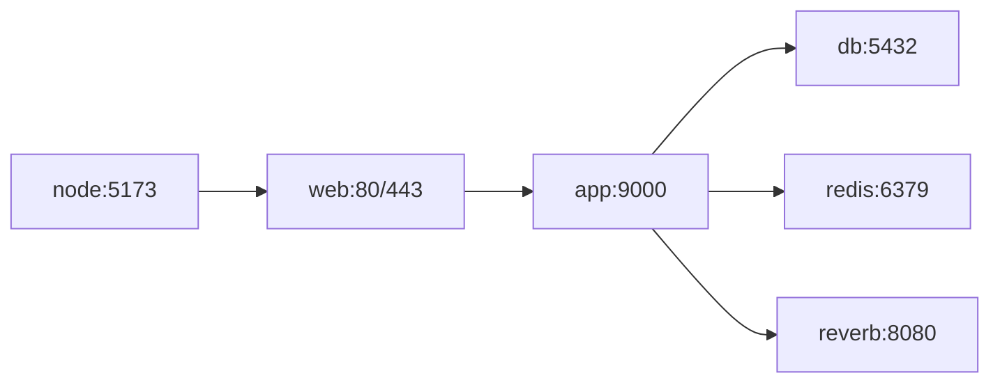

# 🏛️ LitraDesa - Village Library Management System

[](https://laravel.com)
[](https://php.net)
[](https://reactjs.org)
[](https://postgresql.org)
[](https://docker.com)

LitraDesa (Literasi Desa Digital) is a comprehensive hybrid physical-digital village library management system designed for rural Indonesia. It combines QR-based physical book management with a premium digital reading experience.

## 📋 Table of Contents

- [Features](#-features)
- [Tech Stack](#-tech-stack)
- [Prerequisites](#-prerequisites)
- [Quick Start](#-quick-start)
- [Detailed Setup](#-detailed-setup)
- [Development Workflow](#-development-workflow)
- [Production Deployment](#-production-deployment)
- [Architecture](#-architecture)
- [Troubleshooting](#-troubleshooting)
- [Contributing](#-contributing)
- [License](#-license)

## ✨ Features

### Core Features
- 📚 **Dual Book System**: Physical books (Hardbooks) and digital books (Softbooks)
- 📱 **QR-Centric Workflow**: Scan member card + book = instant loan/return (<10 seconds)
- 🔄 **Real-time Updates**: WebSocket-powered book availability notifications
- 📖 **Digital Reader**: In-app PDF/EPUB viewer with offline support
- 👥 **Member Management**: KTP OCR for quick registration, admin approval workflow
- 📊 **Analytics Dashboard**: Track loans, popular books, and member activity

### Technical Features
- 🚀 **Offline-First PWA**: Works without internet connectivity
- 🐳 **Docker-Based**: Easy deployment on village-level servers
- 🔐 **Secure**: Role-based access control, secure authentication
- 📲 **WhatsApp Integration**: Primary notification channel for Indonesia
- 🌐 **Bahasa Indonesia**: Full Indonesian language support
- ⚡ **High Performance**: Optimized for low-bandwidth environments

## 🛠️ Tech Stack

| Component | Technology |
|-----------|-----------|
| **Backend** | Laravel 11 (PHP 8.3) |
| **Frontend** | React 18 + Inertia.js |
| **Database** | PostgreSQL 16 |
| **Cache/Queue** | Redis 7 |
| **Real-time** | Laravel Reverb (WebSocket) |
| **Build Tool** | Vite 5 |
| **Containerization** | Docker + Docker Compose |
| **Web Server** | Nginx (Alpine) |

## 📦 Prerequisites

Before you begin, ensure you have the following installed:

- **Docker Desktop** (v24.0 or higher)
  - [Download for Mac](https://docs.docker.com/desktop/install/mac-install/)
  - [Download for Windows](https://docs.docker.com/desktop/install/windows-install/)
  - [Download for Linux](https://docs.docker.com/desktop/install/linux-install/)
- **Docker Compose** (v2.20 or higher) - Usually included with Docker Desktop
- **Git** (v2.30 or higher)
- **Minimum System Requirements**:
  - 4GB RAM (8GB recommended)
  - 10GB free disk space
  - Multi-core CPU recommended

### Verify Installation

```bash
# Check Docker
docker --version
# Expected: Docker version 24.0.0 or higher

# Check Docker Compose
docker-compose --version
# Expected: Docker Compose version v2.20.0 or higher

# Check Git
git --version
# Expected: git version 2.30.0 or higher
```

## 🚀 Quick Start

Get LitraDesa up and running in 5 minutes:

### 1. Clone the Repository

```bash
git clone git@github.com:Germa-Studio/LitraDesa.git
cd LitraDesa
```

### 2. Run Initialization Script

```bash
# Make the script executable
chmod +x init.sh

# Run the initialization
./init.sh
```

The script will:
- ✅ Create Laravel 11 project
- ✅ Install Inertia.js + React
- ✅ Install Laravel Reverb
- ✅ Configure PostgreSQL
- ✅ Build Docker containers
- ✅ Run database migrations
- ✅ Seed sample data

**⏱️ Estimated time**: 15-30 minutes (depending on internet speed)

### 3. Access the Application

Once initialization completes, access:

- **Web Application**: http://localhost
- **WebSocket Server**: ws://localhost:8080
- **Database**: localhost:5432

**Default Admin Credentials**:
- Email: `admin@litradesa.id`
- Password: `admin123`

> ⚠️ **Important**: Change the default password immediately after first login!

## 📖 Detailed Setup

### Manual Setup (Alternative to init.sh)

If you prefer manual setup or the script fails:

#### Step 1: Create Laravel Project

```bash
# Create Laravel 11 project
composer create-project laravel/laravel:^11.0 src
cd src
```

#### Step 2: Install Inertia.js and React

```bash
# Install Inertia.js server-side
composer require inertiajs/inertia-laravel

# Install Inertia.js client-side + React
npm install @inertiajs/react react react-dom

# Install Laravel Breeze with Inertia + React
composer require laravel/breeze --dev
php artisan breeze:install react

# Install dependencies
npm install
```

#### Step 3: Install Laravel Reverb

```bash
# Install Reverb
composer require laravel/reverb

# Publish Reverb configuration
php artisan reverb:install
```

#### Step 4: Configure Environment

```bash
# Copy environment file
cp .env.example .env

# Generate application key
php artisan key:generate

# Update database configuration in .env
DB_CONNECTION=pgsql
DB_HOST=db
DB_PORT=5432
DB_DATABASE=litradesa
DB_USERNAME=litradesa_user
DB_PASSWORD=litradesa_password

# Update Redis configuration
REDIS_HOST=redis
REDIS_PORT=6379

# Update Reverb configuration
REVERB_HOST=reverb
REVERB_PORT=8080
```

#### Step 5: Build and Start Docker Containers

```bash
# Return to project root
cd ..

# Build Docker images
docker-compose build

# Start containers
docker-compose up -d

# Check container status
docker-compose ps
```

#### Step 6: Run Migrations and Seeders

```bash
# Run migrations
docker-compose exec app php artisan migrate

# Seed database with sample data
docker-compose exec app php artisan db:seed
```

## 💻 Development Workflow

### Starting the Application

```bash
# Quick start (after initial setup)
./setup.sh

# Or manually
docker-compose up -d
```

### Stopping the Application

```bash
# Stop all containers
docker-compose down

# Stop and remove volumes (⚠️ deletes database data)
docker-compose down -v
```

### Viewing Logs

```bash
# View all logs
docker-compose logs -f

# View specific service logs
docker-compose logs -f app
docker-compose logs -f web
docker-compose logs -f db
docker-compose logs -f reverb
```

### Running Artisan Commands

```bash
# General format
docker-compose exec app php artisan <command>

# Examples
docker-compose exec app php artisan migrate
docker-compose exec app php artisan db:seed
docker-compose exec app php artisan make:model Book
docker-compose exec app php artisan make:controller BookController
docker-compose exec app php artisan queue:work
docker-compose exec app php artisan cache:clear
```

### Running Composer Commands

```bash
# Install package
docker-compose exec app composer require vendor/package

# Update dependencies
docker-compose exec app composer update

# Dump autoload
docker-compose exec app composer dump-autoload
```

### Running NPM Commands

```bash
# Install package
docker-compose exec node npm install package-name

# Build assets for production
docker-compose exec node npm run build

# Run development server (already running)
docker-compose logs -f node
```

### Database Management

```bash
# Access PostgreSQL CLI
docker-compose exec db psql -U litradesa_user -d litradesa

# Create database backup
docker-compose exec db pg_dump -U litradesa_user litradesa > backup.sql

# Restore database backup
docker-compose exec -T db psql -U litradesa_user litradesa < backup.sql

# Reset database
docker-compose exec app php artisan migrate:fresh --seed
```

### Redis Management

```bash
# Access Redis CLI
docker-compose exec redis redis-cli

# Clear cache
docker-compose exec app php artisan cache:clear

# Clear Redis completely
docker-compose exec redis redis-cli FLUSHALL
```

### Hot Reload Development

The development environment supports hot reload for both backend and frontend:

- **PHP Files**: Changes are reflected immediately (no restart needed)
- **React Components**: Vite HMR provides instant updates
- **Configuration Files**: May require container restart

```bash
# Restart specific service
docker-compose restart app
docker-compose restart node
```

## 🚢 Production Deployment

Production deployment is supported with a standalone Compose file and Caddy for automatic HTTPS.

For Tencent CVM, follow the full guide in [`docs/DEPLOYMENT_TENCENT_CVM.md`](docs/DEPLOYMENT_TENCENT_CVM.md).

### Quick Production Deploy

```bash
# Copy and edit the production environment
cp src/.env.production.example src/.env
nano src/.env

# Deploy with HTTPS
chmod +x scripts/deploy-production.sh
./scripts/deploy-production.sh
```

### Production Checklist

Before deploying to production:

- [ ] Point a real domain to the server public IP
- [ ] Open only ports 22, 80, and 443 in the cloud firewall/security group
- [ ] Update `src/.env` with production values
- [ ] Set `APP_ENV=production` and `APP_DEBUG=false`
- [ ] Set `APP_URL`, `APP_DOMAIN`, `REVERB_HOST`, and `VITE_REVERB_HOST` to your domain
- [ ] Use secure database credentials
- [ ] Use random `REVERB_APP_KEY` and `REVERB_APP_SECRET`
- [ ] Let the deploy script generate `APP_KEY` on first deploy
- [ ] Set up proper backup strategy
- [ ] Configure monitoring and logging
- [ ] Test offline functionality
- [ ] Set up CDN for static assets (optional)

### Environment Variables for Production

```env
APP_ENV=production
APP_DEBUG=false
APP_URL=https://litradesa.example.com
APP_DOMAIN=litradesa.example.com

DB_PASSWORD=<strong-random-password>

REVERB_HOST=litradesa.example.com
REVERB_PORT=443
REVERB_SCHEME=https
VITE_REVERB_HOST=litradesa.example.com
VITE_REVERB_PORT=443
VITE_REVERB_SCHEME=https
```

### Production Operations

```bash
# Check services
docker compose --env-file src/.env -f docker-compose.prod.yml ps

# View logs
docker compose --env-file src/.env -f docker-compose.prod.yml logs -f caddy
docker compose --env-file src/.env -f docker-compose.prod.yml logs -f app

# Update deployment after git pull
./scripts/deploy-production.sh
```

## 🏗️ Architecture

### System Architecture



### Container Architecture



### Key Design Decisions

1. **Inertia.js over Next.js**: Simpler deployment, tighter Laravel integration, faster for <10s transaction requirement
2. **PostgreSQL over MySQL**: Better JSON support, robust transactions, full-text search
3. **Laravel Reverb over Pusher**: Self-hosted, no external dependencies, offline-capable
4. **Docker over Traditional**: Easy village-level deployment, consistent environments
5. **Redis for Everything**: Cache, sessions, queues - single dependency

## 🔧 Troubleshooting

### Common Issues and Solutions

#### 1. Port Already in Use

**Problem**: Error binding to port 80, 5432, or 8080

**Solution**:
```bash
# Check what's using the port
lsof -i :80
lsof -i :5432
lsof -i :8080

# Stop the conflicting service or change port in docker-compose.yml
# Example: Change web port to 8000
ports:
  - "8000:80"
```

#### 2. Database Connection Failed

**Problem**: `SQLSTATE[08006] [7] could not connect to server`

**Solution**:
```bash
# Check if database container is running
docker-compose ps db

# Check database logs
docker-compose logs db

# Restart database
docker-compose restart db

# Wait for database to be ready
docker-compose exec db pg_isready -U litradesa_user
```

#### 3. Permission Denied Errors

**Problem**: Cannot write to storage or cache directories

**Solution**:
```bash
# Fix Laravel permissions
docker-compose exec app chmod -R 775 storage bootstrap/cache
docker-compose exec app chown -R www-data:www-data storage bootstrap/cache

# If still failing, check SELinux (Linux)
sudo setenforce 0  # Temporary
```

#### 4. Composer Install Fails

**Problem**: Composer dependencies cannot be installed

**Solution**:
```bash
# Clear composer cache
docker-compose exec app composer clear-cache

# Install with verbose output
docker-compose exec app composer install -vvv

# Try with different memory limit
docker-compose exec app php -d memory_limit=-1 /usr/bin/composer install
```

#### 5. Frontend Assets Not Loading

**Problem**: React components not rendering, blank page

**Solution**:
```bash
# Check Vite dev server
docker-compose logs node

# Rebuild assets
docker-compose exec node npm run build

# Clear browser cache
# Hard refresh: Ctrl+Shift+R (Windows/Linux) or Cmd+Shift+R (Mac)

# Check if Vite is accessible
curl http://localhost:5173
```

#### 6. WebSocket Connection Failed

**Problem**: Real-time features not working

**Solution**:
```bash
# Check Reverb logs
docker-compose logs reverb

# Restart Reverb
docker-compose restart reverb

# Test WebSocket connection
wscat -c ws://localhost:8080

# Check firewall settings
sudo ufw allow 8080
```

#### 7. Slow Performance

**Problem**: Application is slow or unresponsive

**Solution**:
```bash
# Check container resources
docker stats

# Optimize Laravel
docker-compose exec app php artisan config:cache
docker-compose exec app php artisan route:cache
docker-compose exec app php artisan view:cache

# Clear all caches
docker-compose exec app php artisan optimize:clear

# Check database queries
# Enable query logging in .env
DB_LOG_QUERIES=true
```

#### 8. Docker Build Fails

**Problem**: `docker-compose build` fails

**Solution**:
```bash
# Clean Docker cache
docker system prune -a

# Rebuild without cache
docker-compose build --no-cache

# Check Docker disk space
docker system df

# Free up space
docker system prune -a --volumes
```

### Getting Help

If you encounter issues not covered here:

1. **Check Logs**: Always start with `docker-compose logs -f`
2. **Search Issues**: Check [GitHub Issues](https://github.com/your-org/litradesa/issues)
3. **Ask Community**: Join our [Discord](https://discord.gg/litradesa)
4. **Report Bug**: Create a [new issue](https://github.com/your-org/litradesa/issues/new)

## 📚 Additional Documentation

- [Product Requirements Document](docs/PRD.md)
- [Initialization Plan](docs/INITIALIZATION_PLAN.md)
- [Implementation Specifications](docs/IMPLEMENTATION_SPECS.md)
- [API Documentation](docs/API.md) (Coming soon)
- [Deployment Guide](docs/DEPLOYMENT.md) (Coming soon)

## 🤝 Contributing

We welcome contributions! Please see our [Contributing Guide](CONTRIBUTING.md) for details.

### Development Setup for Contributors

```bash
# Fork and clone
git clone https://github.com/your-username/litradesa.git
cd litradesa

# Create feature branch
git checkout -b feature/your-feature-name

# Make changes and test
./setup.sh

# Run tests
docker-compose exec app php artisan test

# Commit and push
git add .
git commit -m "feat: your feature description"
git push origin feature/your-feature-name

# Create Pull Request
```

## 📄 License

This project is licensed under the MIT License - see the [LICENSE](LICENSE) file for details.

## 🙏 Acknowledgments

- **Laravel Team** for the amazing framework
- **Inertia.js Team** for seamless SPA integration
- **React Team** for the powerful UI library
- **Village Communities** for inspiration and feedback

## 📞 Contact

- **Project Lead**: [Your Name](mailto:your.email@example.com)
- **Organization**: Germa-Studio
- **Website**: [https://litradesa.com](https://litradesa.com)
- **Support**: [support@litradesa.com](mailto:support@litradesa.com)

---

**Made with ❤️ for Indonesian Villages**

*Empowering rural communities through technology and literacy*
