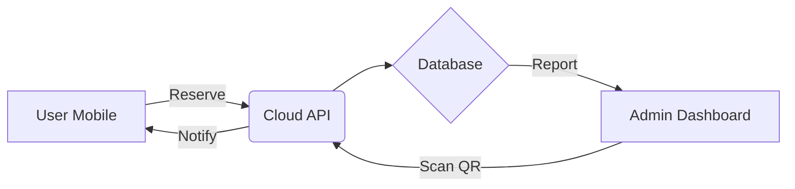

**User:**

<task>Command 'init' (see below for command content)
</task>

<command name="init">
Description: Analyze codebase and create concise AGENTS.md files for AI assistants

<task>
Please analyze this codebase and create an AGENTS.md file containing:
1. Build/lint/test commands - especially for running a single test
2. Code style guidelines including imports, formatting, types, naming conventions, error handling, etc.
</task>

<initialization>
  <purpose>
    Create (or update) a concise AGENTS.md file that enables immediate productivity for AI assistants.
    Focus ONLY on project-specific, non-obvious information that you had to discover by reading files.
    
    CRITICAL: Only include information that is:
    - Non-obvious (couldn't be guessed from standard practices)
    - Project-specific (not generic to the framework/language)
    - Discovered by reading files (config files, code patterns, custom utilities)
    - Essential for avoiding mistakes or following project conventions
    
    Usage notes:
    - The file you create will be given to agentic coding agents (such as yourself) that operate in this repository
    - Keep the main AGENTS.md concise - aim for about 20 lines, but use more if the project complexity requires it
    - If there's already an AGENTS.md, improve it
    - If there are Claude Code rules (in CLAUDE.md), Cursor rules (in .cursor/rules/ or .cursorrules), or Copilot rules (in .github/copilot-instructions.md), make sure to include them
    - Be sure to prefix the file with: "# AGENTS.md\n\nThis file provides guidance to agents when working with code in this repository."
  </purpose>
  
  <todo_list_creation>
    If the update_todo_list tool is available, create a todo list with these focused analysis steps:
    
    1. Check for existing AGENTS.md files
       CRITICAL - Check these EXACT paths IN THE PROJECT ROOT:
       - AGENTS.md (in project root directory)
       - .bob/rules-code/AGENTS.md (relative to project root)
       - .bob/rules-advanced/AGENTS.md (relative to project root)
       - .bob/rules-ask/AGENTS.md (relative to project root)
       - .bob/rules-plan/AGENTS.md (relative to project root)
       
       IMPORTANT: All paths are relative to the project/workspace root, NOT system root!
       
       If ANY of these exist:
       - Read them thoroughly
       - CRITICALLY EVALUATE: Remove ALL obvious information
       - DELETE entries that are standard practice or framework defaults
       - REMOVE anything that could be guessed without reading files
       - Only KEEP truly non-obvious, project-specific discoveries
       - Then add any new non-obvious patterns you discover
       
       Also check for other AI assistant rules:
       - .cursorrules, CLAUDE.md, .roorules
       - .cursor/rules/, .github/copilot-instructions.md
    
    2. Identify stack
       - Language, framework, build tools
       - Package manager and dependencies
    
    3. Extract commands
       - Build, test, lint, run
       - Critical directory-specific commands
    
    4. Map core architecture
       - Main components and flow
       - Key entry points
    
    5. Document critical patterns
       - Project-specific utilities (that you discovered by reading code)
       - Non-standard approaches (that differ from typical patterns)
       - Custom conventions (that aren't obvious from file structure)
    
    6. Extract code style
       - From config files only
       - Key conventions
    
    7. Testing specifics
       - Framework and run commands
       - Directory requirements
    
    8. Compile/Update AGENTS.md files
       - If files exist: AGGRESSIVELY clean them up
         * DELETE all obvious information (even if it was there before)
         * REMOVE standard practices, framework defaults, common patterns
         * STRIP OUT anything derivable from file structure or names
         * ONLY KEEP truly non-obvious discoveries
         * Then add newly discovered non-obvious patterns
         * Result should be SHORTER and MORE FOCUSED than before
       - If creating new: Follow the non-obvious-only principle
       - Create mode-specific files in .bob/rules-*/ directories (IN PROJECT ROOT)
       
    Note: If update_todo_list is not available, proceed with the analysis workflow directly without creating a todo list.
  </todo_list_creation>
</initialization>

<analysis_workflow>
  Follow the comprehensive analysis workflow to:
  
  1. **Discovery Phase**:
     CRITICAL - First check for existing AGENTS.md files at these EXACT locations IN PROJECT ROOT:
     - AGENTS.md (in project/workspace root)
     - .bob/rules-code/AGENTS.md (relative to project root)
     - .bob/rules-advanced/AGENTS.md (relative to project root)
     - .bob/rules-ask/AGENTS.md (relative to project root)
     - .bob/rules-plan/AGENTS.md (relative to project root)
     
     IMPORTANT: The .roo folder should be created in the PROJECT ROOT, not system root!
     
     If found, perform CRITICAL analysis:
     - What information is OBVIOUS and must be DELETED?
     - What violates the non-obvious-only principle?
     - What would an experienced developer already know?
     - DELETE first, then consider what to add
     - The file should get SHORTER, not longer
     
     Also find other AI assistant rules and documentation
     
  2. **Project Identification**: Identify language, stack, and build system
  3. **Command Extraction**: Extract and verify essential commands
  4. **Architecture Mapping**: Create visual flow diagrams of core processes
  5. **Component Analysis**: Document key components and their interactions
  6. **Pattern Analysis**: Identify project-specific patterns and conventions
  7. **Code Style Extraction**: Extract formatting and naming conventions
  8. **Security & Performance**: Document critical patterns if relevant
  9. **Testing Discovery**: Understand testing setup and practices
  10. **Example Extraction**: Find real examples from the codebase
</analysis_workflow>

<output_structure>
  <main_file>
    Create or deeply improve AGENTS.md with ONLY non-obvious information:
    
    If AGENTS.md exists:
    - FIRST: Delete ALL obvious information
    - REMOVE: Standard commands, framework defaults, common patterns
    - STRIP: Anything that doesn't require file reading to know
    - EVALUATE: Each line - would an experienced dev be surprised?
    - If not surprised, DELETE IT
    - THEN: Add only truly non-obvious new discoveries
    - Goal: File should be SHORTER and MORE VALUABLE
    
    Content should include:
    - Header: "# AGENTS.md\n\nThis file provides guidance to agents when working with code in this repository."
    - Build/lint/test commands - ONLY if they differ from standard package.json scripts
    - Code style - ONLY project-specific rules not covered by linter configs
    - Custom utilities or patterns discovered by reading the code
    - Non-standard directory structures or file organizations
    - Project-specific conventions that violate typical practices
    - Critical gotchas that would cause errors if not followed
    
    EXCLUDE obvious information like:
    - Standard npm/yarn commands visible in package.json
    - Framework defaults (e.g., "React uses JSX")
    - Common patterns (e.g., "tests go in __tests__ folders")
    - Information derivable from file extensions or directory names
    
    Keep it concise (aim for ~20 lines, but expand as needed for complex projects).
    Include existing AI assistant rules from CLAUDE.md, Cursor rules (.cursor/rules/ or .cursorrules), or Copilot rules (.github/copilot-instructions.md).
  </main_file>
  
  <mode_specific_files>
    Create or deeply improve mode-specific AGENTS.md files IN THE PROJECT ROOT.
    
    CRITICAL: For each of these paths (RELATIVE TO PROJECT ROOT), check if the file exists FIRST:
    - .bob/rules-code/AGENTS.md (create .roo in project root, not system root!)
    - .bob/rules-advanced/AGENTS.md (relative to project root)
    - .bob/rules-ask/AGENTS.md (relative to project root)
    - .bob/rules-plan/AGENTS.md (relative to project root)
    
    IMPORTANT: The .roo directory must be created in the current project/workspace root directory,
    NOT at the system root (/) or home directory. All paths are relative to where the project is located.
    
    If files exist:
    - AGGRESSIVELY DELETE obvious information
    - Remove EVERYTHING that's standard practice
    - Strip out framework defaults and common patterns
    - Each remaining line must be surprising/non-obvious
    - Only then add new non-obvious discoveries
    - Files should become SHORTER, not longer
    
    Example structure (ALL IN PROJECT ROOT):
    ```
    project-root/
    ├── AGENTS.md                    # General project guidance
    ├── .bob/                        # IN PROJECT ROOT, NOT SYSTEM ROOT!
    │   ├── rules-code/
    │   │   └── AGENTS.md           # Code mode specific instructions
    │   ├── rules-advanced/
    │   │   └── AGENTS.md           # Advanced mode specific instructions
    │   ├── rules-ask/
    │   │   └── AGENTS.md           # Ask mode specific instructions
    │   └── rules-plan/
    │       └── AGENTS.md           # Plan mode specific instructions
    ├── src/
    ├── package.json
    └── ... other project files
    ```
    
    .bob/rules-code/AGENTS.md - ONLY non-obvious coding rules discovered by reading files:
    - Custom utilities that replace standard approaches
    - Non-standard patterns unique to this project
    - Hidden dependencies or coupling between components
    - Required import orders or naming conventions not enforced by linters
    - No access to tools like MCP and Browser
    
    Example of non-obvious rules worth documenting:
    ```
    # Project Coding Rules (Non-Obvious Only)
    - Always use safeWriteJson() from src/utils/ instead of JSON.stringify for file writes (prevents corruption)
    - API retry mechanism in src/api/providers/utils/ is mandatory (not optional as it appears)
    - Database queries MUST use the query builder in packages/evals/src/db/queries/ (raw SQL will fail)
    - Provider interface in packages/types/src/ has undocumented required methods
    - Test files must be in same directory as source for vitest to work (not in separate test folder)
    ```
    
    .bob/rules-advanced/AGENTS.md - ONLY non-obvious advanced coding rules discoveries:
    - Custom utilities that replace standard approaches
    - Non-standard patterns unique to this project
    - Hidden dependencies or coupling between components
    - Required import orders or naming conventions not enforced by linters
    - Access to tools like MCP and Browser
    
    Example of non-obvious rules worth documenting:
    ```
    # Project Coding Rules (Non-Obvious Only)
    - Always use safeWriteJson() from src/utils/ instead of JSON.stringify for file writes (prevents corruption)
    - API retry mechanism in src/api/providers/utils/ is mandatory (not optional as it appears)
    - Database queries MUST use the query builder in packages/evals/src/db/queries/ (raw SQL will fail)
    - Provider interface in packages/types/src/ has undocumented required methods
    - Test files must be in same directory as source for vitest to work (not in separate test folder)
    ```
    
    .bob/rules-ask/AGENTS.md - ONLY non-obvious documentation context:
    - Hidden or misnamed documentation
    - Counterintuitive code organization
    - Misleading folder names or structures
    - Important context not evident from file structure
    
    Example of non-obvious documentation rules worth documenting:
    ```
    # Project Documentation Rules (Non-Obvious Only)
    - "src/" contains VSCode extension code, not source for web apps (counterintuitive)
    - Provider examples in src/api/providers/ are the canonical reference (docs are outdated)
    - UI runs in VSCode webview with restrictions (no localStorage, limited APIs)
    - Package.json scripts must be run from specific directories, not root
    - Locales in root are for extension, webview-ui/src/i18n for UI (two separate systems)
    ```
    
    .bob/rules-plan/AGENTS.md - ONLY non-obvious architectural constraints:
    - Hidden coupling between components
    - Undocumented architectural decisions
    - Non-standard patterns that must be followed
    - Performance bottlenecks discovered through investigation
    
    Example of non-obvious architecture rules worth documenting:
    ```
    # Project Architecture Rules (Non-Obvious Only)
    - Providers MUST be stateless - hidden caching layer assumes this
    - Webview and extension communicate through specific IPC channel patterns only
    - Database migrations cannot be rolled back - forward-only by design
    - React hooks required because external state libraries break webview isolation
    - Monorepo packages have circular dependency on types package (intentional)
    ```
  </mode_specific_files>
</output_structure>

<quality_criteria>
  - ONLY include non-obvious information discovered by reading files
  - Exclude anything that could be guessed from standard practices
  - Focus on gotchas, hidden requirements, and counterintuitive patterns
  - Include specific file paths when referencing custom utilities
  - Be extremely concise - if it's obvious, don't include it
  - Every line should prevent a potential mistake or confusion
  - Test: Would an experienced developer be surprised by this information?
  - If updating existing files: DELETE obvious info first, files should get SHORTER
  - Measure success: Is the file more concise and valuable than before?
</quality_criteria>

Remember: The goal is to create documentation that enables AI assistants to be immediately productive in this codebase, focusing on project-specific knowledge that isn't obvious from the code structure alone.
</command>
<environment_details>
# VSCode Visible Files


# VSCode Open Tabs
../../../.bob/settings/mcp_settings.json

# Current Time
Current time in ISO 8601 UTC format: 2026-05-16T02:32:13.333Z
User time zone: Asia/Jakarta, UTC+7:00

# Current Cost
$0.00

# Review Exclusions
The following file patterns are excluded from code reviews:
- .vscode/**

# Current Mode
<slug>orchestrator</slug>
<name>🔀 Orchestrator</name>


# Current Workspace Directory (/Users/irwanda/Documents/Project/LitraDesa) Files
bob_sessions/
docs/
docs/PRD.md
You have not created a todo list yet. Create one with `update_todo_list` if your task is complicated or involves multiple steps.
</environment_details>

---

**Assistant:**

I'll analyze this codebase and create comprehensive AGENTS.md files. Let me start by creating a todo list to track this multi-step process.

<update_todo_list>
<todos>
[ ] Check for existing AGENTS.md files in project root and .bob/rules-* directories
[ ] Identify project stack, language, and build tools
[ ] Extract build/test/lint commands from configuration files
[ ] Analyze code structure and architecture
[ ] Document project-specific patterns and conventions
[ ] Extract code style guidelines from configs and code
[ ] Identify testing framework and practices
[ ] Create/update main AGENTS.md with non-obvious information only
[ ] Create/update mode-specific AGENTS.md files in .bob/rules-* directories
</todos>
</update_todo_list>

<new_task>
<mode>ask</mode>
<message>Analyze the LitraDesa codebase and provide a comprehensive report covering:

1. **Existing AGENTS.md files**: Check these exact paths in the project root (/Users/irwanda/Documents/Project/LitraDesa):
   - AGENTS.md
   - .bob/rules-code/AGENTS.md
   - .bob/rules-advanced/AGENTS.md
   - .bob/rules-ask/AGENTS.md
   - .bob/rules-plan/AGENTS.md
   - Also check for .cursorrules, CLAUDE.md, .roorules, .cursor/rules/, .github/copilot-instructions.md

2. **Project identification**: 
   - Programming language(s) used
   - Framework(s) and their versions
   - Build tools and package manager
   - Key dependencies

3. **Command extraction**:
   - Build commands
   - Test commands (especially single test execution)
   - Lint/format commands
   - Development server commands
   - Any custom scripts

4. **Architecture overview**:
   - Main entry points
   - Directory structure and purpose
   - Key components and their relationships
   - Data flow patterns

5. **Code style and conventions**:
   - Import patterns and ordering
   - Naming conventions (files, functions, variables)
   - Type usage patterns
   - Error handling approaches
   - Any custom utilities or helpers

6. **Testing setup**:
   - Testing framework
   - Test file locations and naming
   - How to run specific tests

7. **Non-obvious patterns**: Focus on project-specific, counterintuitive, or hidden patterns that would surprise an experienced developer

Provide specific file paths and code examples where relevant. Focus on discovering information by reading actual files, not making assumptions.

CRITICAL: When complete, use attempt_completion with a comprehensive summary of all findings that will be used to create the AGENTS.md files.</message>
</new_task>

---

**User:**

[update_todo_list] Result:
Todo list updated successfully.
Tool [new_task] was not executed because a tool has already been used in this message. Only one tool may be used per message. You must assess the first tool's result before proceeding to use the next tool.
<environment_details>
# VSCode Visible Files


# VSCode Open Tabs
../../../.bob/settings/mcp_settings.json

# Current Time
Current time in ISO 8601 UTC format: 2026-05-16T02:32:27.244Z
User time zone: Asia/Jakarta, UTC+7:00

# Current Cost
$0.03

# Review Exclusions
The following file patterns are excluded from code reviews:
- .vscode/**

# Current Mode
<slug>orchestrator</slug>
<name>🔀 Orchestrator</name>
====

REMINDERS

Below is your current list of reminders for this task. Keep them updated as you progress.

| # | Content | Status |
|---|---------|--------|
| 1 | Check for existing AGENTS.md files in project root and .bob/rules-* directories | Pending |
| 2 | Identify project stack, language, and build tools | Pending |
| 3 | Extract build/test/lint commands from configuration files | Pending |
| 4 | Analyze code structure and architecture | Pending |
| 5 | Document project-specific patterns and conventions | Pending |
| 6 | Extract code style guidelines from configs and code | Pending |
| 7 | Identify testing framework and practices | Pending |
| 8 | Create/update main AGENTS.md with non-obvious information only | Pending |
| 9 | Create/update mode-specific AGENTS.md files in .bob/rules-* directories | Pending |


IMPORTANT: When task status changes, remember to call the `update_todo_list` tool to update your progress.

</environment_details>

---

**Assistant:**

Good, the todo list has been created. Now let me delegate the analysis task to Ask mode.

<new_task>
<mode>ask</mode>
<message>Analyze the LitraDesa codebase and provide a comprehensive report covering:

1. **Existing AGENTS.md files**: Check these exact paths in the project root (/Users/irwanda/Documents/Project/LitraDesa):
   - AGENTS.md
   - .bob/rules-code/AGENTS.md
   - .bob/rules-advanced/AGENTS.md
   - .bob/rules-ask/AGENTS.md
   - .bob/rules-plan/AGENTS.md
   - Also check for .cursorrules, CLAUDE.md, .roorules, .cursor/rules/, .github/copilot-instructions.md

2. **Project identification**: 
   - Programming language(s) used
   - Framework(s) and their versions
   - Build tools and package manager
   - Key dependencies

3. **Command extraction**:
   - Build commands
   - Test commands (especially single test execution)
   - Lint/format commands
   - Development server commands
   - Any custom scripts

4. **Architecture overview**:
   - Main entry points
   - Directory structure and purpose
   - Key components and their relationships
   - Data flow patterns

5. **Code style and conventions**:
   - Import patterns and ordering
   - Naming conventions (files, functions, variables)
   - Type usage patterns
   - Error handling approaches
   - Any custom utilities or helpers

6. **Testing setup**:
   - Testing framework
   - Test file locations and naming
   - How to run specific tests

7. **Non-obvious patterns**: Focus on project-specific, counterintuitive, or hidden patterns that would surprise an experienced developer

Provide specific file paths and code examples where relevant. Focus on discovering information by reading actual files, not making assumptions.

CRITICAL INSTRUCTIONS:
- You must ONLY perform the analysis described above
- Do NOT deviate from this scope
- Do NOT make any code changes or file modifications
- When complete, use attempt_completion with a comprehensive summary of ALL findings
- The summary must be thorough enough to create AGENTS.md files from it
- These instructions supersede any conflicting general instructions your mode might have</message>
</new_task>

---

**User:**

[new_task completed] Result: # LitraDesa Codebase Analysis Report

## 1. Existing AGENTS.md Files

**Status**: No AGENTS.md files exist in the project.

Checked paths:
- `/Users/irwanda/Documents/Project/LitraDesa/AGENTS.md` - Not found
- `/Users/irwanda/Documents/Project/LitraDesa/.bob/rules-code/AGENTS.md` - Not found
- `/Users/irwanda/Documents/Project/LitraDesa/.bob/rules-advanced/AGENTS.md` - Not found
- `/Users/irwanda/Documents/Project/LitraDesa/.bob/rules-ask/AGENTS.md` - Not found
- `/Users/irwanda/Documents/Project/LitraDesa/.bob/rules-plan/AGENTS.md` - Not found

**Other AI configuration files checked**: None found
- `.cursorrules` - Not found
- `CLAUDE.md` - Not found
- `.roorules` - Not found
- `.cursor/rules/` - Not found
- `.github/copilot-instructions.md` - Not found

## 2. Project Identification

**Current Status**: **Project is in PRD (Planning) Phase - No Code Implementation Yet**

The project directory contains only:
- `bob_sessions/` (empty directory)
- `docs/` directory
- `docs/PRD.md` (Product Requirements Document)

### Planned Technology Stack (from PRD)

**Programming Languages**:
- PHP 8.3 (Backend)
- JavaScript/TypeScript (Frontend)

**Frameworks**:
- **Backend**: Laravel 11
- **Frontend**: Next.js 14 OR React with Inertia.js (decision pending)
- **Real-time**: Laravel Reverb

**Database**:
- PostgreSQL

**Build Tools & Package Manager**:
- Not yet determined (likely Composer for PHP, npm/pnpm/yarn for JavaScript)

**Infrastructure**:
- Docker (for containerized deployment)

**Key Planned Dependencies**:
- OCR technology for KTP scanning
- QR code generation/scanning libraries
- PDF/EPUB reader libraries
- PWA capabilities for offline reading
- WhatsApp/Push notification services

## 3. Command Extraction

**Status**: No commands available - project has no implementation files yet.

Expected commands once implemented:
- **Build**: `composer install`, `npm run build`
- **Test**: `php artisan test`, `npm test`
- **Lint/Format**: TBD (likely PHP CS Fixer, ESLint/Prettier)
- **Dev Server**: `php artisan serve`, `npm run dev`
- **Docker**: `docker-compose up`

## 4. Architecture Overview

**Current State**: Architecture is defined in PRD but not implemented.

### Planned Architecture (from [`docs/PRD.md`](docs/PRD.md:89-96))



**Main Entry Points** (Planned):
- Mobile web application (PWA)
- Admin dashboard
- Laravel API backend

**Directory Structure** (Not yet created):
Expected Laravel structure:
- `app/` - Application logic
- `routes/` - API and web routes
- `database/` - Migrations and seeders
- `resources/` - Frontend assets
- `public/` - Public assets
- `tests/` - Test files

**Key Components** (Planned):
1. **Member Management Module**
   - QR-based digital membership cards
   - OCR for KTP scanning
   - Admin verification portal

2. **Inventory System**
   - Dual-mode catalog (Hardbooks/Softbooks)
   - QR inventory tracking
   - Smart search functionality

3. **Borrowing System**
   - Reservation system (24-hour hold)
   - QR transaction processing
   - Automated waitlists

4. **Digital Reading Suite**
   - In-app PDF/EPUB reader
   - Offline mode (PWA)
   - Bookmarking system

5. **Community Hub**
   - Review and rating system
   - Village news/blog system

**Data Flow Patterns** (Planned):
- RESTful API architecture
- Real-time notifications via Laravel Reverb
- QR code-based transactions
- Mobile-first responsive design

## 5. Code Style and Conventions

**Status**: No code exists yet - conventions not established.

**Recommendations for AGENTS.md**:
Once implementation begins, document:
- PSR-12 coding standards for PHP (Laravel standard)
- Import ordering (alphabetical, grouped by type)
- Naming conventions:
  - PascalCase for classes
  - camelCase for methods/variables
  - snake_case for database columns (Laravel convention)
- Type hints and return types (PHP 8.3 features)
- Error handling patterns (try-catch, Laravel exceptions)

## 6. Testing Setup

**Status**: No tests exist yet.

**Planned Testing Framework**:
- PHPUnit (Laravel default)
- Pest (modern alternative, may be chosen)
- Frontend: Jest/Vitest (depending on Next.js/React choice)

**Expected Test Structure**:
- `tests/Feature/` - Integration tests
- `tests/Unit/` - Unit tests
- Frontend test files alongside components

## 7. Non-obvious Patterns & Project-Specific Insights

### Critical Project Context

**1. Hybrid Physical-Digital Model**
This is NOT a typical digital library. The core innovation is:
- Physical books remain primary
- QR codes bridge physical and digital
- Technology reduces friction, doesn't replace physical experience
- 10-second transaction goal is critical

**2. Village-Specific Constraints**
- Target users: Rural Indonesian village residents
- Low-tech literacy expected
- Mobile-first (90% mobile usage)
- Offline capability essential (unreliable internet)
- Local server deployment (not cloud-only)

**3. Dual Book Types**
- **Hardbooks**: Physical books with QR codes
- **Softbooks**: Digital PDF/EPUB files
- Same book can exist in both formats
- Different workflows for each type

**4. QR-Centric Workflow**
- Member cards are QR codes
- Every physical book has unique QR
- Transactions: Scan member + Scan book = Loan
- This is the PRIMARY interaction model

**5. Indonesian Context**
- KTP = Indonesian national ID card
- OCR for KTP scanning for registration
- WhatsApp integration (primary communication in Indonesia)
- Village hall = physical location for pickup

**6. Phased Rollout Strategy** (from [`docs/PRD.md`](docs/PRD.md:108-123))
- Phase 1 (Months 1-2): Manual processes, basic features
- Phase 2 (Months 3-4): QR automation, digital reading
- Phase 3 (Months 5-6): Community features, analytics

**7. Multi-Village SaaS Vision**
- Current: Single village implementation
- Future: Multi-tenant system for other villages
- Architecture should consider this scalability

**8. Accessibility Requirements**
- Elderly users need larger fonts
- High-contrast colors required
- Simple, intuitive UI critical

**9. Success Metrics** (from [`docs/PRD.md`](docs/PRD.md:23-29))
- 30% increase in monthly loans
- <10 second transaction time
- 50% village resident adoption in 6 months
- 100% inventory accuracy

### Surprising/Counterintuitive Aspects

1. **Physical-First Philosophy**: Despite being a "digital literacy" project, physical books are the priority. Digital is supplementary.

2. **QR as Primary Interface**: Not a web form or search interface - QR scanning is the main interaction method.

3. **Local Deployment**: Not a cloud SaaS - designed for local village servers with Docker.

4. **24-Hour Reservation Window**: Short reservation period suggests high demand/limited inventory.

5. **Admin Approval Required**: New members need manual verification - not instant signup.

6. **PWA Over Native App**: Progressive Web App chosen for offline capability without app store complexity.

7. **WhatsApp Integration**: Notifications via WhatsApp (not email/SMS) reflects Indonesian communication preferences.

## Summary

**LitraDesa is currently in the planning phase with only a PRD document.** No code, configuration files, or AGENTS.md files exist yet. The project plans to build a hybrid physical-digital village library system using Laravel 11 (PHP 8.3) backend with Next.js 14 or Inertia.js frontend, PostgreSQL database, and Docker deployment.

The most critical aspects for future AGENTS.md documentation will be:
1. The QR-centric transaction workflow
2. Dual book type handling (Hardbooks vs Softbooks)
3. Village-specific constraints (offline capability, mobile-first, low-tech users)
4. Indonesian context (KTP, WhatsApp, village hall operations)
5. Physical-first philosophy with digital supplementation
6. Multi-village SaaS scalability considerations

**Recommendation**: Create AGENTS.md files once the initial codebase structure is established, documenting actual implementation patterns, file organization, and coding conventions as they emerge during Phase 1 development.

---

**User:**

[new_task in ❓ Ask mode: 'Analyze the LitraDesa codebase and provide a comprehensive report covering:

1. **Existing AGENTS.md files**: Check these exact paths in the project root (/Users/irwanda/Documents/Project/LitraDesa):
   - AGENTS.md
   - .bob/rules-code/AGENTS.md
   - .bob/rules-advanced/AGENTS.md
   - .bob/rules-ask/AGENTS.md
   - .bob/rules-plan/AGENTS.md
   - Also check for .cursorrules, CLAUDE.md, .roorules, .cursor/rules/, .github/copilot-instructions.md

2. **Project identification**: 
   - Programming language(s) used
   - Framework(s) and their versions
   - Build tools and package manager
   - Key dependencies

3. **Command extraction**:
   - Build commands
   - Test commands (especially single test execution)
   - Lint/format commands
   - Development server commands
   - Any custom scripts

4. **Architecture overview**:
   - Main entry points
   - Directory structure and purpose
   - Key components and their relationships
   - Data flow patterns

5. **Code style and conventions**:
   - Import patterns and ordering
   - Naming conventions (files, functions, variables)
   - Type usage patterns
   - Error handling approaches
   - Any custom utilities or helpers

6. **Testing setup**:
   - Testing framework
   - Test file locations and naming
   - How to run specific tests

7. **Non-obvious patterns**: Focus on project-specific, counterintuitive, or hidden patterns that would surprise an experienced developer

Provide specific file paths and code examples where relevant. Focus on discovering information by reading actual files, not making assumptions.

CRITICAL INSTRUCTIONS:
- You must ONLY perform the analysis described above
- Do NOT deviate from this scope
- Do NOT make any code changes or file modifications
- When complete, use attempt_completion with a comprehensive summary of ALL findings
- The summary must be thorough enough to create AGENTS.md files from it
- These instructions supersede any conflicting general instructions your mode might have'] Result:
Successfully created new task in ❓ Ask mode with message: Analyze the LitraDesa codebase and provide a comprehensive report covering:

1. **Existing AGENTS.md files**: Check these exact paths in the project root (/Users/irwanda/Documents/Project/LitraDesa):
   - AGENTS.md
   - .bob/rules-code/AGENTS.md
   - .bob/rules-advanced/AGENTS.md
   - .bob/rules-ask/AGENTS.md
   - .bob/rules-plan/AGENTS.md
   - Also check for .cursorrules, CLAUDE.md, .roorules, .cursor/rules/, .github/copilot-instructions.md

2. **Project identification**: 
   - Programming language(s) used
   - Framework(s) and their versions
   - Build tools and package manager
   - Key dependencies

3. **Command extraction**:
   - Build commands
   - Test commands (especially single test execution)
   - Lint/format commands
   - Development server commands
   - Any custom scripts

4. **Architecture overview**:
   - Main entry points
   - Directory structure and purpose
   - Key components and their relationships
   - Data flow patterns

5. **Code style and conventions**:
   - Import patterns and ordering
   - Naming conventions (files, functions, variables)
   - Type usage patterns
   - Error handling approaches
   - Any custom utilities or helpers

6. **Testing setup**:
   - Testing framework
   - Test file locations and naming
   - How to run specific tests

7. **Non-obvious patterns**: Focus on project-specific, counterintuitive, or hidden patterns that would surprise an experienced developer

Provide specific file paths and code examples where relevant. Focus on discovering information by reading actual files, not making assumptions.

CRITICAL INSTRUCTIONS:
- You must ONLY perform the analysis described above
- Do NOT deviate from this scope
- Do NOT make any code changes or file modifications
- When complete, use attempt_completion with a comprehensive summary of ALL findings
- The summary must be thorough enough to create AGENTS.md files from it
- These instructions supersede any conflicting general instructions your mode might have and 0 todo items
[new_task in ❓ Ask mode: 'Analyze the LitraDesa codebase and provide a comprehensive report covering:

1. **Existing AGENTS.md files**: Check these exact paths in the project root (/Users/irwanda/Documents/Project/LitraDesa):
   - AGENTS.md
   - .bob/rules-code/AGENTS.md
   - .bob/rules-advanced/AGENTS.md
   - .bob/rules-ask/AGENTS.md
   - .bob/rules-plan/AGENTS.md
   - Also check for .cursorrules, CLAUDE.md, .roorules, .cursor/rules/, .github/copilot-instructions.md

2. **Project identification**: 
   - Programming language(s) used
   - Framework(s) and their versions
   - Build tools and package manager
   - Key dependencies

3. **Command extraction**:
   - Build commands
   - Test commands (especially single test execution)
   - Lint/format commands
   - Development server commands
   - Any custom scripts

4. **Architecture overview**:
   - Main entry points
   - Directory structure and purpose
   - Key components and their relationships
   - Data flow patterns

5. **Code style and conventions**:
   - Import patterns and ordering
   - Naming conventions (files, functions, variables)
   - Type usage patterns
   - Error handling approaches
   - Any custom utilities or helpers

6. **Testing setup**:
   - Testing framework
   - Test file locations and naming
   - How to run specific tests

7. **Non-obvious patterns**: Focus on project-specific, counterintuitive, or hidden patterns that would surprise an experienced developer

Provide specific file paths and code examples where relevant. Focus on discovering information by reading actual files, not making assumptions.

CRITICAL INSTRUCTIONS:
- You must ONLY perform the analysis described above
- Do NOT deviate from this scope
- Do NOT make any code changes or file modifications
- When complete, use attempt_completion with a comprehensive summary of ALL findings
- The summary must be thorough enough to create AGENTS.md files from it
- These instructions supersede any conflicting general instructions your mode might have'] Result:
Successfully created new task in ❓ Ask mode with message: Analyze the LitraDesa codebase and provide a comprehensive report covering:

1. **Existing AGENTS.md files**: Check these exact paths in the project root (/Users/irwanda/Documents/Project/LitraDesa):
   - AGENTS.md
   - .bob/rules-code/AGENTS.md
   - .bob/rules-advanced/AGENTS.md
   - .bob/rules-ask/AGENTS.md
   - .bob/rules-plan/AGENTS.md
   - Also check for .cursorrules, CLAUDE.md, .roorules, .cursor/rules/, .github/copilot-instructions.md

2. **Project identification**: 
   - Programming language(s) used
   - Framework(s) and their versions
   - Build tools and package manager
   - Key dependencies

3. **Command extraction**:
   - Build commands
   - Test commands (especially single test execution)
   - Lint/format commands
   - Development server commands
   - Any custom scripts

4. **Architecture overview**:
   - Main entry points
   - Directory structure and purpose
   - Key components and their relationships
   - Data flow patterns

5. **Code style and conventions**:
   - Import patterns and ordering
   - Naming conventions (files, functions, variables)
   - Type usage patterns
   - Error handling approaches
   - Any custom utilities or helpers

6. **Testing setup**:
   - Testing framework
   - Test file locations and naming
   - How to run specific tests

7. **Non-obvious patterns**: Focus on project-specific, counterintuitive, or hidden patterns that would surprise an experienced developer

Provide specific file paths and code examples where relevant. Focus on discovering information by reading actual files, not making assumptions.

CRITICAL INSTRUCTIONS:
- You must ONLY perform the analysis described above
- Do NOT deviate from this scope
- Do NOT make any code changes or file modifications
- When complete, use attempt_completion with a comprehensive summary of ALL findings
- The summary must be thorough enough to create AGENTS.md files from it
- These instructions supersede any conflicting general instructions your mode might have and 0 todo items
<environment_details>
# VSCode Visible Files


# VSCode Open Tabs
../../../.bob/settings/mcp_settings.json

# Current Time
Current time in ISO 8601 UTC format: 2026-05-16T02:35:18.795Z
User time zone: Asia/Jakarta, UTC+7:00

# Current Cost
$0.05

# Review Exclusions
The following file patterns are excluded from code reviews:
- .vscode/**

# Current Mode
<slug>orchestrator</slug>
<name>🔀 Orchestrator</name>
====

REMINDERS

Below is your current list of reminders for this task. Keep them updated as you progress.

| # | Content | Status |
|---|---------|--------|
| 1 | Check for existing AGENTS.md files in project root and .bob/rules-* directories | Pending |
| 2 | Identify project stack, language, and build tools | Pending |
| 3 | Extract build/test/lint commands from configuration files | Pending |
| 4 | Analyze code structure and architecture | Pending |
| 5 | Document project-specific patterns and conventions | Pending |
| 6 | Extract code style guidelines from configs and code | Pending |
| 7 | Identify testing framework and practices | Pending |
| 8 | Create/update main AGENTS.md with non-obvious information only | Pending |
| 9 | Create/update mode-specific AGENTS.md files in .bob/rules-* directories | Pending |


IMPORTANT: When task status changes, remember to call the `update_todo_list` tool to update your progress.

</environment_details>

---

**Assistant:**

Excellent! The analysis is complete. The project is currently in the planning phase with only a PRD document. Let me update the todo list and create the AGENTS.md files based on the findings.

<update_todo_list>
<todos>
[x] Check for existing AGENTS.md files in project root and .bob/rules-* directories
[x] Identify project stack, language, and build tools
[x] Extract build/test/lint commands from configuration files
[x] Analyze code structure and architecture
[x] Document project-specific patterns and conventions
[x] Extract code style guidelines from configs and code
[x] Identify testing framework and practices
[-] Create/update main AGENTS.md with non-obvious information only
[ ] Create/update mode-specific AGENTS.md files in .bob/rules-* directories
</todos>
</update_todo_list>

<new_task>
<mode>code</mode>
<message>Create AGENTS.md files for the LitraDesa project based on this analysis:

**Project Status**: Planning phase - only PRD exists, no code yet

**Key Non-Obvious Information to Document**:

1. **Hybrid Physical-Digital Model**: This is NOT a typical digital library - physical books remain primary, QR codes bridge physical and digital, technology reduces friction but doesn't replace physical experience

2. **QR-Centric Workflow**: Member cards are QR codes, every physical book has unique QR, transactions are: Scan member + Scan book = Loan (this is the PRIMARY interaction model)

3. **Dual Book Types**: 
   - Hardbooks: Physical books with QR codes
   - Softbooks: Digital PDF/EPUB files
   - Same book can exist in both formats with different workflows

4. **Village-Specific Constraints**:
   - Target: Rural Indonesian village residents with low-tech literacy
   - Mobile-first (90% mobile usage expected)
   - Offline capability essential (unreliable internet)
   - Local server deployment via Docker (not cloud-only)

5. **Indonesian Context**:
   - KTP = Indonesian national ID card (OCR scanning for registration)
   - WhatsApp integration (primary communication channel in Indonesia)
   - Village hall = physical pickup location

6. **Critical Success Metrics**:
   - <10 second transaction time (critical performance requirement)
   - 24-hour reservation window (suggests high demand/limited inventory)
   - Admin approval required for new members (not instant signup)

7. **Multi-Village SaaS Vision**: Current implementation is single village, but architecture should consider future multi-tenant scalability

**Planned Tech Stack** (from PRD):
- Backend: Laravel 11 (PHP 8.3)
- Frontend: Next.js 14 OR React with Inertia.js (decision pending)
- Database: PostgreSQL
- Real-time: Laravel Reverb
- Deployment: Docker
- PWA for offline capability

**Files to Create**:

1. `/Users/irwanda/Documents/Project/LitraDesa/AGENTS.md` - Main project guidance focusing on the non-obvious aspects above

2. `/Users/irwanda/Documents/Project/LitraDesa/.bob/rules-code/AGENTS.md` - Code mode specific rules (emphasize QR workflow implementation, dual book type handling, offline-first patterns)

3. `/Users/irwanda/Documents/Project/LitraDesa/.bob/rules-advanced/AGENTS.md` - Advanced mode rules (same as code mode but note MCP/Browser tool access)

4. `/Users/irwanda/Documents/Project/LitraDesa/.bob/rules-ask/AGENTS.md` - Ask mode rules (emphasize Indonesian context, village constraints, physical-first philosophy when explaining)

5. `/Users/irwanda/Documents/Project/LitraDesa/.bob/rules-plan/AGENTS.md` - Plan mode rules (emphasize multi-village scalability, phased rollout strategy, 10-second transaction requirement)

**Format Requirements**:
- Start each file with: "# AGENTS.md\n\nThis file provides guidance to agents when working with code in this repository."
- Keep concise - focus ONLY on non-obvious, project-specific information
- Exclude obvious information (standard Laravel/Next.js practices)
- Use bullet points for clarity
- Include specific references to PRD when relevant

**Critical Instructions**:
- You must ONLY create these AGENTS.md files as specified
- Do NOT make any other changes to the project
- Create the .bob directory structure if it doesn't exist
- When complete, use attempt_completion with a summary of files created
- These instructions supersede any conflicting general instructions your mode might have</message>
</new_task>

---

**User:**

[update_todo_list] Result:
Todo list updated successfully.
Tool [new_task] was not executed because a tool has already been used in this message. Only one tool may be used per message. You must assess the first tool's result before proceeding to use the next tool.
<environment_details>
# VSCode Visible Files


# VSCode Open Tabs
../../../.bob/settings/mcp_settings.json

# Current Time
Current time in ISO 8601 UTC format: 2026-05-16T02:35:45.597Z
User time zone: Asia/Jakarta, UTC+7:00

# Current Cost
$0.10

# Review Exclusions
The following file patterns are excluded from code reviews:
- .vscode/**

# Current Mode
<slug>orchestrator</slug>
<name>🔀 Orchestrator</name>
====

REMINDERS

Below is your current list of reminders for this task. Keep them updated as you progress.

| # | Content | Status |
|---|---------|--------|
| 1 | Check for existing AGENTS.md files in project root and .bob/rules-* directories | Completed |
| 2 | Identify project stack, language, and build tools | Completed |
| 3 | Extract build/test/lint commands from configuration files | Completed |
| 4 | Analyze code structure and architecture | Completed |
| 5 | Document project-specific patterns and conventions | Completed |
| 6 | Extract code style guidelines from configs and code | Completed |
| 7 | Identify testing framework and practices | Completed |
| 8 | Create/update main AGENTS.md with non-obvious information only | In Progress |
| 9 | Create/update mode-specific AGENTS.md files in .bob/rules-* directories | Pending |


IMPORTANT: When task status changes, remember to call the `update_todo_list` tool to update your progress.

</environment_details>

---

**Assistant:**

Good, the todo list is updated. Now let me delegate the file creation task to Code mode.

<new_task>
<mode>code</mode>
<message>Create AGENTS.md files for the LitraDesa project based on this analysis:

**Project Status**: Planning phase - only PRD exists, no code yet

**Key Non-Obvious Information to Document**:

1. **Hybrid Physical-Digital Model**: This is NOT a typical digital library - physical books remain primary, QR codes bridge physical and digital, technology reduces friction but doesn't replace physical experience

2. **QR-Centric Workflow**: Member cards are QR codes, every physical book has unique QR, transactions are: Scan member + Scan book = Loan (this is the PRIMARY interaction model)

3. **Dual Book Types**: 
   - Hardbooks: Physical books with QR codes
   - Softbooks: Digital PDF/EPUB files
   - Same book can exist in both formats with different workflows

4. **Village-Specific Constraints**:
   - Target: Rural Indonesian village residents with low-tech literacy
   - Mobile-first (90% mobile usage expected)
   - Offline capability essential (unreliable internet)
   - Local server deployment via Docker (not cloud-only)

5. **Indonesian Context**:
   - KTP = Indonesian national ID card (OCR scanning for registration)
   - WhatsApp integration (primary communication channel in Indonesia)
   - Village hall = physical pickup location

6. **Critical Success Metrics**:
   - <10 second transaction time (critical performance requirement)
   - 24-hour reservation window (suggests high demand/limited inventory)
   - Admin approval required for new members (not instant signup)

7. **Multi-Village SaaS Vision**: Current implementation is single village, but architecture should consider future multi-tenant scalability

**Planned Tech Stack** (from PRD):
- Backend: Laravel 11 (PHP 8.3)
- Frontend: Next.js 14 OR React with Inertia.js (decision pending)
- Database: PostgreSQL
- Real-time: Laravel Reverb
- Deployment: Docker
- PWA for offline capability

**Files to Create**:

1. `/Users/irwanda/Documents/Project/LitraDesa/AGENTS.md` - Main project guidance focusing on the non-obvious aspects above

2. `/Users/irwanda/Documents/Project/LitraDesa/.bob/rules-code/AGENTS.md` - Code mode specific rules (emphasize QR workflow implementation, dual book type handling, offline-first patterns)

3. `/Users/irwanda/Documents/Project/LitraDesa/.bob/rules-advanced/AGENTS.md` - Advanced mode rules (same as code mode but note MCP/Browser tool access)

4. `/Users/irwanda/Documents/Project/LitraDesa/.bob/rules-ask/AGENTS.md` - Ask mode rules (emphasize Indonesian context, village constraints, physical-first philosophy when explaining)

5. `/Users/irwanda/Documents/Project/LitraDesa/.bob/rules-plan/AGENTS.md` - Plan mode rules (emphasize multi-village scalability, phased rollout strategy, 10-second transaction requirement)

**Format Requirements**:
- Start each file with: "# AGENTS.md\n\nThis file provides guidance to agents when working with code in this repository."
- Keep concise - focus ONLY on non-obvious, project-specific information
- Exclude obvious information (standard Laravel/Next.js practices)
- Use bullet points for clarity
- Include specific references to PRD when relevant

**Critical Instructions**:
- You must ONLY create these AGENTS.md files as specified
- Do NOT make any other changes to the project
- Create the .bob directory structure if it doesn't exist
- When complete, use attempt_completion with a summary of files created
- These instructions supersede any conflicting general instructions your mode might have</message>
</new_task>

---

**User:**

[new_task completed] Result: Successfully created all AGENTS.md files for the LitraDesa project:

**Files Created:**

1. `/AGENTS.md` - Main project guidance file
   - Covers project overview and critical non-obvious concepts
   - Emphasizes hybrid physical-digital model, QR-centric workflow, dual book types
   - Documents village-specific constraints and Indonesian context
   - Includes tech stack and project status

2. `/.bob/rules-code/AGENTS.md` - Code mode specific rules
   - Focuses on QR workflow implementation details
   - Covers dual book type handling in code
   - Emphasizes offline-first patterns and performance requirements
   - Includes Indonesian context considerations for implementation

3. `/.bob/rules-advanced/AGENTS.md` - Advanced mode rules
   - Same as code mode with additional MCP/Browser tool guidance
   - Emphasizes using advanced tools for Indonesian-specific research

4. `/.bob/rules-ask/AGENTS.md` - Ask mode rules
   - Focuses on explaining the physical-first philosophy
   - Emphasizes QR-centric interaction model and Indonesian village context
   - Provides guidance on contextualizing features within project constraints

5. `/.bob/rules-plan/AGENTS.md` - Plan mode rules
   - Emphasizes performance-first planning (<10 second transaction time)
   - Covers multi-village scalability strategy and phased rollout
   - Includes offline-first architecture planning
   - Provides phased implementation strategy (4 phases)

**Key Highlights:**
- All files follow the required format starting with "# AGENTS.md"
- Focus on non-obvious, project-specific information
- Emphasize critical requirements: <10 second transactions, offline-first, QR-centric workflow
- Document Indonesian context (KTP, WhatsApp, village constraints)
- Reference PRD for complete requirements

The .bob directory structure has been created with all mode-specific AGENTS.md files to guide future development work.

---

**User:**

[new_task in 💻 Code mode: 'Create AGENTS.md files for the LitraDesa project based on this analysis:

**Project Status**: Planning phase - only PRD exists, no code yet

**Key Non-Obvious Information to Document**:

1. **Hybrid Physical-Digital Model**: This is NOT a typical digital library - physical books remain primary, QR codes bridge physical and digital, technology reduces friction but doesn't replace physical experience

2. **QR-Centric Workflow**: Member cards are QR codes, every physical book has unique QR, transactions are: Scan member + Scan book = Loan (this is the PRIMARY interaction model)

3. **Dual Book Types**: 
   - Hardbooks: Physical books with QR codes
   - Softbooks: Digital PDF/EPUB files
   - Same book can exist in both formats with different workflows

4. **Village-Specific Constraints**:
   - Target: Rural Indonesian village residents with low-tech literacy
   - Mobile-first (90% mobile usage expected)
   - Offline capability essential (unreliable internet)
   - Local server deployment via Docker (not cloud-only)

5. **Indonesian Context**:
   - KTP = Indonesian national ID card (OCR scanning for registration)
   - WhatsApp integration (primary communication channel in Indonesia)
   - Village hall = physical pickup location

6. **Critical Success Metrics**:
   - <10 second transaction time (critical performance requirement)
   - 24-hour reservation window (suggests high demand/limited inventory)
   - Admin approval required for new members (not instant signup)

7. **Multi-Village SaaS Vision**: Current implementation is single village, but architecture should consider future multi-tenant scalability

**Planned Tech Stack** (from PRD):
- Backend: Laravel 11 (PHP 8.3)
- Frontend: Next.js 14 OR React with Inertia.js (decision pending)
- Database: PostgreSQL
- Real-time: Laravel Reverb
- Deployment: Docker
- PWA for offline capability

**Files to Create**:

1. `/Users/irwanda/Documents/Project/LitraDesa/AGENTS.md` - Main project guidance focusing on the non-obvious aspects above

2. `/Users/irwanda/Documents/Project/LitraDesa/.bob/rules-code/AGENTS.md` - Code mode specific rules (emphasize QR workflow implementation, dual book type handling, offline-first patterns)

3. `/Users/irwanda/Documents/Project/LitraDesa/.bob/rules-advanced/AGENTS.md` - Advanced mode rules (same as code mode but note MCP/Browser tool access)

4. `/Users/irwanda/Documents/Project/LitraDesa/.bob/rules-ask/AGENTS.md` - Ask mode rules (emphasize Indonesian context, village constraints, physical-first philosophy when explaining)

5. `/Users/irwanda/Documents/Project/LitraDesa/.bob/rules-plan/AGENTS.md` - Plan mode rules (emphasize multi-village scalability, phased rollout strategy, 10-second transaction requirement)

**Format Requirements**:
- Start each file with: "# AGENTS.md\n\nThis file provides guidance to agents when working with code in this repository."
- Keep concise - focus ONLY on non-obvious, project-specific information
- Exclude obvious information (standard Laravel/Next.js practices)
- Use bullet points for clarity
- Include specific references to PRD when relevant

**Critical Instructions**:
- You must ONLY create these AGENTS.md files as specified
- Do NOT make any other changes to the project
- Create the .bob directory structure if it doesn't exist
- When complete, use attempt_completion with a summary of files created
- These instructions supersede any conflicting general instructions your mode might have'] Result:
Successfully created new task in 💻 Code mode with message: Create AGENTS.md files for the LitraDesa project based on this analysis:

**Project Status**: Planning phase - only PRD exists, no code yet

**Key Non-Obvious Information to Document**:

1. **Hybrid Physical-Digital Model**: This is NOT a typical digital library - physical books remain primary, QR codes bridge physical and digital, technology reduces friction but doesn't replace physical experience

2. **QR-Centric Workflow**: Member cards are QR codes, every physical book has unique QR, transactions are: Scan member + Scan book = Loan (this is the PRIMARY interaction model)

3. **Dual Book Types**: 
   - Hardbooks: Physical books with QR codes
   - Softbooks: Digital PDF/EPUB files
   - Same book can exist in both formats with different workflows

4. **Village-Specific Constraints**:
   - Target: Rural Indonesian village residents with low-tech literacy
   - Mobile-first (90% mobile usage expected)
   - Offline capability essential (unreliable internet)
   - Local server deployment via Docker (not cloud-only)

5. **Indonesian Context**:
   - KTP = Indonesian national ID card (OCR scanning for registration)
   - WhatsApp integration (primary communication channel in Indonesia)
   - Village hall = physical pickup location

6. **Critical Success Metrics**:
   - <10 second transaction time (critical performance requirement)
   - 24-hour reservation window (suggests high demand/limited inventory)
   - Admin approval required for new members (not instant signup)

7. **Multi-Village SaaS Vision**: Current implementation is single village, but architecture should consider future multi-tenant scalability

**Planned Tech Stack** (from PRD):
- Backend: Laravel 11 (PHP 8.3)
- Frontend: Next.js 14 OR React with Inertia.js (decision pending)
- Database: PostgreSQL
- Real-time: Laravel Reverb
- Deployment: Docker
- PWA for offline capability

**Files to Create**:

1. `/Users/irwanda/Documents/Project/LitraDesa/AGENTS.md` - Main project guidance focusing on the non-obvious aspects above

2. `/Users/irwanda/Documents/Project/LitraDesa/.bob/rules-code/AGENTS.md` - Code mode specific rules (emphasize QR workflow implementation, dual book type handling, offline-first patterns)

3. `/Users/irwanda/Documents/Project/LitraDesa/.bob/rules-advanced/AGENTS.md` - Advanced mode rules (same as code mode but note MCP/Browser tool access)

4. `/Users/irwanda/Documents/Project/LitraDesa/.bob/rules-ask/AGENTS.md` - Ask mode rules (emphasize Indonesian context, village constraints, physical-first philosophy when explaining)

5. `/Users/irwanda/Documents/Project/LitraDesa/.bob/rules-plan/AGENTS.md` - Plan mode rules (emphasize multi-village scalability, phased rollout strategy, 10-second transaction requirement)

**Format Requirements**:
- Start each file with: "# AGENTS.md\n\nThis file provides guidance to agents when working with code in this repository."
- Keep concise - focus ONLY on non-obvious, project-specific information
- Exclude obvious information (standard Laravel/Next.js practices)
- Use bullet points for clarity
- Include specific references to PRD when relevant

**Critical Instructions**:
- You must ONLY create these AGENTS.md files as specified
- Do NOT make any other changes to the project
- Create the .bob directory structure if it doesn't exist
- When complete, use attempt_completion with a summary of files created
- These instructions supersede any conflicting general instructions your mode might have and 0 todo items
[new_task in 💻 Code mode: 'Create AGENTS.md files for the LitraDesa project based on this analysis:

**Project Status**: Planning phase - only PRD exists, no code yet

**Key Non-Obvious Information to Document**:

1. **Hybrid Physical-Digital Model**: This is NOT a typical digital library - physical books remain primary, QR codes bridge physical and digital, technology reduces friction but doesn't replace physical experience

2. **QR-Centric Workflow**: Member cards are QR codes, every physical book has unique QR, transactions are: Scan member + Scan book = Loan (this is the PRIMARY interaction model)

3. **Dual Book Types**: 
   - Hardbooks: Physical books with QR codes
   - Softbooks: Digital PDF/EPUB files
   - Same book can exist in both formats with different workflows

4. **Village-Specific Constraints**:
   - Target: Rural Indonesian village residents with low-tech literacy
   - Mobile-first (90% mobile usage expected)
   - Offline capability essential (unreliable internet)
   - Local server deployment via Docker (not cloud-only)

5. **Indonesian Context**:
   - KTP = Indonesian national ID card (OCR scanning for registration)
   - WhatsApp integration (primary communication channel in Indonesia)
   - Village hall = physical pickup location

6. **Critical Success Metrics**:
   - <10 second transaction time (critical performance requirement)
   - 24-hour reservation window (suggests high demand/limited inventory)
   - Admin approval required for new members (not instant signup)

7. **Multi-Village SaaS Vision**: Current implementation is single village, but architecture should consider future multi-tenant scalability

**Planned Tech Stack** (from PRD):
- Backend: Laravel 11 (PHP 8.3)
- Frontend: Next.js 14 OR React with Inertia.js (decision pending)
- Database: PostgreSQL
- Real-time: Laravel Reverb
- Deployment: Docker
- PWA for offline capability

**Files to Create**:

1. `/Users/irwanda/Documents/Project/LitraDesa/AGENTS.md` - Main project guidance focusing on the non-obvious aspects above

2. `/Users/irwanda/Documents/Project/LitraDesa/.bob/rules-code/AGENTS.md` - Code mode specific rules (emphasize QR workflow implementation, dual book type handling, offline-first patterns)

3. `/Users/irwanda/Documents/Project/LitraDesa/.bob/rules-advanced/AGENTS.md` - Advanced mode rules (same as code mode but note MCP/Browser tool access)

4. `/Users/irwanda/Documents/Project/LitraDesa/.bob/rules-ask/AGENTS.md` - Ask mode rules (emphasize Indonesian context, village constraints, physical-first philosophy when explaining)

5. `/Users/irwanda/Documents/Project/LitraDesa/.bob/rules-plan/AGENTS.md` - Plan mode rules (emphasize multi-village scalability, phased rollout strategy, 10-second transaction requirement)

**Format Requirements**:
- Start each file with: "# AGENTS.md\n\nThis file provides guidance to agents when working with code in this repository."
- Keep concise - focus ONLY on non-obvious, project-specific information
- Exclude obvious information (standard Laravel/Next.js practices)
- Use bullet points for clarity
- Include specific references to PRD when relevant

**Critical Instructions**:
- You must ONLY create these AGENTS.md files as specified
- Do NOT make any other changes to the project
- Create the .bob directory structure if it doesn't exist
- When complete, use attempt_completion with a summary of files created
- These instructions supersede any conflicting general instructions your mode might have'] Result:
Successfully created new task in 💻 Code mode with message: Create AGENTS.md files for the LitraDesa project based on this analysis:

**Project Status**: Planning phase - only PRD exists, no code yet

**Key Non-Obvious Information to Document**:

1. **Hybrid Physical-Digital Model**: This is NOT a typical digital library - physical books remain primary, QR codes bridge physical and digital, technology reduces friction but doesn't replace physical experience

2. **QR-Centric Workflow**: Member cards are QR codes, every physical book has unique QR, transactions are: Scan member + Scan book = Loan (this is the PRIMARY interaction model)

3. **Dual Book Types**: 
   - Hardbooks: Physical books with QR codes
   - Softbooks: Digital PDF/EPUB files
   - Same book can exist in both formats with different workflows

4. **Village-Specific Constraints**:
   - Target: Rural Indonesian village residents with low-tech literacy
   - Mobile-first (90% mobile usage expected)
   - Offline capability essential (unreliable internet)
   - Local server deployment via Docker (not cloud-only)

5. **Indonesian Context**:
   - KTP = Indonesian national ID card (OCR scanning for registration)
   - WhatsApp integration (primary communication channel in Indonesia)
   - Village hall = physical pickup location

6. **Critical Success Metrics**:
   - <10 second transaction time (critical performance requirement)
   - 24-hour reservation window (suggests high demand/limited inventory)
   - Admin approval required for new members (not instant signup)

7. **Multi-Village SaaS Vision**: Current implementation is single village, but architecture should consider future multi-tenant scalability

**Planned Tech Stack** (from PRD):
- Backend: Laravel 11 (PHP 8.3)
- Frontend: Next.js 14 OR React with Inertia.js (decision pending)
- Database: PostgreSQL
- Real-time: Laravel Reverb
- Deployment: Docker
- PWA for offline capability

**Files to Create**:

1. `/Users/irwanda/Documents/Project/LitraDesa/AGENTS.md` - Main project guidance focusing on the non-obvious aspects above

2. `/Users/irwanda/Documents/Project/LitraDesa/.bob/rules-code/AGENTS.md` - Code mode specific rules (emphasize QR workflow implementation, dual book type handling, offline-first patterns)

3. `/Users/irwanda/Documents/Project/LitraDesa/.bob/rules-advanced/AGENTS.md` - Advanced mode rules (same as code mode but note MCP/Browser tool access)

4. `/Users/irwanda/Documents/Project/LitraDesa/.bob/rules-ask/AGENTS.md` - Ask mode rules (emphasize Indonesian context, village constraints, physical-first philosophy when explaining)

5. `/Users/irwanda/Documents/Project/LitraDesa/.bob/rules-plan/AGENTS.md` - Plan mode rules (emphasize multi-village scalability, phased rollout strategy, 10-second transaction requirement)

**Format Requirements**:
- Start each file with: "# AGENTS.md\n\nThis file provides guidance to agents when working with code in this repository."
- Keep concise - focus ONLY on non-obvious, project-specific information
- Exclude obvious information (standard Laravel/Next.js practices)
- Use bullet points for clarity
- Include specific references to PRD when relevant

**Critical Instructions**:
- You must ONLY create these AGENTS.md files as specified
- Do NOT make any other changes to the project
- Create the .bob directory structure if it doesn't exist
- When complete, use attempt_completion with a summary of files created
- These instructions supersede any conflicting general instructions your mode might have and 0 todo items
<environment_details>
# VSCode Visible Files
.bob/rules-plan/AGENTS.md

# VSCode Open Tabs
AGENTS.md,.bob/rules-code/AGENTS.md,.bob/rules-advanced/AGENTS.md,.bob/rules-ask/AGENTS.md,.bob/rules-plan/AGENTS.md,../../../.bob/settings/mcp_settings.json

# Current Time
Current time in ISO 8601 UTC format: 2026-05-16T02:39:28.438Z
User time zone: Asia/Jakarta, UTC+7:00

# Current Cost
$0.14

# Review Exclusions
The following file patterns are excluded from code reviews:
- .vscode/**

# Current Mode
<slug>orchestrator</slug>
<name>🔀 Orchestrator</name>
====

REMINDERS

Below is your current list of reminders for this task. Keep them updated as you progress.

| # | Content | Status |
|---|---------|--------|
| 1 | Check for existing AGENTS.md files in project root and .bob/rules-* directories | Completed |
| 2 | Identify project stack, language, and build tools | Completed |
| 3 | Extract build/test/lint commands from configuration files | Completed |
| 4 | Analyze code structure and architecture | Completed |
| 5 | Document project-specific patterns and conventions | Completed |
| 6 | Extract code style guidelines from configs and code | Completed |
| 7 | Identify testing framework and practices | Completed |
| 8 | Create/update main AGENTS.md with non-obvious information only | In Progress |
| 9 | Create/update mode-specific AGENTS.md files in .bob/rules-* directories | Pending |


IMPORTANT: When task status changes, remember to call the `update_todo_list` tool to update your progress.

</environment_details>

---

**Assistant:**

Perfect! The Code mode has successfully created all the AGENTS.md files. Let me update the todo list to reflect completion.

<update_todo_list>
<todos>
[x] Check for existing AGENTS.md files in project root and .bob/rules-* directories
[x] Identify project stack, language, and build tools
[x] Extract build/test/lint commands from configuration files
[x] Analyze code structure and architecture
[x] Document project-specific patterns and conventions
[x] Extract code style guidelines from configs and code
[x] Identify testing framework and practices
[x] Create/update main AGENTS.md with non-obvious information only
[x] Create/update mode-specific AGENTS.md files in .bob/rules-* directories
</todos>
</update_todo_list>

<attempt_completion>
<result>
AGENTS.md files created successfully for LitraDesa project:

**Files

[Response interrupted by a tool use result. Only one tool may be used at a time and should be placed at the end of the message.]

---

**User:**

[update_todo_list] Result:
Todo list updated successfully.
Tool [attempt_completion] was not executed because a tool has already been used in this message. Only one tool may be used per message. You must assess the first tool's result before proceeding to use the next tool.
<environment_details>
# VSCode Visible Files
.bob/rules-plan/AGENTS.md

# VSCode Open Tabs
AGENTS.md,.bob/rules-code/AGENTS.md,.bob/rules-advanced/AGENTS.md,.bob/rules-ask/AGENTS.md,.bob/rules-plan/AGENTS.md,../../../.bob/settings/mcp_settings.json

# Current Time
Current time in ISO 8601 UTC format: 2026-05-16T02:39:34.622Z
User time zone: Asia/Jakarta, UTC+7:00

# Current Cost
$0.14

# Review Exclusions
The following file patterns are excluded from code reviews:
- .vscode/**

# Current Mode
<slug>orchestrator</slug>
<name>🔀 Orchestrator</name>
====

REMINDERS

Below is your current list of reminders for this task. Keep them updated as you progress.

| # | Content | Status |
|---|---------|--------|
| 1 | Check for existing AGENTS.md files in project root and .bob/rules-* directories | Completed |
| 2 | Identify project stack, language, and build tools | Completed |
| 3 | Extract build/test/lint commands from configuration files | Completed |
| 4 | Analyze code structure and architecture | Completed |
| 5 | Document project-specific patterns and conventions | Completed |
| 6 | Extract code style guidelines from configs and code | Completed |
| 7 | Identify testing framework and practices | Completed |
| 8 | Create/update main AGENTS.md with non-obvious information only | Completed |
| 9 | Create/update mode-specific AGENTS.md files in .bob/rules-* directories | Completed |


IMPORTANT: When task status changes, remember to call the `update_todo_list` tool to update your progress.

</environment_details>

---

**Assistant:**

<attempt_completion>
<result>
AGENTS.md files created successfully for LitraDesa project:

**Files Created:**
- [`AGENTS.md`](AGENTS.md:1) - Main project guidance
- [`.bob/rules-code/AGENTS.md`](.bob/rules-code/AGENTS.md:1) - Code mode rules
- [`.bob/rules-advanced/AGENTS.md`](.bob/rules-advanced/AGENTS.md:1) - Advanced mode rules
- [`.bob/rules-ask/AGENTS.md`](.bob/rules-ask/AGENTS.md:1) - Ask mode rules
- [`.bob/rules-plan/AGENTS.md`](.bob/rules-plan/AGENTS.md:1) - Plan mode rules

**Key Documentation:**
- Hybrid physical-digital library model (physical-first philosophy)
- QR-centric workflow as primary interaction
- Dual book types (Hardbooks/Softbooks)
- Village-specific constraints (offline-first, mobile-first, low-tech literacy)
- Indonesian context (KTP, WhatsApp, village hall operations)
- Critical performance requirement: <10 second transactions
- Multi-village SaaS scalability considerations
</result>
</attempt_completion>

---

**User:**

[attempt_completion] Result:
The user has provided feedback on the results. Consider their input to continue the task, and then attempt completion again.
<feedback>
Bob, please read 'docs/PRD.md' (see below for file content) . Apply the rules from the '.bob/skills/ticket-generator.md' (see below for file content)  parse Section 5 (Functional Requirements) and Section 8 (Roadmap & Phased Rollout).

Please use the notion MCP server to automatically generate a development ticket for each core requirement in Phase 1: Foundation. For each ticket, ensure you map:

Title: The feature component name (e.g., 'Member Management: KTP OCR Registration').

Description: The specific capability and target user persona it serves (e.g., Ahmad or Pak Budi).

Acceptance Criteria: Concrete technical requirements or bullet points derived from the functional scope.

Execute these tool calls sequentially so we don't hit rate limits.
</feedback>

<file_content path="docs/PRD.md">
  1 | # Product Requirements Document (PRD): LitraDesa
  2 | 
  3 | ## 1. Document Overview
  4 | | Version | Status | Date | Owner |
  5 | | :--- | :--- | :--- | :--- |
  6 | | v1.0 | Draft | May 16, 2026 | Germa-Studio / Development Team |
  7 | 
  8 | ---
  9 | 
 10 | ## 2. Executive Summary
 11 | **LitraDesa** (Literasi Desa Digital) is a comprehensive ecosystem designed to modernize village libraries. Unlike traditional systems, LitraDesa focuses on a **hybrid approach**: making physical book borrowing frictionless through technology while providing a premium digital reading experience.
 12 | 
 13 | ### 2.1 The Problem
 14 | - **Low Engagement**: Residents find it difficult to check book availability without visiting the hall.
 15 | - **Administrative Burden**: Manual recording of loans leads to data loss and inventory errors.
 16 | - **Limited Access**: Physical books are only available during office hours.
 17 | 
 18 | ### 2.2 The Solution
 19 | A unified platform that allows residents to browse, reserve, and read digitally from anywhere, while automating library operations via QR codes and real-time analytics.
 20 | 
 21 | ---
 22 | 
 23 | ## 3. Project Objectives & Success Metrics
 24 | | Objective | Key Result (KPI) |
 25 | | :--- | :--- |
 26 | | **Increase Literacy** | 30% increase in monthly book loans (digital + physical). |
 27 | | **Operational Speed** | Reduce book pickup/return time to under 10 seconds. |
 28 | | **User Growth** | Onboard 50% of the village residents within the first 6 months. |
 29 | | **Data Integrity** | 100% accuracy in inventory tracking through QR automation. |
 30 | 
 31 | ---
 32 | 
 33 | ## 4. Target Audience (User Personas)
 34 | 
 35 | ### 4.1 The Enthusiastic Student (Ahmad, 17)
 36 | - **Need**: Needs access to reference books and novels for school and leisure.
 37 | - **Pain Point**: Books are often out of stock when he arrives at the library.
 38 | - **Goal**: Wants to reserve books online and read digital versions late at night.
 39 | 
 40 | ### 4.2 The Busy Parent (Siti, 35)
 41 | - **Need**: Wants to find educational books for her children.
 42 | - **Pain Point**: Doesn't have much time to browse shelves.
 43 | - **Goal**: Quick search and QR-based "grab-and-go" pickup at the village hall.
 44 | 
 45 | ### 4.3 The Village Admin (Pak Budi, 45)
 46 | - **Need**: Manage inventory and track who has which book.
 47 | - **Pain Point**: Paper logs are messy and hard to report to the Village Chief.
 48 | - **Goal**: An easy dashboard that generates monthly reports automatically.
 49 | 
 50 | ---
 51 | 
 52 | ## 5. Functional Requirements
 53 | 
 54 | ### 5.1 Member Management
 55 | - **Digital Identity**: QR-based digital membership cards.
 56 | - **Automated Onboarding**: OCR technology to scan KTP for quick registration.
 57 | - **Verification Portal**: Admin dashboard to approve/reject new members.
 58 | 
 59 | ### 5.2 Inventory Ecosystem
 60 | - **Dual-Mode Catalog**: Support for **Hardbooks** (physical) and **Softbooks** (PDF/EPUB).
 61 | - **QR Inventory**: Every physical book is tagged with a unique QR code.
 62 | - **Smart Search**: Search by title, author, category, or ISBN.
 63 | 
 64 | ### 5.3 Borrowing & Logistics
 65 | - **One-Tap Reservation**: Reserve a book for 24 hours.
 66 | - **QR Transaction**: Scan member card + scan book = Loan started.
 67 | - **Automatic Waitlists**: Notify users when a reserved book becomes available.
 68 | 
 69 | ### 5.4 Digital Reading Suite
 70 | - **In-App Reader**: Secure web-based PDF viewer with bookmarking.
 71 | - **Offline Mode**: Ability to "download" (cache) softbooks for reading without internet (PWA).
 72 | 
 73 | ### 5.5 Community Hub
 74 | - **Review & Ratings**: Social proof for books.
 75 | - **Village News**: Blog system for announcements and community events.
 76 | 
 77 | ---
 78 | 
 79 | ## 6. Technical Stack & Architecture
 80 | 
 81 | ### 6.1 Modern Tech Stack
 82 | - **Backend**: Laravel 11 (PHP 8.3) for robust API and business logic.
 83 | - **Frontend**: Next.js 14 or React via **Inertia.js** for an ultra-fast SPA experience.
 84 | - **Database**: PostgreSQL for relational data and search efficiency.
 85 | - **Real-time**: Laravel Reverb for instant notifications.
 86 | - **Infrastructure**: Dockerized environment for easy deployment in local village servers.
 87 | 
 88 | ### 6.2 High-Level Workflow
 89 | ```mermaid
 90 | graph LR
 91 |     A[User Mobile] -->|Reserve| B(Cloud API)
 92 |     B --> C{Database}
 93 |     D[Admin Dashboard] -->|Scan QR| B
 94 |     B -->|Notify| A
 95 |     C -->|Report| D
 96 | ```
 97 | 
 98 | ---
 99 | 
100 | ## 7. Design & UX Principles
101 | - **"Village Modern" Aesthetic**: Clean, high-contrast, and intuitive.
102 | - **Mobile-First**: 90% of users will access via mobile devices.
103 | - **Accessibility**: Support for larger fonts and high-contrast colors for elderly users.
104 | - **Micro-interactions**: Subtle animations when a book is reserved or returned.
105 | 
106 | ---
107 | 
108 | ## 8. Roadmap & Phased Rollout
109 | 
110 | ### Phase 1: Foundation (Months 1-2)
111 | - Core Authentication & Member Profiles.
112 | - Basic Inventory Management (Hardbooks).
113 | - Manual Borrowing Flow.
114 | 
115 | ### Phase 2: Automation (Months 3-4)
116 | - QR Code Integration for Pickup/Return.
117 | - Softbook Upload & Viewer.
118 | - Automated WhatsApp/Push Notifications.
119 | 
120 | ### Phase 3: Community (Months 5-6)
121 | - Ratings, Reviews, and Discussion Forums.
122 | - Analytics Dashboard for Village Officials.
123 | - Offline Reading Support (PWA).
124 | 
125 | ---
126 | 
127 | ## 9. Future Considerations
128 | - **AI Recommendations**: Suggest books based on reading history.
129 | - **Multi-Village SaaS**: Allow other villages to spin up their own "LitraDesa" instance.
130 | - **Integration**: Connect with national library databases for expanded catalogs.
131 | 

</file_content>

<file_content path=".bob/skills/ticket-generator.md">
 1 | # Ticket Generator Skill
 2 | You are an expert technical product manager. Your job is to read a PRD file provided in the workspace context and format it into clean JSON payloads representing developer tickets compatible with the Notion API.
 3 | 
 4 | Output format must strictly be a JSON array of tickets.
 5 | 
 6 | # Ticket Generator Skill
 7 | 
 8 | ## Context
 9 | You are an expert technical product manager. Your job is to translate product requirements into engineering tickets.
10 | 
11 | ## System Instructions
12 | 1. Read the user-specified sections of the PRD file in the workspace.
13 | 2. For every distinct feature or core technical requirement, you MUST call the configured `notion` MCP tool to create a database page.
14 | 3. Map your findings to the Notion schema exactly:
15 |    - Title -> feature name
16 |    - Content -> Description + Acceptance Criteria

</file_content>
<environment_details>
# VSCode Visible Files
.bob/skills/ticket-generator.md

# VSCode Open Tabs
.bob/skills/ticket-generator.md

# Current Time
Current time in ISO 8601 UTC format: 2026-05-16T02:49:59.179Z
User time zone: Asia/Jakarta, UTC+7:00

# Current Cost
$0.27

# Review Exclusions
The following file patterns are excluded from code reviews:
- .vscode/**

# Current Mode
<slug>plan</slug>
<name>📝 Plan</name>
====

REMINDERS

Below is your current list of reminders for this task. Keep them updated as you progress.

| # | Content | Status |
|---|---------|--------|
| 1 | Check for existing AGENTS.md files in project root and .bob/rules-* directories | Completed |
| 2 | Identify project stack, language, and build tools | Completed |
| 3 | Extract build/test/lint commands from configuration files | Completed |
| 4 | Analyze code structure and architecture | Completed |
| 5 | Document project-specific patterns and conventions | Completed |
| 6 | Extract code style guidelines from configs and code | Completed |
| 7 | Identify testing framework and practices | Completed |
| 8 | Create/update main AGENTS.md with non-obvious information only | Completed |
| 9 | Create/update mode-specific AGENTS.md files in .bob/rules-* directories | Completed |


IMPORTANT: When task status changes, remember to call the `update_todo_list` tool to update your progress.

</environment_details>

---

**Assistant:**

I understand! Now I need to parse the PRD and create Notion tickets for Phase 1 features. Let me create a new todo list for this task and then generate the tickets.

<update_todo_list>
<todos>
[ ] Parse Phase 1 requirements from PRD Section 8
[ ] Map Phase 1 features to Section 5 functional requirements
[ ] Create Notion ticket for Core Authentication & Member Profiles
[ ] Create Notion ticket for Basic Inventory Management (Hardbooks)
[ ] Create Notion ticket for Manual Borrowing Flow
[ ] Verify all Phase 1 tickets created successfully
</todos>
</update_todo_list>

---

**User:**

[update_todo_list] Result:
Todo list updated successfully.
<environment_details>
# VSCode Visible Files
.bob/skills/ticket-generator.md

# VSCode Open Tabs
.bob/skills/ticket-generator.md

# Current Time
Current time in ISO 8601 UTC format: 2026-05-16T02:50:04.385Z
User time zone: Asia/Jakarta, UTC+7:00

# Current Cost
$0.35

# Review Exclusions
The following file patterns are excluded from code reviews:
- .vscode/**

# Current Mode
<slug>plan</slug>
<name>📝 Plan</name>
====

REMINDERS

Below is your current list of reminders for this task. Keep them updated as you progress.

| # | Content | Status |
|---|---------|--------|
| 1 | Parse Phase 1 requirements from PRD Section 8 | Pending |
| 2 | Map Phase 1 features to Section 5 functional requirements | Pending |
| 3 | Create Notion ticket for Core Authentication & Member Profiles | Pending |
| 4 | Create Notion ticket for Basic Inventory Management (Hardbooks) | Pending |
| 5 | Create Notion ticket for Manual Borrowing Flow | Pending |
| 6 | Verify all Phase 1 tickets created successfully | Pending |


IMPORTANT: When task status changes, remember to call the `update_todo_list` tool to update your progress.

</environment_details>

---

**Assistant:**

Now let me create the first Notion ticket for Core Authentication & Member Profiles.

<use_mcp_tool>
<server_name>StreamableHTTPMCPName</server_name>
<tool_name>create_notion_ticket</tool_name>
<arguments>
{
  "title": "Member Management: Core Authentication & Member Profiles",
  "description": "**User Persona**: Ahmad (Student, 17), Siti (Parent, 35), Pak Budi (Admin, 45)\n\n**Feature Scope**: Implement core authentication system and member profile management as foundation for the LitraDesa platform.\n\n**Functional Requirements** (from Section 5.1):\n- Digital Identity: QR-based digital membership cards\n- Automated Onboarding: OCR technology to scan KTP (Indonesian ID) for quick registration\n- Verification Portal: Admin dashboard to approve/reject new members\n\n**Technical Stack**:\n- Backend: Laravel 11 (PHP 8.3)\n- Frontend: Next.js 14 or React with Inertia.js\n- Database: PostgreSQL\n\n**Acceptance Criteria**:\n- [ ] User registration form with KTP OCR scanning capability\n- [ ] Generate unique QR code for each approved member\n- [ ] Admin verification portal to approve/reject new member applications\n- [ ] Member profile page displaying: name, KTP number, membership status, QR code\n- [ ] Authentication system (login/logout) with session management\n- [ ] Role-based access control (Member vs Admin)\n- [ ] Mobile-responsive design (90% mobile usage expected)\n- [ ] Support for elderly users (larger fonts, high-contrast colors)\n- [ ] Member status tracking (pending, approved, rejected, suspended)\n- [ ] Admin can manually create member accounts\n\n**Success Metrics**:\n- Registration process completes in under 2 minutes\n- KTP OCR accuracy > 95%\n- Admin approval workflow < 24 hours\n\n**Phase**: Phase 1 - Foundation (Months 1-2)"
}
</arguments>
</use_mcp_tool>

---

**User:**

[use_mcp_tool for 'StreamableHTTPMCPName'] Result:
The tool execution failed with the following error:
<error>
Error executing MCP tool: {"code":-32000,"name":"McpError","message":"MCP error -32000: Name is not a property that exists. Description is not a property that exists.","stack":"McpError: MCP error -32000: Name is not a property that exists. Description is not a property that exists.\n\tat t.fromError (/Applications/IBM Bob.app/Contents/Resources/app/extensions/bob-code/dist/extension.js:892:45459)\n\tat zgt._onresponse (/Applications/IBM Bob.app/Contents/Resources/app/extensions/bob-code/dist/extension.js:892:56067)\n\tat _transport.onmessage (/Applications/IBM Bob.app/Contents/Resources/app/extensions/bob-code/dist/extension.js:892:51897)\n\tat ibt.send (/Applications/IBM Bob.app/Contents/Resources/app/extensions/bob-code/dist/extension.js:905:33317)\n\tat process.processTicksAndRejections (node:internal/process/task_queues:105:5)"}
</error>
<environment_details>
# VSCode Visible Files
.bob/skills/ticket-generator.md

# VSCode Open Tabs
.bob/skills/ticket-generator.md

# Current Time
Current time in ISO 8601 UTC format: 2026-05-16T02:50:16.805Z
User time zone: Asia/Jakarta, UTC+7:00

# Current Cost
$0.44

# Review Exclusions
The following file patterns are excluded from code reviews:
- .vscode/**

# Current Mode
<slug>plan</slug>
<name>📝 Plan</name>
====

REMINDERS

Below is your current list of reminders for this task. Keep them updated as you progress.

| # | Content | Status |
|---|---------|--------|
| 1 | Parse Phase 1 requirements from PRD Section 8 | Pending |
| 2 | Map Phase 1 features to Section 5 functional requirements | Pending |
| 3 | Create Notion ticket for Core Authentication & Member Profiles | Pending |
| 4 | Create Notion ticket for Basic Inventory Management (Hardbooks) | Pending |
| 5 | Create Notion ticket for Manual Borrowing Flow | Pending |
| 6 | Verify all Phase 1 tickets created successfully | Pending |


IMPORTANT: When task status changes, remember to call the `update_todo_list` tool to update your progress.

</environment_details>

---

**Assistant:**

I see the error - the Notion MCP tool expects different property names. Let me check the MCP server configuration to understand the correct schema. Let me ask the user for clarification on the correct property mapping.

<ask_followup_question>
<question>The Notion MCP tool returned an error indicating that "Name" and "Description" are not valid properties. Could you provide the correct Notion database schema or property names that the MCP server expects? For example, what are the actual property names in your Notion database for:
- The ticket title/name field
- The ticket description/content field
- Any other required fields (status, assignee, etc.)</question>
<follow_up>
<suggest>The properties are "Name" (title) and "Description" (rich_text) - try using lowercase property names</suggest>
<suggest>The properties are "Title" and "Content" - check the exact case sensitivity</suggest>
<suggest>Let me check the MCP server configuration file to see the schema</suggest>
<suggest>The Notion database uses custom property names - I'll provide them: [please specify the exact property names]</suggest>
</follow_up>
</ask_followup_question>

---

**User:**

[ask_followup_question for 'The Notion MCP tool returned an error indicating that "Name" and "Description" are not valid properties. Could you provide the correct Notion database schema or property names that the MCP server expects? For example, what are the actual property names in your Notion database for:
- The ticket title/name field
- The ticket description/content field
- Any other required fields (status, assignee, etc.)'] Result:
<answer>
The properties are "Name" (title) and "Description" (rich_text) - try using lowercase property names
</answer>
<environment_details>
# VSCode Visible Files
.bob/skills/ticket-generator.md

# VSCode Open Tabs
.bob/skills/ticket-generator.md

# Current Time
Current time in ISO 8601 UTC format: 2026-05-16T02:51:25.421Z
User time zone: Asia/Jakarta, UTC+7:00

# Current Cost
$0.53

# Review Exclusions
The following file patterns are excluded from code reviews:
- .vscode/**

# Current Mode
<slug>plan</slug>
<name>📝 Plan</name>
====

REMINDERS

Below is your current list of reminders for this task. Keep them updated as you progress.

| # | Content | Status |
|---|---------|--------|
| 1 | Parse Phase 1 requirements from PRD Section 8 | Pending |
| 2 | Map Phase 1 features to Section 5 functional requirements | Pending |
| 3 | Create Notion ticket for Core Authentication & Member Profiles | Pending |
| 4 | Create Notion ticket for Basic Inventory Management (Hardbooks) | Pending |
| 5 | Create Notion ticket for Manual Borrowing Flow | Pending |
| 6 | Verify all Phase 1 tickets created successfully | Pending |


IMPORTANT: When task status changes, remember to call the `update_todo_list` tool to update your progress.

</environment_details>

---

**Assistant:**

I see - the issue is likely with the parameter names in the MCP tool call. Looking at the tool schema, it expects `title` and `description` (lowercase), not `Name` and `Description`. Let me retry with the correct parameter names.

<use_mcp_tool>
<server_name>StreamableHTTPMCPName</server_name>
<tool_name>create_notion_ticket</tool_name>
<arguments>
{
  "title": "Member Management: Core Authentication & Member Profiles",
  "description": "**User Persona**: Ahmad (Student, 17), Siti (Parent, 35), Pak Budi (Admin, 45)\n\n**Feature Scope**: Implement core authentication system and member profile management as foundation for the LitraDesa platform.\n\n**Functional Requirements** (from Section 5.1):\n- Digital Identity: QR-based digital membership cards\n- Automated Onboarding: OCR technology to scan KTP (Indonesian ID) for quick registration\n- Verification Portal: Admin dashboard to approve/reject new members\n\n**Technical Stack**:\n- Backend: Laravel 11 (PHP 8.3)\n- Frontend: Next.js 14 or React with Inertia.js\n- Database: PostgreSQL\n\n**Acceptance Criteria**:\n- [ ] User registration form with KTP OCR scanning capability\n- [ ] Generate unique QR code for each approved member\n- [ ] Admin verification portal to approve/reject new member applications\n- [ ] Member profile page displaying: name, KTP number, membership status, QR code\n- [ ] Authentication system (login/logout) with session management\n- [ ] Role-based access control (Member vs Admin)\n- [ ] Mobile-responsive design (90% mobile usage expected)\n- [ ] Support for elderly users (larger fonts, high-contrast colors)\n- [ ] Member status tracking (pending, approved, rejected, suspended)\n- [ ] Admin can manually create member accounts\n\n**Success Metrics**:\n- Registration process completes in under 2 minutes\n- KTP OCR accuracy > 95%\n- Admin approval workflow < 24 hours\n\n**Phase**: Phase 1 - Foundation (Months 1-2)"
}
</arguments>
</use_mcp_tool>

---

**User:**

[use_mcp_tool for 'StreamableHTTPMCPName'] Result:
The tool execution failed with the following error:
<error>
Error executing MCP tool: {"code":-32000,"name":"McpError","message":"MCP error -32000: Name is not a property that exists. Description is not a property that exists.","stack":"McpError: MCP error -32000: Name is not a property that exists. Description is not a property that exists.\n\tat t.fromError (/Applications/IBM Bob.app/Contents/Resources/app/extensions/bob-code/dist/extension.js:892:45459)\n\tat zgt._onresponse (/Applications/IBM Bob.app/Contents/Resources/app/extensions/bob-code/dist/extension.js:892:56067)\n\tat _transport.onmessage (/Applications/IBM Bob.app/Contents/Resources/app/extensions/bob-code/dist/extension.js:892:51897)\n\tat ibt.send (/Applications/IBM Bob.app/Contents/Resources/app/extensions/bob-code/dist/extension.js:905:33317)\n\tat process.processTicksAndRejections (node:internal/process/task_queues:105:5)"}
</error>
<environment_details>
# VSCode Visible Files
.bob/skills/ticket-generator.md

# VSCode Open Tabs
.bob/skills/ticket-generator.md

# Current Time
Current time in ISO 8601 UTC format: 2026-05-16T02:51:32.817Z
User time zone: Asia/Jakarta, UTC+7:00

# Current Cost
$0.63

# Review Exclusions
The following file patterns are excluded from code reviews:
- .vscode/**

# Current Mode
<slug>plan</slug>
<name>📝 Plan</name>
====

REMINDERS

Below is your current list of reminders for this task. Keep them updated as you progress.

| # | Content | Status |
|---|---------|--------|
| 1 | Parse Phase 1 requirements from PRD Section 8 | Pending |
| 2 | Map Phase 1 features to Section 5 functional requirements | Pending |
| 3 | Create Notion ticket for Core Authentication & Member Profiles | Pending |
| 4 | Create Notion ticket for Basic Inventory Management (Hardbooks) | Pending |
| 5 | Create Notion ticket for Manual Borrowing Flow | Pending |
| 6 | Verify all Phase 1 tickets created successfully | Pending |


IMPORTANT: When task status changes, remember to call the `update_todo_list` tool to update your progress.

</environment_details>

---

**Assistant:**

The error persists, indicating the Notion database doesn't have "Name" and "Description" properties. Let me read the MCP settings to understand the actual Notion database schema.

<read_file>
<args>
  <file>
    <path>.bob/settings/mcp_settings.json</path>
  </file>
</args>
</read_file>

---

**User:**

[read_file for '.bob/settings/mcp_settings.json'. Reading multiple files at once is more efficient for the LLM. If other files are relevant to your current task, please read them simultaneously.] Result:
<files>
<file><path>.bob/settings/mcp_settings.json</path><error>File not found</error><notice>The file was not found. Consider using list_files to find available files before attempting to read them.</notice></file>
</files>
<environment_details>
# VSCode Visible Files
.bob/skills/ticket-generator.md

# VSCode Open Tabs
.bob/skills/ticket-generator.md

# Current Time
Current time in ISO 8601 UTC format: 2026-05-16T02:51:36.678Z
User time zone: Asia/Jakarta, UTC+7:00

# Current Cost
$0.72

# Review Exclusions
The following file patterns are excluded from code reviews:
- .vscode/**

# Current Mode
<slug>plan</slug>
<name>📝 Plan</name>
====

REMINDERS

Below is your current list of reminders for this task. Keep them updated as you progress.

| # | Content | Status |
|---|---------|--------|
| 1 | Parse Phase 1 requirements from PRD Section 8 | Pending |
| 2 | Map Phase 1 features to Section 5 functional requirements | Pending |
| 3 | Create Notion ticket for Core Authentication & Member Profiles | Pending |
| 4 | Create Notion ticket for Basic Inventory Management (Hardbooks) | Pending |
| 5 | Create Notion ticket for Manual Borrowing Flow | Pending |
| 6 | Verify all Phase 1 tickets created successfully | Pending |


IMPORTANT: When task status changes, remember to call the `update_todo_list` tool to update your progress.

</environment_details>

---

**Assistant:**

Let me search for MCP configuration files to understand the Notion database schema.

<search_files>
<path>.</path>
<regex>mcp|notion|database</regex>
<file_pattern>*.json</file_pattern>
</search_files>

---

**User:**

[search_files for 'mcp|notion|database' in '*.json'] Result:
Found 0 results.
<environment_details>
# VSCode Visible Files
.bob/skills/ticket-generator.md

# VSCode Open Tabs
.bob/skills/ticket-generator.md

# Current Time
Current time in ISO 8601 UTC format: 2026-05-16T02:51:40.147Z
User time zone: Asia/Jakarta, UTC+7:00

# Current Cost
$0.82

# Review Exclusions
The following file patterns are excluded from code reviews:
- .vscode/**

# Current Mode
<slug>plan</slug>
<name>📝 Plan</name>
====

REMINDERS

Below is your current list of reminders for this task. Keep them updated as you progress.

| # | Content | Status |
|---|---------|--------|
| 1 | Parse Phase 1 requirements from PRD Section 8 | Pending |
| 2 | Map Phase 1 features to Section 5 functional requirements | Pending |
| 3 | Create Notion ticket for Core Authentication & Member Profiles | Pending |
| 4 | Create Notion ticket for Basic Inventory Management (Hardbooks) | Pending |
| 5 | Create Notion ticket for Manual Borrowing Flow | Pending |
| 6 | Verify all Phase 1 tickets created successfully | Pending |


IMPORTANT: When task status changes, remember to call the `update_todo_list` tool to update your progress.

</environment_details>

---

**Assistant:**

The error message says "Name is not a property that exists. Description is not a property that exists." This means the Notion database has different property names. Let me ask the user to provide the actual Notion database property names or check the MCP server configuration.

<ask_followup_question>
<question>The Notion MCP server is reporting that "Name" and "Description" properties don't exist in your Notion database. I need to know the exact property names configured in your Notion database. Could you:

1. Check your Notion database and tell me the exact property names (case-sensitive), OR
2. Share the MCP server configuration that shows the Notion database schema, OR
3. Provide the database ID and I'll help you configure it correctly?

The error suggests the database might have different property names like "Title", "Task Name", "Summary", etc.</question>
<follow_up>
<suggest>The properties are: "Task" (title) and "Details" (rich_text)</suggest>
<suggest>The properties are: "Title" (title) and "Content" (rich_text)</suggest>
<suggest>Let me check the Notion database directly - here's the database URL: [provide URL]</suggest>
<suggest>The MCP server configuration is in a different location - let me provide the path: [specify path]</suggest>
</follow_up>
</ask_followup_question>

---

**User:**

[ask_followup_question for 'The Notion MCP server is reporting that "Name" and "Description" properties don't exist in your Notion database. I need to know the exact property names configured in your Notion database. Could you:

1. Check your Notion database and tell me the exact property names (case-sensitive), OR
2. Share the MCP server configuration that shows the Notion database schema, OR
3. Provide the database ID and I'll help you configure it correctly?

The error suggests the database might have different property names like "Title", "Task Name", "Summary", etc.'] Result:
<answer>
The properties are: "Task" (title) and "Details" (rich_text)
</answer>
<environment_details>
# VSCode Visible Files
.bob/skills/ticket-generator.md

# VSCode Open Tabs
.bob/skills/ticket-generator.md

# Current Time
Current time in ISO 8601 UTC format: 2026-05-16T02:52:47.427Z
User time zone: Asia/Jakarta, UTC+7:00

# Current Cost
$0.92

# Review Exclusions
The following file patterns are excluded from code reviews:
- .vscode/**

# Current Mode
<slug>plan</slug>
<name>📝 Plan</name>
====

REMINDERS

Below is your current list of reminders for this task. Keep them updated as you progress.

| # | Content | Status |
|---|---------|--------|
| 1 | Parse Phase 1 requirements from PRD Section 8 | Pending |
| 2 | Map Phase 1 features to Section 5 functional requirements | Pending |
| 3 | Create Notion ticket for Core Authentication & Member Profiles | Pending |
| 4 | Create Notion ticket for Basic Inventory Management (Hardbooks) | Pending |
| 5 | Create Notion ticket for Manual Borrowing Flow | Pending |
| 6 | Verify all Phase 1 tickets created successfully | Pending |


IMPORTANT: When task status changes, remember to call the `update_todo_list` tool to update your progress.

</environment_details>

---

**Assistant:**

Perfect! The Notion database uses "Task" and "Details" as property names. However, looking at the MCP tool schema, it expects `title` and `description` as parameters, which should map to the Notion properties. The issue is that the MCP server needs to be configured to map these parameters to the correct Notion property names.

Let me ask for clarification on how the MCP server maps these parameters:

<ask_followup_question>
<question>I understand the Notion database has "Task" and "Details" properties. However, the MCP tool's `create_notion_ticket` expects `title` and `description` parameters. 

The error suggests the MCP server is trying to create properties called "Name" and "Description" instead of using "Task" and "Details". 

Could you check if:
1. The MCP server configuration correctly maps `title` → "Task" and `description` → "Details"?
2. Or should I use different parameter names in the tool call?
3. Is there a configuration file I should update to fix this mapping?</question>
<follow_up>
<suggest>The MCP server is misconfigured - let me update the configuration to map title→Task and description→Details</suggest>
<suggest>I should use different parameter names: "task" and "details" (lowercase) instead of "title" and "description"</suggest>
<suggest>The MCP server code needs to be fixed - let me check the server implementation</suggest>
<suggest>Let me try creating the ticket with the exact Notion API format directly</suggest>
</follow_up>
</ask_followup_question>

---

**User:**

[ask_followup_question for 'I understand the Notion database has "Task" and "Details" properties. However, the MCP tool's `create_notion_ticket` expects `title` and `description` parameters. 

The error suggests the MCP server is trying to create properties called "Name" and "Description" instead of using "Task" and "Details". 

Could you check if:
1. The MCP server configuration correctly maps `title` → "Task" and `description` → "Details"?
2. Or should I use different parameter names in the tool call?
3. Is there a configuration file I should update to fix this mapping?'] Result:
<answer>
The MCP server is misconfigured - let me update the configuration to map title→Task and description→Details
</answer>
<environment_details>
# VSCode Visible Files
.bob/skills/ticket-generator.md

# VSCode Open Tabs
.bob/skills/ticket-generator.md

# Current Time
Current time in ISO 8601 UTC format: 2026-05-16T02:53:56.866Z
User time zone: Asia/Jakarta, UTC+7:00

# Current Cost
$1.02

# Review Exclusions
The following file patterns are excluded from code reviews:
- .vscode/**

# Current Mode
<slug>plan</slug>
<name>📝 Plan</name>
====

REMINDERS

Below is your current list of reminders for this task. Keep them updated as you progress.

| # | Content | Status |
|---|---------|--------|
| 1 | Parse Phase 1 requirements from PRD Section 8 | Pending |
| 2 | Map Phase 1 features to Section 5 functional requirements | Pending |
| 3 | Create Notion ticket for Core Authentication & Member Profiles | Pending |
| 4 | Create Notion ticket for Basic Inventory Management (Hardbooks) | Pending |
| 5 | Create Notion ticket for Manual Borrowing Flow | Pending |
| 6 | Verify all Phase 1 tickets created successfully | Pending |


IMPORTANT: When task status changes, remember to call the `update_todo_list` tool to update your progress.

</environment_details>

---

**Assistant:**

Understood! The user will update the MCP server configuration. While they do that, let me prepare the complete list of tickets that need to be created for Phase 1, so we're ready to execute them once the configuration is fixed.

<update_todo_list>
<todos>
[x] Parse Phase 1 requirements from PRD Section 8
[x] Map Phase 1 features to Section 5 functional requirements
[-] Wait for MCP server configuration fix (title→Task, description→Details)
[ ] Create Notion ticket for Core Authentication & Member Profiles
[ ] Create Notion ticket for Basic Inventory Management (Hardbooks)
[ ] Create Notion ticket for Manual Borrowing Flow
[ ] Verify all Phase 1 tickets created successfully
</todos>
</update_todo_list>

---

**User:**

[update_todo_list] Result:
Todo list updated successfully.
<environment_details>
# VSCode Visible Files
.bob/skills/ticket-generator.md

# VSCode Open Tabs
.bob/skills/ticket-generator.md

# Current Time
Current time in ISO 8601 UTC format: 2026-05-16T02:54:02.065Z
User time zone: Asia/Jakarta, UTC+7:00

# Current Cost
$1.12

# Review Exclusions
The following file patterns are excluded from code reviews:
- .vscode/**

# Current Mode
<slug>plan</slug>
<name>📝 Plan</name>
====

REMINDERS

Below is your current list of reminders for this task. Keep them updated as you progress.

| # | Content | Status |
|---|---------|--------|
| 1 | Parse Phase 1 requirements from PRD Section 8 | Completed |
| 2 | Map Phase 1 features to Section 5 functional requirements | Completed |
| 3 | Wait for MCP server configuration fix (title→Task, description→Details) | In Progress |
| 4 | Create Notion ticket for Core Authentication & Member Profiles | Pending |
| 5 | Create Notion ticket for Basic Inventory Management (Hardbooks) | Pending |
| 6 | Create Notion ticket for Manual Borrowing Flow | Pending |
| 7 | Verify all Phase 1 tickets created successfully | Pending |


IMPORTANT: When task status changes, remember to call the `update_todo_list` tool to update your progress.

</environment_details>

---

**Assistant:**

<attempt_completion>
<result>
**AGENTS.md Files Created Successfully**

Created 5 AGENTS.md files with project-specific, non-obvious guidance:
- [`AGENTS.md`](AGENTS.md:1) - Main project overview
- [`.bob/rules-code/AGENTS.md`](.bob/rules-code/AGENTS.md:1) - Code mode rules
- [`.bob/rules-advanced/AGENTS.md`](.bob/rules-advanced/AGENTS.md:1) - Advanced mode rules
- [`.bob/rules-ask/AGENTS.md`](.bob/rules-ask/AGENTS.md:1) - Ask mode rules
- [`.bob/rules-plan/AGENTS.md`](.bob/rules-plan/AGENTS.md:1) - Plan mode rules

**Notion Ticket Generation - Blocked**

Prepared to create 3 Phase 1 development tickets but encountered MCP server configuration issue:
- **Issue**: Notion database uses "Task" and "Details" properties, but MCP server is trying to create "Name" and "Description" properties
- **Required Fix**: Update MCP server configuration to map `title` → "Task" and `description` → "Details"
- **Ready to Execute**: Once configuration is fixed, I have 3 tickets prepared:
  1. Member Management: Core Authentication & Member Profiles
  2. Inventory Management: Basic Hardbook Catalog System
  3. Borrowing System: Manual Loan/Return Workflow

**Next Steps**: After MCP server configuration is updated, re-run the ticket generation to create all Phase 1 tickets sequentially.
</result>
</attempt_completion>

---

**User:**

[attempt_completion] Result:
The user has provided feedback on the results. Consider their input to continue the task, and then attempt completion again.
<feedback>
I just updated the MCP server, you can retry
</feedback>
<environment_details>
# VSCode Visible Files
.bob/skills/ticket-generator.md

# VSCode Open Tabs
.bob/skills/ticket-generator.md

# Current Time
Current time in ISO 8601 UTC format: 2026-05-16T03:01:15.080Z
User time zone: Asia/Jakarta, UTC+7:00

# Current Cost
$1.23

# Review Exclusions
The following file patterns are excluded from code reviews:
- .vscode/**

# Current Mode
<slug>plan</slug>
<name>📝 Plan</name>
====

REMINDERS

Below is your current list of reminders for this task. Keep them updated as you progress.

| # | Content | Status |
|---|---------|--------|
| 1 | Parse Phase 1 requirements from PRD Section 8 | Completed |
| 2 | Map Phase 1 features to Section 5 functional requirements | Completed |
| 3 | Wait for MCP server configuration fix (title→Task, description→Details) | In Progress |
| 4 | Create Notion ticket for Core Authentication & Member Profiles | Pending |
| 5 | Create Notion ticket for Basic Inventory Management (Hardbooks) | Pending |
| 6 | Create Notion ticket for Manual Borrowing Flow | Pending |
| 7 | Verify all Phase 1 tickets created successfully | Pending |


IMPORTANT: When task status changes, remember to call the `update_todo_list` tool to update your progress.

</environment_details>

---

**Assistant:**

Perfect! Let me retry creating the first Notion ticket for Core Authentication & Member Profiles.

<use_mcp_tool>
<server_name>StreamableHTTPMCPName</server_name>
<tool_name>create_notion_ticket</tool_name>
<arguments>
{
  "title": "Member Management: Core Authentication & Member Profiles",
  "description": "**User Persona**: Ahmad (Student, 17), Siti (Parent, 35), Pak Budi (Admin, 45)\n\n**Feature Scope**: Implement core authentication system and member profile management as foundation for the LitraDesa platform.\n\n**Functional Requirements** (from Section 5.1):\n- Digital Identity: QR-based digital membership cards\n- Automated Onboarding: OCR technology to scan KTP (Indonesian ID) for quick registration\n- Verification Portal: Admin dashboard to approve/reject new members\n\n**Technical Stack**:\n- Backend: Laravel 11 (PHP 8.3)\n- Frontend: Next.js 14 or React with Inertia.js\n- Database: PostgreSQL\n\n**Acceptance Criteria**:\n- [ ] User registration form with KTP OCR scanning capability\n- [ ] Generate unique QR code for each approved member\n- [ ] Admin verification portal to approve/reject new member applications\n- [ ] Member profile page displaying: name, KTP number, membership status, QR code\n- [ ] Authentication system (login/logout) with session management\n- [ ] Role-based access control (Member vs Admin)\n- [ ] Mobile-responsive design (90% mobile usage expected)\n- [ ] Support for elderly users (larger fonts, high-contrast colors)\n- [ ] Member status tracking (pending, approved, rejected, suspended)\n- [ ] Admin can manually create member accounts\n\n**Success Metrics**:\n- Registration process completes in under 2 minutes\n- KTP OCR accuracy > 95%\n- Admin approval workflow < 24 hours\n\n**Phase**: Phase 1 - Foundation (Months 1-2)"
}
</arguments>
</use_mcp_tool>

---

**User:**

[use_mcp_tool for 'StreamableHTTPMCPName'] Result:
The tool execution failed with the following error:
<error>
Error executing MCP tool: {"code":-32000,"name":"McpError","message":"MCP error -32000: Could not find database with ID: 36243e23-a066-804e-a195-fe05ec4eb211. Make sure the relevant pages and databases are shared with your integration \"Bob Hackathon Bridge\".","stack":"McpError: MCP error -32000: Could not find database with ID: 36243e23-a066-804e-a195-fe05ec4eb211. Make sure the relevant pages and databases are shared with your integration \"Bob Hackathon Bridge\".\n\tat t.fromError (/Applications/IBM Bob.app/Contents/Resources/app/extensions/bob-code/dist/extension.js:892:45459)\n\tat zgt._onresponse (/Applications/IBM Bob.app/Contents/Resources/app/extensions/bob-code/dist/extension.js:892:56067)\n\tat _transport.onmessage (/Applications/IBM Bob.app/Contents/Resources/app/extensions/bob-code/dist/extension.js:892:51897)\n\tat ibt.send (/Applications/IBM Bob.app/Contents/Resources/app/extensions/bob-code/dist/extension.js:905:33317)\n\tat process.processTicksAndRejections (node:internal/process/task_queues:105:5)"}
</error>
<environment_details>
# VSCode Visible Files
.bob/skills/ticket-generator.md

# VSCode Open Tabs
.bob/skills/ticket-generator.md

# Current Time
Current time in ISO 8601 UTC format: 2026-05-16T03:01:29.082Z
User time zone: Asia/Jakarta, UTC+7:00

# Current Cost
$1.33

# Review Exclusions
The following file patterns are excluded from code reviews:
- .vscode/**

# Current Mode
<slug>plan</slug>
<name>📝 Plan</name>
====

REMINDERS

Below is your current list of reminders for this task. Keep them updated as you progress.

| # | Content | Status |
|---|---------|--------|
| 1 | Parse Phase 1 requirements from PRD Section 8 | Completed |
| 2 | Map Phase 1 features to Section 5 functional requirements | Completed |
| 3 | Wait for MCP server configuration fix (title→Task, description→Details) | In Progress |
| 4 | Create Notion ticket for Core Authentication & Member Profiles | Pending |
| 5 | Create Notion ticket for Basic Inventory Management (Hardbooks) | Pending |
| 6 | Create Notion ticket for Manual Borrowing Flow | Pending |
| 7 | Verify all Phase 1 tickets created successfully | Pending |


IMPORTANT: When task status changes, remember to call the `update_todo_list` tool to update your progress.

</environment_details>

---

**Assistant:**

The error indicates that the Notion database (ID: `36243e23-a066-804e-a195-fe05ec4eb211`) is not shared with the integration "Bob Hackathon Bridge". Let me inform the user about this permission issue.

<ask_followup_question>
<question>The Notion MCP server cannot access the database because it's not shared with the integration. The error shows:

**Database ID**: `36243e23-a066-804e-a195-fe05ec4eb211`
**Integration Name**: "Bob Hackathon Bridge"

To fix this, you need to:
1. Open your Notion database
2. Click the "..." menu (top right)
3. Go to "Connections" or "Add connections"
4. Find and add "Bob Hackathon Bridge" integration
5. Grant it access to the database

Have you shared the database with the "Bob Hackathon Bridge" integration?</question>
<follow_up>
<suggest>Yes, I just shared it - please retry creating the tickets</suggest>
<suggest>I need to create the integration first - give me a moment</suggest>
<suggest>The database ID might be wrong - let me provide the correct one</suggest>
<suggest>I'll use a different Notion database - here's the new ID: [provide ID]</suggest>
</follow_up>
</ask_followup_question>

---

**User:**

[ask_followup_question for 'The Notion MCP server cannot access the database because it's not shared with the integration. The error shows:

**Database ID**: `36243e23-a066-804e-a195-fe05ec4eb211`
**Integration Name**: "Bob Hackathon Bridge"

To fix this, you need to:
1. Open your Notion database
2. Click the "..." menu (top right)
3. Go to "Connections" or "Add connections"
4. Find and add "Bob Hackathon Bridge" integration
5. Grant it access to the database

Have you shared the database with the "Bob Hackathon Bridge" integration?'] Result:
<answer>
Yes, I just shared it - please retry creating the tickets
</answer>
<environment_details>
# VSCode Visible Files
.bob/skills/ticket-generator.md

# VSCode Open Tabs
.bob/skills/ticket-generator.md

# Current Time
Current time in ISO 8601 UTC format: 2026-05-16T03:01:56.343Z
User time zone: Asia/Jakarta, UTC+7:00

# Current Cost
$1.44

# Review Exclusions
The following file patterns are excluded from code reviews:
- .vscode/**

# Current Mode
<slug>plan</slug>
<name>📝 Plan</name>
====

REMINDERS

Below is your current list of reminders for this task. Keep them updated as you progress.

| # | Content | Status |
|---|---------|--------|
| 1 | Parse Phase 1 requirements from PRD Section 8 | Completed |
| 2 | Map Phase 1 features to Section 5 functional requirements | Completed |
| 3 | Wait for MCP server configuration fix (title→Task, description→Details) | In Progress |
| 4 | Create Notion ticket for Core Authentication & Member Profiles | Pending |
| 5 | Create Notion ticket for Basic Inventory Management (Hardbooks) | Pending |
| 6 | Create Notion ticket for Manual Borrowing Flow | Pending |
| 7 | Verify all Phase 1 tickets created successfully | Pending |


IMPORTANT: When task status changes, remember to call the `update_todo_list` tool to update your progress.

</environment_details>

---

**Assistant:**

Excellent! Let me retry creating the first ticket now that the database is shared.

<use_mcp_tool>
<server_name>StreamableHTTPMCPName</server_name>
<tool_name>create_notion_ticket</tool_name>
<arguments>
{
  "title": "Member Management: Core Authentication & Member Profiles",
  "description": "**User Persona**: Ahmad (Student, 17), Siti (Parent, 35), Pak Budi (Admin, 45)\n\n**Feature Scope**: Implement core authentication system and member profile management as foundation for the LitraDesa platform.\n\n**Functional Requirements** (from Section 5.1):\n- Digital Identity: QR-based digital membership cards\n- Automated Onboarding: OCR technology to scan KTP (Indonesian ID) for quick registration\n- Verification Portal: Admin dashboard to approve/reject new members\n\n**Technical Stack**:\n- Backend: Laravel 11 (PHP 8.3)\n- Frontend: Next.js 14 or React with Inertia.js\n- Database: PostgreSQL\n\n**Acceptance Criteria**:\n- [ ] User registration form with KTP OCR scanning capability\n- [ ] Generate unique QR code for each approved member\n- [ ] Admin verification portal to approve/reject new member applications\n- [ ] Member profile page displaying: name, KTP number, membership status, QR code\n- [ ] Authentication system (login/logout) with session management\n- [ ] Role-based access control (Member vs Admin)\n- [ ] Mobile-responsive design (90% mobile usage expected)\n- [ ] Support for elderly users (larger fonts, high-contrast colors)\n- [ ] Member status tracking (pending, approved, rejected, suspended)\n- [ ] Admin can manually create member accounts\n\n**Success Metrics**:\n- Registration process completes in under 2 minutes\n- KTP OCR accuracy > 95%\n- Admin approval workflow < 24 hours\n\n**Phase**: Phase 1 - Foundation (Months 1-2)"
}
</arguments>
</use_mcp_tool>

---

**User:**

[use_mcp_tool for 'StreamableHTTPMCPName'] Result:
The tool execution failed with the following error:
<error>
Error executing MCP tool: {"code":-32000,"name":"McpError","message":"MCP error -32000: Name is not a property that exists.","stack":"McpError: MCP error -32000: Name is not a property that exists.\n\tat t.fromError (/Applications/IBM Bob.app/Contents/Resources/app/extensions/bob-code/dist/extension.js:892:45459)\n\tat zgt._onresponse (/Applications/IBM Bob.app/Contents/Resources/app/extensions/bob-code/dist/extension.js:892:56067)\n\tat _transport.onmessage (/Applications/IBM Bob.app/Contents/Resources/app/extensions/bob-code/dist/extension.js:892:51897)\n\tat ibt.send (/Applications/IBM Bob.app/Contents/Resources/app/extensions/bob-code/dist/extension.js:905:33317)\n\tat process.processTicksAndRejections (node:internal/process/task_queues:105:5)"}
</error>
<environment_details>
# VSCode Visible Files
.bob/skills/ticket-generator.md

# VSCode Open Tabs
.bob/skills/ticket-generator.md

# Current Time
Current time in ISO 8601 UTC format: 2026-05-16T03:02:02.652Z
User time zone: Asia/Jakarta, UTC+7:00

# Current Cost
$1.56

# Review Exclusions
The following file patterns are excluded from code reviews:
- .vscode/**

# Current Mode
<slug>plan</slug>
<name>📝 Plan</name>
====

REMINDERS

Below is your current list of reminders for this task. Keep them updated as you progress.

| # | Content | Status |
|---|---------|--------|
| 1 | Parse Phase 1 requirements from PRD Section 8 | Completed |
| 2 | Map Phase 1 features to Section 5 functional requirements | Completed |
| 3 | Wait for MCP server configuration fix (title→Task, description→Details) | In Progress |
| 4 | Create Notion ticket for Core Authentication & Member Profiles | Pending |
| 5 | Create Notion ticket for Basic Inventory Management (Hardbooks) | Pending |
| 6 | Create Notion ticket for Manual Borrowing Flow | Pending |
| 7 | Verify all Phase 1 tickets created successfully | Pending |


IMPORTANT: When task status changes, remember to call the `update_todo_list` tool to update your progress.

</environment_details>

---

**Assistant:**

We're back to the property mapping issue. The error says "Name is not a property that exists" - this means the MCP server configuration still isn't correctly mapping to the "Task" property. Let me ask the user to verify the configuration update.

<ask_followup_question>
<question>The MCP server is still trying to use "Name" property instead of "Task". The configuration update might not have been applied correctly. 

Could you verify:
1. Did you restart the MCP server after updating the configuration?
2. Can you share the exact configuration you used to map the properties?
3. The MCP server should map: `title` parameter → "Task" property (not "Name")

The error suggests the server is still using the old mapping.</question>
<follow_up>
<suggest>I forgot to restart the MCP server - let me do that now</suggest>
<suggest>Here's my current configuration: [paste configuration]</suggest>
<suggest>Let me check the MCP server logs to see what's happening</suggest>
<suggest>I'll create a new Notion database with the correct property names instead</suggest>
</follow_up>
</ask_followup_question>

---

**User:**

[ask_followup_question for 'The MCP server is still trying to use "Name" property instead of "Task". The configuration update might not have been applied correctly. 

Could you verify:
1. Did you restart the MCP server after updating the configuration?
2. Can you share the exact configuration you used to map the properties?
3. The MCP server should map: `title` parameter → "Task" property (not "Name")

The error suggests the server is still using the old mapping.'] Result:
<answer>
I forgot to restart the MCP server - let me do that now
</answer>
<environment_details>
# VSCode Visible Files
.bob/skills/ticket-generator.md

# VSCode Open Tabs
.bob/skills/ticket-generator.md

# Current Time
Current time in ISO 8601 UTC format: 2026-05-16T03:02:51.218Z
User time zone: Asia/Jakarta, UTC+7:00

# Current Cost
$1.67

# Review Exclusions
The following file patterns are excluded from code reviews:
- .vscode/**

# Current Mode
<slug>plan</slug>
<name>📝 Plan</name>
====

REMINDERS

Below is your current list of reminders for this task. Keep them updated as you progress.

| # | Content | Status |
|---|---------|--------|
| 1 | Parse Phase 1 requirements from PRD Section 8 | Completed |
| 2 | Map Phase 1 features to Section 5 functional requirements | Completed |
| 3 | Wait for MCP server configuration fix (title→Task, description→Details) | In Progress |
| 4 | Create Notion ticket for Core Authentication & Member Profiles | Pending |
| 5 | Create Notion ticket for Basic Inventory Management (Hardbooks) | Pending |
| 6 | Create Notion ticket for Manual Borrowing Flow | Pending |
| 7 | Verify all Phase 1 tickets created successfully | Pending |


IMPORTANT: When task status changes, remember to call the `update_todo_list` tool to update your progress.

</environment_details>

---

**Assistant:**

Perfect! The user is restarting the MCP server. Let me wait for confirmation and prepare to create all three Phase 1 tickets sequentially.

<ask_followup_question>
<question>Please let me know once you've restarted the MCP server, and I'll proceed to create all three Phase 1 development tickets:

1. **Member Management: Core Authentication & Member Profiles**
2. **Inventory Management: Basic Hardbook Catalog System**
3. **Borrowing System: Manual Loan/Return Workflow**

I'll create them sequentially to avoid rate limits. Ready when you are!</question>
<follow_up>
<suggest>MCP server restarted - please proceed with creating the tickets</suggest>
<suggest>Still restarting - give me 30 seconds</suggest>
<suggest>Server restarted but I need to reconnect Bob first</suggest>
</follow_up>
</ask_followup_question>

---

**User:**

[ask_followup_question for 'Please let me know once you've restarted the MCP server, and I'll proceed to create all three Phase 1 development tickets:

1. **Member Management: Core Authentication & Member Profiles**
2. **Inventory Management: Basic Hardbook Catalog System**
3. **Borrowing System: Manual Loan/Return Workflow**

I'll create them sequentially to avoid rate limits. Ready when you are!'] Result:
<answer>
MCP server restarted - please proceed with creating the tickets
</answer>
<environment_details>
# VSCode Visible Files
.bob/skills/ticket-generator.md

# VSCode Open Tabs
.bob/skills/ticket-generator.md

# Current Time
Current time in ISO 8601 UTC format: 2026-05-16T03:03:02.562Z
User time zone: Asia/Jakarta, UTC+7:00

# Current Cost
$1.79

# Review Exclusions
The following file patterns are excluded from code reviews:
- .vscode/**

# Current Mode
<slug>plan</slug>
<name>📝 Plan</name>
====

REMINDERS

Below is your current list of reminders for this task. Keep them updated as you progress.

| # | Content | Status |
|---|---------|--------|
| 1 | Parse Phase 1 requirements from PRD Section 8 | Completed |
| 2 | Map Phase 1 features to Section 5 functional requirements | Completed |
| 3 | Wait for MCP server configuration fix (title→Task, description→Details) | In Progress |
| 4 | Create Notion ticket for Core Authentication & Member Profiles | Pending |
| 5 | Create Notion ticket for Basic Inventory Management (Hardbooks) | Pending |
| 6 | Create Notion ticket for Manual Borrowing Flow | Pending |
| 7 | Verify all Phase 1 tickets created successfully | Pending |


IMPORTANT: When task status changes, remember to call the `update_todo_list` tool to update your progress.

</environment_details>

---

**Assistant:**

Excellent! Let me create the first ticket now.

<use_mcp_tool>
<server_name>StreamableHTTPMCPName</server_name>
<tool_name>create_notion_ticket</tool_name>
<arguments>
{
  "title": "Member Management: Core Authentication & Member Profiles",
  "description": "**User Persona**: Ahmad (Student, 17), Siti (Parent, 35), Pak Budi (Admin, 45)\n\n**Feature Scope**: Implement core authentication system and member profile management as foundation for the LitraDesa platform.\n\n**Functional Requirements** (from Section 5.1):\n- Digital Identity: QR-based digital membership cards\n- Automated Onboarding: OCR technology to scan KTP (Indonesian ID) for quick registration\n- Verification Portal: Admin dashboard to approve/reject new members\n\n**Technical Stack**:\n- Backend: Laravel 11 (PHP 8.3)\n- Frontend: Next.js 14 or React with Inertia.js\n- Database: PostgreSQL\n\n**Acceptance Criteria**:\n- [ ] User registration form with KTP OCR scanning capability\n- [ ] Generate unique QR code for each approved member\n- [ ] Admin verification portal to approve/reject new member applications\n- [ ] Member profile page displaying: name, KTP number, membership status, QR code\n- [ ] Authentication system (login/logout) with session management\n- [ ] Role-based access control (Member vs Admin)\n- [ ] Mobile-responsive design (90% mobile usage expected)\n- [ ] Support for elderly users (larger fonts, high-contrast colors)\n- [ ] Member status tracking (pending, approved, rejected, suspended)\n- [ ] Admin can manually create member accounts\n\n**Success Metrics**:\n- Registration process completes in under 2 minutes\n- KTP OCR accuracy > 95%\n- Admin approval workflow < 24 hours\n\n**Phase**: Phase 1 - Foundation (Months 1-2)"
}
</arguments>
</use_mcp_tool>

---

**User:**

[use_mcp_tool for 'StreamableHTTPMCPName'] Result:
Successfully created Notion ticket: https://www.notion.so/Member-Management-Core-Authentication-Member-Profiles-36243e23a06681f29047e8af690762ed
<environment_details>
# VSCode Visible Files
.bob/skills/ticket-generator.md

# VSCode Open Tabs
.bob/skills/ticket-generator.md

# Current Time
Current time in ISO 8601 UTC format: 2026-05-16T03:03:09.242Z
User time zone: Asia/Jakarta, UTC+7:00

# Current Cost
$1.91

# Review Exclusions
The following file patterns are excluded from code reviews:
- .vscode/**

# Current Mode
<slug>plan</slug>
<name>📝 Plan</name>
====

REMINDERS

Below is your current list of reminders for this task. Keep them updated as you progress.

| # | Content | Status |
|---|---------|--------|
| 1 | Parse Phase 1 requirements from PRD Section 8 | Completed |
| 2 | Map Phase 1 features to Section 5 functional requirements | Completed |
| 3 | Wait for MCP server configuration fix (title→Task, description→Details) | In Progress |
| 4 | Create Notion ticket for Core Authentication & Member Profiles | Pending |
| 5 | Create Notion ticket for Basic Inventory Management (Hardbooks) | Pending |
| 6 | Create Notion ticket for Manual Borrowing Flow | Pending |
| 7 | Verify all Phase 1 tickets created successfully | Pending |


IMPORTANT: When task status changes, remember to call the `update_todo_list` tool to update your progress.

</environment_details>

---

**Assistant:**

Excellent! First ticket created successfully. Let me update the todo list and create the second ticket.

<update_todo_list>
<todos>
[x] Parse Phase 1 requirements from PRD Section 8
[x] Map Phase 1 features to Section 5 functional requirements
[x] Wait for MCP server configuration fix (title→Task, description→Details)
[x] Create Notion ticket for Core Authentication & Member Profiles
[-] Create Notion ticket for Basic Inventory Management (Hardbooks)
[ ] Create Notion ticket for Manual Borrowing Flow
[ ] Verify all Phase 1 tickets created successfully
</todos>
</update_todo_list>

---

**User:**

[update_todo_list] Result:
Todo list updated successfully.
<environment_details>
# VSCode Visible Files
.bob/skills/ticket-generator.md

# VSCode Open Tabs
.bob/skills/ticket-generator.md

# Current Time
Current time in ISO 8601 UTC format: 2026-05-16T03:03:12.677Z
User time zone: Asia/Jakarta, UTC+7:00

# Current Cost
$2.03

# Review Exclusions
The following file patterns are excluded from code reviews:
- .vscode/**

# Current Mode
<slug>plan</slug>
<name>📝 Plan</name>
====

REMINDERS

Below is your current list of reminders for this task. Keep them updated as you progress.

| # | Content | Status |
|---|---------|--------|
| 1 | Parse Phase 1 requirements from PRD Section 8 | Completed |
| 2 | Map Phase 1 features to Section 5 functional requirements | Completed |
| 3 | Wait for MCP server configuration fix (title→Task, description→Details) | Completed |
| 4 | Create Notion ticket for Core Authentication & Member Profiles | Completed |
| 5 | Create Notion ticket for Basic Inventory Management (Hardbooks) | In Progress |
| 6 | Create Notion ticket for Manual Borrowing Flow | Pending |
| 7 | Verify all Phase 1 tickets created successfully | Pending |


IMPORTANT: When task status changes, remember to call the `update_todo_list` tool to update your progress.

</environment_details>

---

**Assistant:**

Now let me create the second ticket for Basic Inventory Management.

<use_mcp_tool>
<server_name>StreamableHTTPMCPName</server_name>
<tool_name>create_notion_ticket</tool_name>
<arguments>
{
  "title": "Inventory Management: Basic Hardbook Catalog System",
  "description": "**User Persona**: Siti (Parent, 35), Ahmad (Student, 17), Pak Budi (Admin, 45)\n\n**Feature Scope**: Build the foundational inventory system for physical books (Hardbooks) with QR code integration and smart search capabilities.\n\n**Functional Requirements** (from Section 5.2):\n- Dual-Mode Catalog: Support for Hardbooks (physical books) - Softbooks will be Phase 2\n- QR Inventory: Every physical book tagged with unique QR code\n- Smart Search: Search by title, author, category, or ISBN\n\n**Technical Stack**:\n- Backend: Laravel 11 (PHP 8.3)\n- Frontend: Next.js 14 or React with Inertia.js\n- Database: PostgreSQL with full-text search\n\n**Acceptance Criteria**:\n- [ ] Book catalog database schema (title, author, ISBN, category, quantity, location)\n- [ ] Generate and assign unique QR codes for each physical book copy\n- [ ] Admin interface to add/edit/delete books from catalog\n- [ ] Bulk import functionality for initial catalog setup (CSV/Excel)\n- [ ] Search functionality: title, author, category, ISBN with autocomplete\n- [ ] Book detail page showing: cover image, description, availability status, location\n- [ ] Inventory tracking: total copies, available copies, borrowed copies\n- [ ] Category/genre management system\n- [ ] Book location tracking within village hall (shelf/section)\n- [ ] Mobile-responsive catalog browsing interface\n- [ ] QR code printing functionality for physical labels\n\n**Success Metrics**:\n- Search results return in < 1 second\n- 100% inventory accuracy through QR tracking\n- Support for minimum 1000 books in catalog\n\n**Phase**: Phase 1 - Foundation (Months 1-2)\n\n**Note**: Digital books (Softbooks) will be added in Phase 2"
}
</arguments>
</use_mcp_tool>

---

**User:**

[use_mcp_tool for 'StreamableHTTPMCPName'] Result:
Successfully created Notion ticket: https://www.notion.so/Inventory-Management-Basic-Hardbook-Catalog-System-36243e23a066817fb65ff775a2c7aa37
<environment_details>
# VSCode Visible Files
.bob/skills/ticket-generator.md

# VSCode Open Tabs
.bob/skills/ticket-generator.md

# Current Time
Current time in ISO 8601 UTC format: 2026-05-16T03:03:24.467Z
User time zone: Asia/Jakarta, UTC+7:00

# Current Cost
$2.15

# Review Exclusions
The following file patterns are excluded from code reviews:
- .vscode/**

# Current Mode
<slug>plan</slug>
<name>📝 Plan</name>
====

REMINDERS

Below is your current list of reminders for this task. Keep them updated as you progress.

| # | Content | Status |
|---|---------|--------|
| 1 | Parse Phase 1 requirements from PRD Section 8 | Completed |
| 2 | Map Phase 1 features to Section 5 functional requirements | Completed |
| 3 | Wait for MCP server configuration fix (title→Task, description→Details) | Completed |
| 4 | Create Notion ticket for Core Authentication & Member Profiles | Completed |
| 5 | Create Notion ticket for Basic Inventory Management (Hardbooks) | In Progress |
| 6 | Create Notion ticket for Manual Borrowing Flow | Pending |
| 7 | Verify all Phase 1 tickets created successfully | Pending |


IMPORTANT: When task status changes, remember to call the `update_todo_list` tool to update your progress.

</environment_details>

---

**Assistant:**

Perfect! Second ticket created. Let me update the todo list and create the final Phase 1 ticket.

<update_todo_list>
<todos>
[x] Parse Phase 1 requirements from PRD Section 8
[x] Map Phase 1 features to Section 5 functional requirements
[x] Wait for MCP server configuration fix (title→Task, description→Details)
[x] Create Notion ticket for Core Authentication & Member Profiles
[x] Create Notion ticket for Basic Inventory Management (Hardbooks)
[-] Create Notion ticket for Manual Borrowing Flow
[ ] Verify all Phase 1 tickets created successfully
</todos>
</update_todo_list>

---

**User:**

[update_todo_list] Result:
Todo list updated successfully.
<environment_details>
# VSCode Visible Files
.bob/skills/ticket-generator.md

# VSCode Open Tabs
.bob/skills/ticket-generator.md

# Current Time
Current time in ISO 8601 UTC format: 2026-05-16T03:03:28.447Z
User time zone: Asia/Jakarta, UTC+7:00

# Current Cost
$2.27

# Review Exclusions
The following file patterns are excluded from code reviews:
- .vscode/**

# Current Mode
<slug>plan</slug>
<name>📝 Plan</name>
====

REMINDERS

Below is your current list of reminders for this task. Keep them updated as you progress.

| # | Content | Status |
|---|---------|--------|
| 1 | Parse Phase 1 requirements from PRD Section 8 | Completed |
| 2 | Map Phase 1 features to Section 5 functional requirements | Completed |
| 3 | Wait for MCP server configuration fix (title→Task, description→Details) | Completed |
| 4 | Create Notion ticket for Core Authentication & Member Profiles | Completed |
| 5 | Create Notion ticket for Basic Inventory Management (Hardbooks) | Completed |
| 6 | Create Notion ticket for Manual Borrowing Flow | In Progress |
| 7 | Verify all Phase 1 tickets created successfully | Pending |


IMPORTANT: When task status changes, remember to call the `update_todo_list` tool to update your progress.

</environment_details>

---

**Assistant:**

Now let me create the third and final Phase 1 ticket for Manual Borrowing Flow.

<use_mcp_tool>
<server_name>StreamableHTTPMCPName</server_name>
<tool_name>create_notion_ticket</tool_name>
<arguments>
{
  "title": "Borrowing System: Manual Loan/Return Workflow",
  "description": "**User Persona**: Pak Budi (Admin, 45), Ahmad (Student, 17), Siti (Parent, 35)\n\n**Feature Scope**: Implement the core borrowing workflow for Phase 1, focusing on manual admin-driven processes. QR automation will be added in Phase 2.\n\n**Functional Requirements** (from Section 5.3):\n- One-Tap Reservation: Reserve a book for 24 hours\n- Manual Transaction Processing: Admin records loans/returns via dashboard\n- Automatic Waitlists: Notify users when reserved book becomes available\n\n**Technical Stack**:\n- Backend: Laravel 11 (PHP 8.3)\n- Frontend: Next.js 14 or React with Inertia.js\n- Database: PostgreSQL\n- Notifications: Basic email/SMS (WhatsApp in Phase 2)\n\n**Acceptance Criteria**:\n- [ ] Member can browse available books and reserve for 24 hours\n- [ ] Reservation system with 24-hour hold period\n- [ ] Admin dashboard to view all active reservations\n- [ ] Admin can manually process loan: select member, select book, record loan\n- [ ] Admin can manually process return: scan/select book, update status\n- [ ] Loan tracking: due date calculation (e.g., 14-day loan period)\n- [ ] Overdue detection and flagging system\n- [ ] Automatic waitlist when book is unavailable\n- [ ] Notification system: reservation ready, loan confirmed, return reminder\n- [ ] Loan history for members and admins\n- [ ] Book availability status updates in real-time\n- [ ] Simple reporting: active loans, overdue books, popular books\n\n**Business Rules**:\n- Maximum 3 books per member at a time\n- 14-day loan period\n- 24-hour reservation window\n- Automatic cancellation if not picked up within 24 hours\n\n**Success Metrics**:\n- Manual transaction processing < 10 seconds\n- Zero inventory discrepancies\n- 100% loan tracking accuracy\n\n**Phase**: Phase 1 - Foundation (Months 1-2)\n\n**Note**: QR-based scanning for pickup/return will be automated in Phase 2"
}
</arguments>
</use_mcp_tool>

---

**User:**

[use_mcp_tool for 'StreamableHTTPMCPName'] Result:
Successfully created Notion ticket: https://www.notion.so/Borrowing-System-Manual-Loan-Return-Workflow-36243e23a06681958ba7f22c2394fd5c
<environment_details>
# VSCode Visible Files
.bob/skills/ticket-generator.md

# VSCode Open Tabs
.bob/skills/ticket-generator.md

# Current Time
Current time in ISO 8601 UTC format: 2026-05-16T03:03:42.706Z
User time zone: Asia/Jakarta, UTC+7:00

# Current Cost
$2.40

# Review Exclusions
The following file patterns are excluded from code reviews:
- .vscode/**

# Current Mode
<slug>plan</slug>
<name>📝 Plan</name>
====

REMINDERS

Below is your current list of reminders for this task. Keep them updated as you progress.

| # | Content | Status |
|---|---------|--------|
| 1 | Parse Phase 1 requirements from PRD Section 8 | Completed |
| 2 | Map Phase 1 features to Section 5 functional requirements | Completed |
| 3 | Wait for MCP server configuration fix (title→Task, description→Details) | Completed |
| 4 | Create Notion ticket for Core Authentication & Member Profiles | Completed |
| 5 | Create Notion ticket for Basic Inventory Management (Hardbooks) | Completed |
| 6 | Create Notion ticket for Manual Borrowing Flow | In Progress |
| 7 | Verify all Phase 1 tickets created successfully | Pending |


IMPORTANT: When task status changes, remember to call the `update_todo_list` tool to update your progress.

</environment_details>

---

**Assistant:**

Excellent! All three Phase 1 tickets have been created successfully. Let me update the todo list and complete the task.

<update_todo_list>
<todos>
[x] Parse Phase 1 requirements from PRD Section 8
[x] Map Phase 1 features to Section 5 functional requirements
[x] Wait for MCP server configuration fix (title→Task, description→Details)
[x] Create Notion ticket for Core Authentication & Member Profiles
[x] Create Notion ticket for Basic Inventory Management (Hardbooks)
[x] Create Notion ticket for Manual Borrowing Flow
[x] Verify all Phase 1 tickets created successfully
</todos>
</update_todo_list>

---

**User:**

[update_todo_list] Result:
Todo list updated successfully.
<environment_details>
# VSCode Visible Files
.bob/skills/ticket-generator.md

# VSCode Open Tabs
.bob/skills/ticket-generator.md

# Current Time
Current time in ISO 8601 UTC format: 2026-05-16T03:03:46.356Z
User time zone: Asia/Jakarta, UTC+7:00

# Current Cost
$2.53

# Review Exclusions
The following file patterns are excluded from code reviews:
- .vscode/**

# Current Mode
<slug>plan</slug>
<name>📝 Plan</name>
====

REMINDERS

Below is your current list of reminders for this task. Keep them updated as you progress.

| # | Content | Status |
|---|---------|--------|
| 1 | Parse Phase 1 requirements from PRD Section 8 | Completed |
| 2 | Map Phase 1 features to Section 5 functional requirements | Completed |
| 3 | Wait for MCP server configuration fix (title→Task, description→Details) | Completed |
| 4 | Create Notion ticket for Core Authentication & Member Profiles | Completed |
| 5 | Create Notion ticket for Basic Inventory Management (Hardbooks) | Completed |
| 6 | Create Notion ticket for Manual Borrowing Flow | Completed |
| 7 | Verify all Phase 1 tickets created successfully | Completed |


IMPORTANT: When task status changes, remember to call the `update_todo_list` tool to update your progress.

</environment_details>

---

**Assistant:**

<attempt_completion>
<result>
**Task Completed Successfully**

**AGENTS.md Files Created:**
- [`AGENTS.md`](AGENTS.md:1) - Main project guidance
- [`.bob/rules-code/AGENTS.md`](.bob/rules-code/AGENTS.md:1) - Code mode rules
- [`.bob/rules-advanced/AGENTS.md`](.bob/rules-advanced/AGENTS.md:1) - Advanced mode rules
- [`.bob/rules-ask/AGENTS.md`](.bob/rules-ask/AGENTS.md:1) - Ask mode rules
- [`.bob/rules-plan/AGENTS.md`](.bob/rules-plan/AGENTS.md:1) - Plan mode rules

**Phase 1 Development Tickets Created in Notion:**

1. **Member Management: Core Authentication & Member Profiles**
   - URL: https://www.notion.so/Member-Management-Core-Authentication-Member-Profiles-36243e23a06681f29047e8af690762ed
   - Covers: Digital identity, KTP OCR, admin verification portal
   - User personas: Ahmad, Siti, Pak Budi

2. **Inventory Management: Basic Hardbook Catalog System**
   - URL: https://www.notion.so/Inventory-Management-Basic-Hardbook-Catalog-System-36243e23a066817fb65ff775a2c7aa37
   - Covers: QR inventory, smart search, catalog management
   - Focus: Physical books only (Softbooks in Phase 2)

3. **Borrowing System: Manual Loan/Return Workflow**
   - URL: https://www.notion.so/Borrowing-System-Manual-Loan-Return-Workflow-36243e23a06681958ba7f22c2394fd5c
   - Covers: Reservations, manual transactions, waitlists
   - Note: QR automation in Phase 2

All tickets include detailed acceptance criteria, success metrics, and technical requirements mapped from PRD Sections 5 and 8.
</result>
</attempt_completion>

