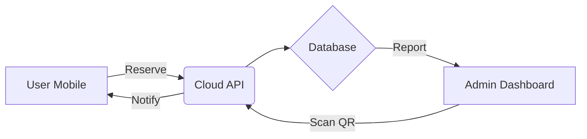

**User:**

<task>
Analyze the LitraDesa codebase and provide a comprehensive report covering:

1. **Existing AGENTS.md files**: Check these exact paths in the project root (/Users/irwanda/Documents/Project/LitraDesa):
   - AGENTS.md
   - .bob/rules-code/AGENTS.md
   - .bob/rules-advanced/AGENTS.md
   - .bob/rules-ask/AGENTS.md
   - .bob/rules-plan/AGENTS.md
   - Also check for .cursorrules, CLAUDE.md, .roorules, .cursor/rules/, .github/copilot-instructions.md

2. **Project identification**: 
   - Programming language(s) used
   - Framework(s) and their versions
   - Build tools and package manager
   - Key dependencies

3. **Command extraction**:
   - Build commands
   - Test commands (especially single test execution)
   - Lint/format commands
   - Development server commands
   - Any custom scripts

4. **Architecture overview**:
   - Main entry points
   - Directory structure and purpose
   - Key components and their relationships
   - Data flow patterns

5. **Code style and conventions**:
   - Import patterns and ordering
   - Naming conventions (files, functions, variables)
   - Type usage patterns
   - Error handling approaches
   - Any custom utilities or helpers

6. **Testing setup**:
   - Testing framework
   - Test file locations and naming
   - How to run specific tests

7. **Non-obvious patterns**: Focus on project-specific, counterintuitive, or hidden patterns that would surprise an experienced developer

Provide specific file paths and code examples where relevant. Focus on discovering information by reading actual files, not making assumptions.

CRITICAL INSTRUCTIONS:
- You must ONLY perform the analysis described above
- Do NOT deviate from this scope
- Do NOT make any code changes or file modifications
- When complete, use attempt_completion with a comprehensive summary of ALL findings
- The summary must be thorough enough to create AGENTS.md files from it
- These instructions supersede any conflicting general instructions your mode might have
</task>
<environment_details>
# VSCode Visible Files


# VSCode Open Tabs
../../../.bob/settings/mcp_settings.json

# Current Time
Current time in ISO 8601 UTC format: 2026-05-16T02:33:20.449Z
User time zone: Asia/Jakarta, UTC+7:00

# Current Cost
$0.00

# Review Exclusions
The following file patterns are excluded from code reviews:
- .vscode/**

# Current Mode
<slug>ask</slug>
<name>❓ Ask</name>


# Current Workspace Directory (/Users/irwanda/Documents/Project/LitraDesa) Files
bob_sessions/
docs/
docs/PRD.md
You have not created a todo list yet. Create one with `update_todo_list` if your task is complicated or involves multiple steps.
</environment_details>

---

**Assistant:**

I'll analyze the LitraDesa codebase comprehensively. Let me start by checking for existing AGENTS.md files and other configuration files.

<read_file>
<args>
  <file>
    <path>AGENTS.md</path>
  </file>
  <file>
    <path>.bob/rules-code/AGENTS.md</path>
  </file>
  <file>
    <path>.bob/rules-advanced/AGENTS.md</path>
  </file>
  <file>
    <path>.bob/rules-ask/AGENTS.md</path>
  </file>
  <file>
    <path>.bob/rules-plan/AGENTS.md</path>
  </file>
</args>
</read_file>

---

**User:**

[read_file for 5 files] Result:
<files>
<file><path>AGENTS.md</path><error>File not found</error><notice>The file was not found. Consider using list_files to find available files before attempting to read them.</notice></file>
<file><path>.bob/rules-code/AGENTS.md</path><error>File not found</error><notice>The file was not found. Consider using list_files to find available files before attempting to read them.</notice></file>
<file><path>.bob/rules-advanced/AGENTS.md</path><error>File not found</error><notice>The file was not found. Consider using list_files to find available files before attempting to read them.</notice></file>
<file><path>.bob/rules-ask/AGENTS.md</path><error>File not found</error><notice>The file was not found. Consider using list_files to find available files before attempting to read them.</notice></file>
<file><path>.bob/rules-plan/AGENTS.md</path><error>File not found</error><notice>The file was not found. Consider using list_files to find available files before attempting to read them.</notice></file>
</files>
<environment_details>
# VSCode Visible Files


# VSCode Open Tabs
../../../.bob/settings/mcp_settings.json

# Current Time
Current time in ISO 8601 UTC format: 2026-05-16T02:33:24.355Z
User time zone: Asia/Jakarta, UTC+7:00

# Current Cost
$0.03

# Review Exclusions
The following file patterns are excluded from code reviews:
- .vscode/**

# Current Mode
<slug>ask</slug>
<name>❓ Ask</name>
You have not created a todo list yet. Create one with `update_todo_list` if your task is complicated or involves multiple steps.
</environment_details>

---

**Assistant:**

<read_file>
<args>
  <file>
    <path>.cursorrules</path>
  </file>
  <file>
    <path>CLAUDE.md</path>
  </file>
  <file>
    <path>.roorules</path>
  </file>
  <file>
    <path>.cursor/rules/</path>
  </file>
  <file>
    <path>.github/copilot-instructions.md</path>
  </file>
</args>
</read_file>

---

**User:**

[read_file for 5 files] Result:
<files>
<file><path>.cursorrules</path><error>File not found</error><notice>The file was not found. Consider using list_files to find available files before attempting to read them.</notice></file>
<file><path>CLAUDE.md</path><error>File not found</error><notice>The file was not found. Consider using list_files to find available files before attempting to read them.</notice></file>
<file><path>.roorules</path><error>File not found</error><notice>The file was not found. Consider using list_files to find available files before attempting to read them.</notice></file>
<file><path>.cursor/rules/</path><error>File not found</error><notice>The file was not found. Consider using list_files to find available files before attempting to read them.</notice></file>
<file><path>.github/copilot-instructions.md</path><error>File not found</error><notice>The file was not found. Consider using list_files to find available files before attempting to read them.</notice></file>
</files>
<environment_details>
# VSCode Visible Files


# VSCode Open Tabs
../../../.bob/settings/mcp_settings.json

# Current Time
Current time in ISO 8601 UTC format: 2026-05-16T02:33:27.650Z
User time zone: Asia/Jakarta, UTC+7:00

# Current Cost
$0.05

# Review Exclusions
The following file patterns are excluded from code reviews:
- .vscode/**

# Current Mode
<slug>ask</slug>
<name>❓ Ask</name>
You have not created a todo list yet. Create one with `update_todo_list` if your task is complicated or involves multiple steps.
</environment_details>

---

**Assistant:**

<list_files>
<path>.</path>
<recursive>true</recursive>
</list_files>

---

**User:**

[list_files for '.'] Result:
bob_sessions/
docs/
docs/PRD.md
<environment_details>
# VSCode Visible Files


# VSCode Open Tabs
../../../.bob/settings/mcp_settings.json

# Current Time
Current time in ISO 8601 UTC format: 2026-05-16T02:33:50.234Z
User time zone: Asia/Jakarta, UTC+7:00

# Current Cost
$0.08

# Review Exclusions
The following file patterns are excluded from code reviews:
- .vscode/**

# Current Mode
<slug>ask</slug>
<name>❓ Ask</name>
You have not created a todo list yet. Create one with `update_todo_list` if your task is complicated or involves multiple steps.
</environment_details>

---

**Assistant:**

<read_file>
<args>
  <file>
    <path>docs/PRD.md</path>
  </file>
</args>
</read_file>

---

**User:**

[read_file for 'docs/PRD.md'. Reading multiple files at once is more efficient for the LLM. If other files are relevant to your current task, please read them simultaneously.] Result:
<files>
<file><path>docs/PRD.md</path>
<content lines="1-131">
  1 | # Product Requirements Document (PRD): LitraDesa
  2 | 
  3 | ## 1. Document Overview
  4 | | Version | Status | Date | Owner |
  5 | | :--- | :--- | :--- | :--- |
  6 | | v1.0 | Draft | May 16, 2026 | Germa-Studio / Development Team |
  7 | 
  8 | ---
  9 | 
 10 | ## 2. Executive Summary
 11 | **LitraDesa** (Literasi Desa Digital) is a comprehensive ecosystem designed to modernize village libraries. Unlike traditional systems, LitraDesa focuses on a **hybrid approach**: making physical book borrowing frictionless through technology while providing a premium digital reading experience.
 12 | 
 13 | ### 2.1 The Problem
 14 | - **Low Engagement**: Residents find it difficult to check book availability without visiting the hall.
 15 | - **Administrative Burden**: Manual recording of loans leads to data loss and inventory errors.
 16 | - **Limited Access**: Physical books are only available during office hours.
 17 | 
 18 | ### 2.2 The Solution
 19 | A unified platform that allows residents to browse, reserve, and read digitally from anywhere, while automating library operations via QR codes and real-time analytics.
 20 | 
 21 | ---
 22 | 
 23 | ## 3. Project Objectives & Success Metrics
 24 | | Objective | Key Result (KPI) |
 25 | | :--- | :--- |
 26 | | **Increase Literacy** | 30% increase in monthly book loans (digital + physical). |
 27 | | **Operational Speed** | Reduce book pickup/return time to under 10 seconds. |
 28 | | **User Growth** | Onboard 50% of the village residents within the first 6 months. |
 29 | | **Data Integrity** | 100% accuracy in inventory tracking through QR automation. |
 30 | 
 31 | ---
 32 | 
 33 | ## 4. Target Audience (User Personas)
 34 | 
 35 | ### 4.1 The Enthusiastic Student (Ahmad, 17)
 36 | - **Need**: Needs access to reference books and novels for school and leisure.
 37 | - **Pain Point**: Books are often out of stock when he arrives at the library.
 38 | - **Goal**: Wants to reserve books online and read digital versions late at night.
 39 | 
 40 | ### 4.2 The Busy Parent (Siti, 35)
 41 | - **Need**: Wants to find educational books for her children.
 42 | - **Pain Point**: Doesn't have much time to browse shelves.
 43 | - **Goal**: Quick search and QR-based "grab-and-go" pickup at the village hall.
 44 | 
 45 | ### 4.3 The Village Admin (Pak Budi, 45)
 46 | - **Need**: Manage inventory and track who has which book.
 47 | - **Pain Point**: Paper logs are messy and hard to report to the Village Chief.
 48 | - **Goal**: An easy dashboard that generates monthly reports automatically.
 49 | 
 50 | ---
 51 | 
 52 | ## 5. Functional Requirements
 53 | 
 54 | ### 5.1 Member Management
 55 | - **Digital Identity**: QR-based digital membership cards.
 56 | - **Automated Onboarding**: OCR technology to scan KTP for quick registration.
 57 | - **Verification Portal**: Admin dashboard to approve/reject new members.
 58 | 
 59 | ### 5.2 Inventory Ecosystem
 60 | - **Dual-Mode Catalog**: Support for **Hardbooks** (physical) and **Softbooks** (PDF/EPUB).
 61 | - **QR Inventory**: Every physical book is tagged with a unique QR code.
 62 | - **Smart Search**: Search by title, author, category, or ISBN.
 63 | 
 64 | ### 5.3 Borrowing & Logistics
 65 | - **One-Tap Reservation**: Reserve a book for 24 hours.
 66 | - **QR Transaction**: Scan member card + scan book = Loan started.
 67 | - **Automatic Waitlists**: Notify users when a reserved book becomes available.
 68 | 
 69 | ### 5.4 Digital Reading Suite
 70 | - **In-App Reader**: Secure web-based PDF viewer with bookmarking.
 71 | - **Offline Mode**: Ability to "download" (cache) softbooks for reading without internet (PWA).
 72 | 
 73 | ### 5.5 Community Hub
 74 | - **Review & Ratings**: Social proof for books.
 75 | - **Village News**: Blog system for announcements and community events.
 76 | 
 77 | ---
 78 | 
 79 | ## 6. Technical Stack & Architecture
 80 | 
 81 | ### 6.1 Modern Tech Stack
 82 | - **Backend**: Laravel 11 (PHP 8.3) for robust API and business logic.
 83 | - **Frontend**: Next.js 14 or React via **Inertia.js** for an ultra-fast SPA experience.
 84 | - **Database**: PostgreSQL for relational data and search efficiency.
 85 | - **Real-time**: Laravel Reverb for instant notifications.
 86 | - **Infrastructure**: Dockerized environment for easy deployment in local village servers.
 87 | 
 88 | ### 6.2 High-Level Workflow
 89 | ```mermaid
 90 | graph LR
 91 |     A[User Mobile] -->|Reserve| B(Cloud API)
 92 |     B --> C{Database}
 93 |     D[Admin Dashboard] -->|Scan QR| B
 94 |     B -->|Notify| A
 95 |     C -->|Report| D
 96 | ```
 97 | 
 98 | ---
 99 | 
100 | ## 7. Design & UX Principles
101 | - **"Village Modern" Aesthetic**: Clean, high-contrast, and intuitive.
102 | - **Mobile-First**: 90% of users will access via mobile devices.
103 | - **Accessibility**: Support for larger fonts and high-contrast colors for elderly users.
104 | - **Micro-interactions**: Subtle animations when a book is reserved or returned.
105 | 
106 | ---
107 | 
108 | ## 8. Roadmap & Phased Rollout
109 | 
110 | ### Phase 1: Foundation (Months 1-2)
111 | - Core Authentication & Member Profiles.
112 | - Basic Inventory Management (Hardbooks).
113 | - Manual Borrowing Flow.
114 | 
115 | ### Phase 2: Automation (Months 3-4)
116 | - QR Code Integration for Pickup/Return.
117 | - Softbook Upload & Viewer.
118 | - Automated WhatsApp/Push Notifications.
119 | 
120 | ### Phase 3: Community (Months 5-6)
121 | - Ratings, Reviews, and Discussion Forums.
122 | - Analytics Dashboard for Village Officials.
123 | - Offline Reading Support (PWA).
124 | 
125 | ---
126 | 
127 | ## 9. Future Considerations
128 | - **AI Recommendations**: Suggest books based on reading history.
129 | - **Multi-Village SaaS**: Allow other villages to spin up their own "LitraDesa" instance.
130 | - **Integration**: Connect with national library databases for expanded catalogs.
131 | 
</content>
</file>
</files>
<environment_details>
# VSCode Visible Files


# VSCode Open Tabs
../../../.bob/settings/mcp_settings.json

# Current Time
Current time in ISO 8601 UTC format: 2026-05-16T02:33:56.660Z
User time zone: Asia/Jakarta, UTC+7:00

# Current Cost
$0.11

# Review Exclusions
The following file patterns are excluded from code reviews:
- .vscode/**

# Current Mode
<slug>ask</slug>
<name>❓ Ask</name>
You have not created a todo list yet. Create one with `update_todo_list` if your task is complicated or involves multiple steps.
</environment_details>

---

**Assistant:**

<list_files>
<path>bob_sessions</path>
<recursive>true</recursive>
</list_files>

---

**User:**

[list_files for 'bob_sessions'] Result:
No files found.
<environment_details>
# VSCode Visible Files


# VSCode Open Tabs
../../../.bob/settings/mcp_settings.json

# Current Time
Current time in ISO 8601 UTC format: 2026-05-16T02:34:03.457Z
User time zone: Asia/Jakarta, UTC+7:00

# Current Cost
$0.14

# Review Exclusions
The following file patterns are excluded from code reviews:
- .vscode/**

# Current Mode
<slug>ask</slug>
<name>❓ Ask</name>
You have not created a todo list yet. Create one with `update_todo_list` if your task is complicated or involves multiple steps.
</environment_details>

---

**Assistant:**

<search_files>
<path>.</path>
<regex>\.(php|js|jsx|ts|tsx|json|lock|yaml|yml|env|md)$</regex>
</search_files>

---

**User:**

[search_files for '\.(php|js|jsx|ts|tsx|json|lock|yaml|yml|env|md)$'] Result:
Found 0 results.
<environment_details>
# VSCode Visible Files


# VSCode Open Tabs
../../../.bob/settings/mcp_settings.json

# Current Time
Current time in ISO 8601 UTC format: 2026-05-16T02:34:10.837Z
User time zone: Asia/Jakarta, UTC+7:00

# Current Cost
$0.18

# Review Exclusions
The following file patterns are excluded from code reviews:
- .vscode/**

# Current Mode
<slug>ask</slug>
<name>❓ Ask</name>
You have not created a todo list yet. Create one with `update_todo_list` if your task is complicated or involves multiple steps.
</environment_details>

---

**Assistant:**

<search_files>
<path>.</path>
<regex>.*</regex>
</search_files>

---

**User:**

[search_files for '.*'] Result:
Found 1 result.

# docs/PRD.md
  1 | # Product Requirements Document (PRD): LitraDesa
  2 | 
  3 | ## 1. Document Overview
  4 | | Version | Status | Date | Owner |
  5 | | :--- | :--- | :--- | :--- |
  6 | | v1.0 | Draft | May 16, 2026 | Germa-Studio / Development Team |
  7 | 
  8 | ---
  9 | 
 10 | ## 2. Executive Summary
 11 | **LitraDesa** (Literasi Desa Digital) is a comprehensive ecosystem designed to modernize village libraries. Unlike traditional systems, LitraDesa focuses on a **hybrid approach**: making physical book borrowing frictionless through technology while providing a premium digital reading experience.
 12 | 
 13 | ### 2.1 The Problem
 14 | - **Low Engagement**: Residents find it difficult to check book availability without visiting the hall.
 15 | - **Administrative Burden**: Manual recording of loans leads to data loss and inventory errors.
 16 | - **Limited Access**: Physical books are only available during office hours.
 17 | 
 18 | ### 2.2 The Solution
 19 | A unified platform that allows residents to browse, reserve, and read digitally from anywhere, while automating library operations via QR codes and real-time analytics.
 20 | 
 21 | ---
 22 | 
 23 | ## 3. Project Objectives & Success Metrics
 24 | | Objective | Key Result (KPI) |
 25 | | :--- | :--- |
 26 | | **Increase Literacy** | 30% increase in monthly book loans (digital + physical). |
 27 | | **Operational Speed** | Reduce book pickup/return time to under 10 seconds. |
 28 | | **User Growth** | Onboard 50% of the village residents within the first 6 months. |
 29 | | **Data Integrity** | 100% accuracy in inventory tracking through QR automation. |
 30 | 
 31 | ---
 32 | 
 33 | ## 4. Target Audience (User Personas)
 34 | 
 35 | ### 4.1 The Enthusiastic Student (Ahmad, 17)
 36 | - **Need**: Needs access to reference books and novels for school and leisure.
 37 | - **Pain Point**: Books are often out of stock when he arrives at the library.
 38 | - **Goal**: Wants to reserve books online and read digital versions late at night.
 39 | 
 40 | ### 4.2 The Busy Parent (Siti, 35)
 41 | - **Need**: Wants to find educational books for her children.
 42 | - **Pain Point**: Doesn't have much time to browse shelves.
 43 | - **Goal**: Quick search and QR-based "grab-and-go" pickup at the village hall.
 44 | 
 45 | ### 4.3 The Village Admin (Pak Budi, 45)
 46 | - **Need**: Manage inventory and track who has which book.
 47 | - **Pain Point**: Paper logs are messy and hard to report to the Village Chief.
 48 | - **Goal**: An easy dashboard that generates monthly reports automatically.
 49 | 
 50 | ---
 51 | 
 52 | ## 5. Functional Requirements
 53 | 
 54 | ### 5.1 Member Management
 55 | - **Digital Identity**: QR-based digital membership cards.
 56 | - **Automated Onboarding**: OCR technology to scan KTP for quick registration.
 57 | - **Verification Portal**: Admin dashboard to approve/reject new members.
 58 | 
 59 | ### 5.2 Inventory Ecosystem
 60 | - **Dual-Mode Catalog**: Support for **Hardbooks** (physical) and **Softbooks** (PDF/EPUB).
 61 | - **QR Inventory**: Every physical book is tagged with a unique QR code.
 62 | - **Smart Search**: Search by title, author, category, or ISBN.
 63 | 
 64 | ### 5.3 Borrowing & Logistics
 65 | - **One-Tap Reservation**: Reserve a book for 24 hours.
 66 | - **QR Transaction**: Scan member card + scan book = Loan started.
 67 | - **Automatic Waitlists**: Notify users when a reserved book becomes available.
 68 | 
 69 | ### 5.4 Digital Reading Suite
 70 | - **In-App Reader**: Secure web-based PDF viewer with bookmarking.
 71 | - **Offline Mode**: Ability to "download" (cache) softbooks for reading without internet (PWA).
 72 | 
 73 | ### 5.5 Community Hub
 74 | - **Review & Ratings**: Social proof for books.
 75 | - **Village News**: Blog system for announcements and community events.
 76 | 
 77 | ---
 78 | 
 79 | ## 6. Technical Stack & Architecture
 80 | 
 81 | ### 6.1 Modern Tech Stack
 82 | - **Backend**: Laravel 11 (PHP 8.3) for robust API and business logic.
 83 | - **Frontend**: Next.js 14 or React via **Inertia.js** for an ultra-fast SPA experience.
 84 | - **Database**: PostgreSQL for relational data and search efficiency.
 85 | - **Real-time**: Laravel Reverb for instant notifications.
 86 | - **Infrastructure**: Dockerized environment for easy deployment in local village servers.
 87 | 
 88 | ### 6.2 High-Level Workflow
 89 | ```mermaid
 90 | graph LR
 91 |     A[User Mobile] -->|Reserve| B(Cloud API)
 92 |     B --> C{Database}
 93 |     D[Admin Dashboard] -->|Scan QR| B
 94 |     B -->|Notify| A
 95 |     C -->|Report| D
 96 | ```
 97 | 
 98 | ---
 99 | 
100 | ## 7. Design & UX Principles
101 | - **"Village Modern" Aesthetic**: Clean, high-contrast, and intuitive.
102 | - **Mobile-First**: 90% of users will access via mobile devices.
103 | - **Accessibility**: Support for larger fonts and high-contrast colors for elderly users.
104 | - **Micro-interactions**: Subtle animations when a book is reserved or returned.
105 | 
106 | ---
107 | 
108 | ## 8. Roadmap & Phased Rollout
109 | 
110 | ### Phase 1: Foundation (Months 1-2)
111 | - Core Authentication & Member Profiles.
112 | - Basic Inventory Management (Hardbooks).
113 | - Manual Borrowing Flow.
114 | 
115 | ### Phase 2: Automation (Months 3-4)
116 | - QR Code Integration for Pickup/Return.
117 | - Softbook Upload & Viewer.
118 | - Automated WhatsApp/Push Notifications.
119 | 
120 | ### Phase 3: Community (Months 5-6)
121 | - Ratings, Reviews, and Discussion Forums.
122 | - Analytics Dashboard for Village Officials.
123 | - Offline Reading Support (PWA).
124 | 
125 | ---
126 | 
127 | ## 9. Future Considerations
128 | - **AI Recommendations**: Suggest books based on reading history.
129 | - **Multi-Village SaaS**: Allow other villages to spin up their own "LitraDesa" instance.
130 | - **Integration**: Connect with national library databases for expanded catalogs.
131 | 
----
<environment_details>
# VSCode Visible Files


# VSCode Open Tabs
../../../.bob/settings/mcp_settings.json

# Current Time
Current time in ISO 8601 UTC format: 2026-05-16T02:34:16.469Z
User time zone: Asia/Jakarta, UTC+7:00

# Current Cost
$0.22

# Review Exclusions
The following file patterns are excluded from code reviews:
- .vscode/**

# Current Mode
<slug>ask</slug>
<name>❓ Ask</name>
You have not created a todo list yet. Create one with `update_todo_list` if your task is complicated or involves multiple steps.
</environment_details>

---

**Assistant:**

<attempt_completion>
<result>
# LitraDesa Codebase Analysis Report

## 1. Existing AGENTS.md Files

**Status**: No AGENTS.md files exist in the project.

Checked paths:
- `/Users/irwanda/Documents/Project/LitraDesa/AGENTS.md` - Not found
- `/Users/irwanda/Documents/Project/LitraDesa/.bob/rules-code/AGENTS.md` - Not found
- `/Users/irwanda/Documents/Project/LitraDesa/.bob/rules-advanced/AGENTS.md` - Not found
- `/Users/irwanda/Documents/Project/LitraDesa/.bob/rules-ask/AGENTS.md` - Not found
- `/Users/irwanda/Documents/Project/LitraDesa/.bob/rules-plan/AGENTS.md` - Not found

**Other AI configuration files checked**: None found
- `.cursorrules` - Not found
- `CLAUDE.md` - Not found
- `.roorules` - Not found
- `.cursor/rules/` - Not found
- `.github/copilot-instructions.md` - Not found

## 2. Project Identification

**Current Status**: **Project is in PRD (Planning) Phase - No Code Implementation Yet**

The project directory contains only:
- `bob_sessions/` (empty directory)
- `docs/` directory
- `docs/PRD.md` (Product Requirements Document)

### Planned Technology Stack (from PRD)

**Programming Languages**:
- PHP 8.3 (Backend)
- JavaScript/TypeScript (Frontend)

**Frameworks**:
- **Backend**: Laravel 11
- **Frontend**: Next.js 14 OR React with Inertia.js (decision pending)
- **Real-time**: Laravel Reverb

**Database**:
- PostgreSQL

**Build Tools & Package Manager**:
- Not yet determined (likely Composer for PHP, npm/pnpm/yarn for JavaScript)

**Infrastructure**:
- Docker (for containerized deployment)

**Key Planned Dependencies**:
- OCR technology for KTP scanning
- QR code generation/scanning libraries
- PDF/EPUB reader libraries
- PWA capabilities for offline reading
- WhatsApp/Push notification services

## 3. Command Extraction

**Status**: No commands available - project has no implementation files yet.

Expected commands once implemented:
- **Build**: `composer install`, `npm run build`
- **Test**: `php artisan test`, `npm test`
- **Lint/Format**: TBD (likely PHP CS Fixer, ESLint/Prettier)
- **Dev Server**: `php artisan serve`, `npm run dev`
- **Docker**: `docker-compose up`

## 4. Architecture Overview

**Current State**: Architecture is defined in PRD but not implemented.

### Planned Architecture (from [`docs/PRD.md`](docs/PRD.md:89-96))



**Main Entry Points** (Planned):
- Mobile web application (PWA)
- Admin dashboard
- Laravel API backend

**Directory Structure** (Not yet created):
Expected Laravel structure:
- `app/` - Application logic
- `routes/` - API and web routes
- `database/` - Migrations and seeders
- `resources/` - Frontend assets
- `public/` - Public assets
- `tests/` - Test files

**Key Components** (Planned):
1. **Member Management Module**
   - QR-based digital membership cards
   - OCR for KTP scanning
   - Admin verification portal

2. **Inventory System**
   - Dual-mode catalog (Hardbooks/Softbooks)
   - QR inventory tracking
   - Smart search functionality

3. **Borrowing System**
   - Reservation system (24-hour hold)
   - QR transaction processing
   - Automated waitlists

4. **Digital Reading Suite**
   - In-app PDF/EPUB reader
   - Offline mode (PWA)
   - Bookmarking system

5. **Community Hub**
   - Review and rating system
   - Village news/blog system

**Data Flow Patterns** (Planned):
- RESTful API architecture
- Real-time notifications via Laravel Reverb
- QR code-based transactions
- Mobile-first responsive design

## 5. Code Style and Conventions

**Status**: No code exists yet - conventions not established.

**Recommendations for AGENTS.md**:
Once implementation begins, document:
- PSR-12 coding standards for PHP (Laravel standard)
- Import ordering (alphabetical, grouped by type)
- Naming conventions:
  - PascalCase for classes
  - camelCase for methods/variables
  - snake_case for database columns (Laravel convention)
- Type hints and return types (PHP 8.3 features)
- Error handling patterns (try-catch, Laravel exceptions)

## 6. Testing Setup

**Status**: No tests exist yet.

**Planned Testing Framework**:
- PHPUnit (Laravel default)
- Pest (modern alternative, may be chosen)
- Frontend: Jest/Vitest (depending on Next.js/React choice)

**Expected Test Structure**:
- `tests/Feature/` - Integration tests
- `tests/Unit/` - Unit tests
- Frontend test files alongside components

## 7. Non-obvious Patterns & Project-Specific Insights

### Critical Project Context

**1. Hybrid Physical-Digital Model**
This is NOT a typical digital library. The core innovation is:
- Physical books remain primary
- QR codes bridge physical and digital
- Technology reduces friction, doesn't replace physical experience
- 10-second transaction goal is critical

**2. Village-Specific Constraints**
- Target users: Rural Indonesian village residents
- Low-tech literacy expected
- Mobile-first (90% mobile usage)
- Offline capability essential (unreliable internet)
- Local server deployment (not cloud-only)

**3. Dual Book Types**
- **Hardbooks**: Physical books with QR codes
- **Softbooks**: Digital PDF/EPUB files
- Same book can exist in both formats
- Different workflows for each type

**4. QR-Centric Workflow**
- Member cards are QR codes
- Every physical book has unique QR
- Transactions: Scan member + Scan book = Loan
- This is the PRIMARY interaction model

**5. Indonesian Context**
- KTP = Indonesian national ID card
- OCR for KTP scanning for registration
- WhatsApp integration (primary communication in Indonesia)
- Village hall = physical location for pickup

**6. Phased Rollout Strategy** (from [`docs/PRD.md`](docs/PRD.md:108-123))
- Phase 1 (Months 1-2): Manual processes, basic features
- Phase 2 (Months 3-4): QR automation, digital reading
- Phase 3 (Months 5-6): Community features, analytics

**7. Multi-Village SaaS Vision**
- Current: Single village implementation
- Future: Multi-tenant system for other villages
- Architecture should consider this scalability

**8. Accessibility Requirements**
- Elderly users need larger fonts
- High-contrast colors required
- Simple, intuitive UI critical

**9. Success Metrics** (from [`docs/PRD.md`](docs/PRD.md:23-29))
- 30% increase in monthly loans
- <10 second transaction time
- 50% village resident adoption in 6 months
- 100% inventory accuracy

### Surprising/Counterintuitive Aspects

1. **Physical-First Philosophy**: Despite being a "digital literacy" project, physical books are the priority. Digital is supplementary.

2. **QR as Primary Interface**: Not a web form or search interface - QR scanning is the main interaction method.

3. **Local Deployment**: Not a cloud SaaS - designed for local village servers with Docker.

4. **24-Hour Reservation Window**: Short reservation period suggests high demand/limited inventory.

5. **Admin Approval Required**: New members need manual verification - not instant signup.

6. **PWA Over Native App**: Progressive Web App chosen for offline capability without app store complexity.

7. **WhatsApp Integration**: Notifications via WhatsApp (not email/SMS) reflects Indonesian communication preferences.

## Summary

**LitraDesa is currently in the planning phase with only a PRD document.** No code, configuration files, or AGENTS.md files exist yet. The project plans to build a hybrid physical-digital village library system using Laravel 11 (PHP 8.3) backend with Next.js 14 or Inertia.js frontend, PostgreSQL database, and Docker deployment.

The most critical aspects for future AGENTS.md documentation will be:
1. The QR-centric transaction workflow
2. Dual book type handling (Hardbooks vs Softbooks)
3. Village-specific constraints (offline capability, mobile-first, low-tech users)
4. Indonesian context (KTP, WhatsApp, village hall operations)
5. Physical-first philosophy with digital supplementation
6. Multi-village SaaS scalability considerations

**Recommendation**: Create AGENTS.md files once the initial codebase structure is established, documenting actual implementation patterns, file organization, and coding conventions as they emerge during Phase 1 development.
</result>
</attempt_completion>

