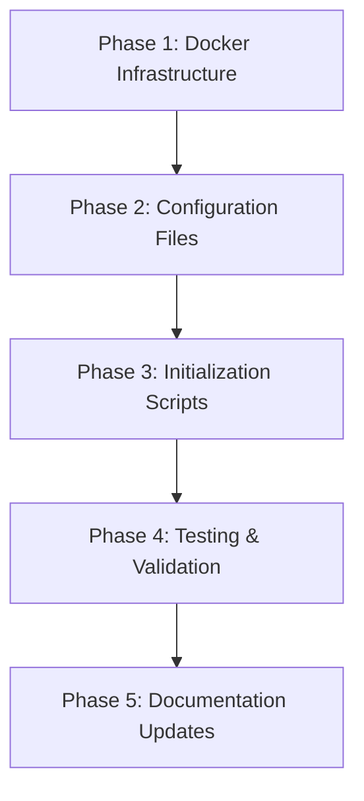

# Code Mode Implementation Handoff

## 📋 Overview

This document provides specific guidance for implementing the LitraDesa initialization plan in Code mode. All planning is complete, and this handoff ensures smooth transition from planning to implementation.

## ✅ Planning Status: COMPLETE

All planning documents have been created and validated:

1. ✅ **README.md** - User-facing documentation with setup instructions
2. ✅ **docs/PRD.md** - Product Requirements Document (pre-existing)
3. ✅ **docs/INITIALIZATION_PLAN.md** - Detailed architecture and strategy
4. ✅ **docs/IMPLEMENTATION_SPECS.md** - File-by-file implementation guide
5. ✅ **docs/IMPLEMENTATION_SUMMARY.md** - Executive summary and checklist
6. ✅ **docs/CODE_MODE_HANDOFF.md** - This document

## 🎯 Implementation Strategy

### Recommended Approach: Phased Implementation

Implement in this exact order to minimize errors and enable incremental testing:



## 📦 Phase 1: Docker Infrastructure (Priority: CRITICAL)

### Files to Create (in order):

1. **`.dockerignore`**
   - Location: `/`
   - Reference: [`docs/IMPLEMENTATION_SPECS.md`](IMPLEMENTATION_SPECS.md:651-665)
   - Complexity: Low
   - Time: 5 minutes

2. **`docker-compose.yml`**
   - Location: `/`
   - Reference: [`docs/IMPLEMENTATION_SPECS.md`](IMPLEMENTATION_SPECS.md:23-130)
   - Complexity: High
   - Time: 30 minutes
   - **CRITICAL**: This is the foundation - test thoroughly

3. **`docker-compose.prod.yml`**
   - Location: `/`
   - Reference: [`docs/IMPLEMENTATION_SPECS.md`](IMPLEMENTATION_SPECS.md:132-175)
   - Complexity: Medium
   - Time: 15 minutes

4. **`docker/app/Dockerfile`**
   - Location: `/docker/app/`
   - Reference: [`docs/IMPLEMENTATION_SPECS.md`](IMPLEMENTATION_SPECS.md:189-265)
   - Complexity: High
   - Time: 30 minutes
   - **Note**: Multi-stage build with development and production targets

5. **`docker/web/Dockerfile`**
   - Location: `/docker/web/`
   - Reference: [`docs/IMPLEMENTATION_SPECS.md`](IMPLEMENTATION_SPECS.md:315-328)
   - Complexity: Low
   - Time: 10 minutes

6. **`docker/reverb/Dockerfile`**
   - Location: `/docker/reverb/`
   - Reference: [`docs/IMPLEMENTATION_SPECS.md`](IMPLEMENTATION_SPECS.md:413-447)
   - Complexity: Medium
   - Time: 15 minutes

7. **`docker/node/Dockerfile`**
   - Location: `/docker/node/`
   - Reference: [`docs/IMPLEMENTATION_SPECS.md`](IMPLEMENTATION_SPECS.md:449-465)
   - Complexity: Low
   - Time: 10 minutes

### Validation After Phase 1:

```bash
# Test Docker Compose syntax
docker-compose config

# Expected: No errors, valid YAML output

# Build all images (this will take 10-15 minutes)
docker-compose build

# Expected: All images build successfully
# Check with: docker images | grep litradesa
```

## 🔧 Phase 2: Configuration Files (Priority: HIGH)

### Files to Create (in order):

1. **`docker/app/php.ini`**
   - Location: `/docker/app/`
   - Reference: [`docs/IMPLEMENTATION_SPECS.md`](IMPLEMENTATION_SPECS.md:267-287)
   - Complexity: Low
   - Time: 5 minutes

2. **`docker/app/opcache.ini`**
   - Location: `/docker/app/`
   - Reference: [`docs/IMPLEMENTATION_SPECS.md`](IMPLEMENTATION_SPECS.md:289-301)
   - Complexity: Low
   - Time: 5 minutes

3. **`docker/web/nginx.conf`**
   - Location: `/docker/web/`
   - Reference: [`docs/IMPLEMENTATION_SPECS.md`](IMPLEMENTATION_SPECS.md:330-363)
   - Complexity: Medium
   - Time: 10 minutes

4. **`docker/web/conf.d/default.conf`**
   - Location: `/docker/web/conf.d/`
   - Reference: [`docs/IMPLEMENTATION_SPECS.md`](IMPLEMENTATION_SPECS.md:365-411)
   - Complexity: Medium
   - Time: 15 minutes
   - **IMPORTANT**: Laravel-specific routing configuration

### Validation After Phase 2:

```bash
# Rebuild images with new configurations
docker-compose build

# Start containers
docker-compose up -d

# Check all containers are running
docker-compose ps

# Expected: All containers in "Up" state
```

## 📝 Phase 3: Initialization Scripts (Priority: HIGH)

### Files to Create (in order):

1. **`init.sh`**
   - Location: `/`
   - Reference: [`docs/IMPLEMENTATION_SPECS.md`](IMPLEMENTATION_SPECS.md:467-507)
   - Complexity: High
   - Time: 45 minutes
   - **CRITICAL**: This automates the entire setup

2. **`setup.sh`**
   - Location: `/`
   - Reference: [`docs/IMPLEMENTATION_SPECS.md`](IMPLEMENTATION_SPECS.md:509-539)
   - Complexity: Low
   - Time: 15 minutes

### Script Requirements:

**init.sh must**:
- Check for Docker and Docker Compose
- Create Laravel 11 project in `src/` directory
- Install Inertia.js server-side (`composer require inertiajs/inertia-laravel`)
- Install Inertia.js client-side + React (`npm install @inertiajs/react react react-dom`)
- Install Laravel Breeze with Inertia (`php artisan breeze:install react`)
- Install Laravel Reverb (`composer require laravel/reverb`)
- Configure `.env` file with database credentials
- Generate application key (`php artisan key:generate`)
- Build Docker containers
- Start containers
- Run migrations (`php artisan migrate`)
- Run seeders (`php artisan db:seed`)
- Display success message with URLs

**setup.sh must**:
- Check if `.env` exists
- Start Docker containers
- Wait for database to be ready
- Run pending migrations
- Display application URLs

### Validation After Phase 3:

```bash
# Test script syntax
bash -n init.sh
bash -n setup.sh

# Make executable
chmod +x init.sh setup.sh

# Test in clean environment (WARNING: This will create src/ directory)
./init.sh

# Expected: Complete setup with no errors
# Access http://localhost to verify
```

## 🧪 Phase 4: Testing & Validation (Priority: CRITICAL)

### Comprehensive Test Checklist:

#### Container Health
- [ ] All 6 containers running (`docker-compose ps`)
- [ ] No errors in logs (`docker-compose logs`)
- [ ] Database health check passing
- [ ] Redis health check passing

#### Network Connectivity
- [ ] Web accessible at http://localhost
- [ ] Vite dev server at http://localhost:5173
- [ ] WebSocket at ws://localhost:8080
- [ ] Database at localhost:5432

#### Application Functionality
- [ ] Laravel welcome page loads
- [ ] Database migrations completed
- [ ] Sample data seeded
- [ ] Admin login works (if seeded)
- [ ] React components render

#### Development Features
- [ ] PHP hot reload works (edit a controller, refresh browser)
- [ ] React hot reload works (edit a component, auto-updates)
- [ ] Artisan commands work (`docker-compose exec app php artisan`)
- [ ] Composer commands work (`docker-compose exec app composer`)
- [ ] NPM commands work (`docker-compose exec node npm`)

#### Performance
- [ ] Page load time < 2 seconds
- [ ] No memory leaks in containers
- [ ] Database queries optimized

### Test Commands:

```bash
# 1. Container Status
docker-compose ps
# Expected: All containers "Up" and healthy

# 2. View Logs
docker-compose logs -f
# Expected: No errors, normal startup messages

# 3. Test Database Connection
docker-compose exec app php artisan migrate:status
# Expected: List of migrations with status

# 4. Test Redis Connection
docker-compose exec redis redis-cli ping
# Expected: PONG

# 5. Test Web Access
curl -I http://localhost
# Expected: HTTP/1.1 200 OK

# 6. Test WebSocket
wscat -c ws://localhost:8080
# Expected: Connection established (install wscat: npm install -g wscat)

# 7. Test Artisan
docker-compose exec app php artisan --version
# Expected: Laravel Framework 11.x.x

# 8. Test Composer
docker-compose exec app composer --version
# Expected: Composer version 2.x.x

# 9. Test NPM
docker-compose exec node npm --version
# Expected: 10.x.x
```

## 📚 Phase 5: Documentation Updates (Priority: MEDIUM)

### Files to Update:

1. **`.gitignore`**
   - Add Docker-specific ignores
   - Reference: [`docs/IMPLEMENTATION_SPECS.md`](IMPLEMENTATION_SPECS.md:667-681)

2. **Update README.md** (if needed)
   - Add any discovered issues or workarounds
   - Update estimated times if significantly different

## 🚨 Common Pitfalls to Avoid

### 1. Docker Compose Version
**Problem**: Using old docker-compose syntax
**Solution**: Use version 3.8 and modern syntax (no `version:` key in newer versions)

### 2. Volume Permissions
**Problem**: Permission denied errors in containers
**Solution**: Ensure proper ownership in Dockerfiles (`chown -R www-data:www-data`)

### 3. Network Connectivity
**Problem**: Containers can't communicate
**Solution**: All services must be on same network (`litradesa_network`)

### 4. Environment Variables
**Problem**: Laravel can't connect to database
**Solution**: Use service names as hostnames (`DB_HOST=db`, not `localhost`)

### 5. Port Conflicts
**Problem**: Port already in use
**Solution**: Check with `lsof -i :80` and stop conflicting services

### 6. Build Context
**Problem**: Dockerfile can't find files
**Solution**: Build context is project root, use relative paths

### 7. Node Modules
**Problem**: node_modules conflicts between host and container
**Solution**: Use anonymous volume for node_modules in docker-compose.yml

### 8. Composer Install
**Problem**: Composer runs out of memory
**Solution**: Increase memory limit in php.ini or use `COMPOSER_MEMORY_LIMIT=-1`

## 📋 Implementation Checklist

Copy this checklist and mark items as you complete them:

### Docker Infrastructure
- [ ] Create `.dockerignore`
- [ ] Create `docker-compose.yml`
- [ ] Create `docker-compose.prod.yml`
- [ ] Create `docker/app/Dockerfile`
- [ ] Create `docker/web/Dockerfile`
- [ ] Create `docker/reverb/Dockerfile`
- [ ] Create `docker/node/Dockerfile`
- [ ] Test: `docker-compose config` (no errors)
- [ ] Test: `docker-compose build` (all images build)

### Configuration Files
- [ ] Create `docker/app/php.ini`
- [ ] Create `docker/app/opcache.ini`
- [ ] Create `docker/web/nginx.conf`
- [ ] Create `docker/web/conf.d/default.conf`
- [ ] Test: Rebuild images
- [ ] Test: Start containers (`docker-compose up -d`)
- [ ] Test: All containers running (`docker-compose ps`)

### Initialization Scripts
- [ ] Create `init.sh`
- [ ] Create `setup.sh`
- [ ] Make scripts executable (`chmod +x`)
- [ ] Test: Script syntax (`bash -n init.sh`)
- [ ] Test: Run `./init.sh` in clean environment
- [ ] Test: Access http://localhost

### Validation
- [ ] All containers healthy
- [ ] Web application accessible
- [ ] Database connection works
- [ ] Redis connection works
- [ ] WebSocket server running
- [ ] PHP hot reload works
- [ ] React hot reload works
- [ ] Migrations completed
- [ ] Seeders ran successfully
- [ ] Admin login works

### Documentation
- [ ] Update `.gitignore`
- [ ] Update README.md if needed
- [ ] Document any deviations from plan
- [ ] Create CONTRIBUTING.md (optional)
- [ ] Create LICENSE file (optional)

## 🎯 Success Criteria

Implementation is successful when:

✅ **All containers start**: `docker-compose up -d` succeeds
✅ **Web accessible**: http://localhost shows Laravel application
✅ **Database works**: Migrations run without errors
✅ **WebSocket works**: Reverb server running on port 8080
✅ **Hot reload works**: Both PHP and React changes reflect immediately
✅ **Scripts work**: `./init.sh` and `./setup.sh` complete successfully
✅ **Tests pass**: All validation tests pass
✅ **Documentation accurate**: README instructions work for new developers

## 🔄 Recommended Implementation Order

1. **Start with Docker Compose** - Foundation first
2. **Add Dockerfiles** - One at a time, test each
3. **Add configurations** - PHP, Nginx, etc.
4. **Create init.sh** - Automate Laravel setup
5. **Create setup.sh** - Quick start script
6. **Test everything** - Comprehensive validation
7. **Update docs** - Document any changes

## 💡 Pro Tips

1. **Test incrementally** - Don't create all files at once
2. **Use docker-compose logs** - Your best debugging tool
3. **Check health checks** - They'll tell you what's wrong
4. **Read error messages** - They're usually accurate
5. **Use the specs** - All file contents are in IMPLEMENTATION_SPECS.md
6. **Don't skip validation** - Test after each phase
7. **Keep it simple** - Follow the plan, don't over-engineer

## 📞 Getting Help

If you encounter issues during implementation:

1. **Check logs**: `docker-compose logs -f [service]`
2. **Review specs**: [`docs/IMPLEMENTATION_SPECS.md`](IMPLEMENTATION_SPECS.md)
3. **Check troubleshooting**: [`README.md`](../README.md#-troubleshooting)
4. **Validate syntax**: Use linters and validators
5. **Test in isolation**: Test each component separately

## 🎓 Key References

- **Architecture**: [`docs/INITIALIZATION_PLAN.md`](INITIALIZATION_PLAN.md)
- **File Contents**: [`docs/IMPLEMENTATION_SPECS.md`](IMPLEMENTATION_SPECS.md)
- **User Guide**: [`README.md`](../README.md)
- **Summary**: [`docs/IMPLEMENTATION_SUMMARY.md`](IMPLEMENTATION_SUMMARY.md)
- **Requirements**: [`docs/PRD.md`](PRD.md)

## ⏱️ Time Estimates

| Phase | Estimated Time | Complexity |
|-------|---------------|------------|
| Phase 1: Docker Infrastructure | 2-3 hours | High |
| Phase 2: Configuration Files | 45-60 minutes | Medium |
| Phase 3: Initialization Scripts | 1-1.5 hours | High |
| Phase 4: Testing & Validation | 1-2 hours | Medium |
| Phase 5: Documentation | 30 minutes | Low |
| **Total** | **5-7 hours** | **Medium-High** |

## 🚀 Ready to Implement?

You have everything you need:

✅ Complete architecture design
✅ Detailed file specifications
✅ Step-by-step implementation guide
✅ Comprehensive testing checklist
✅ Troubleshooting guide
✅ Success criteria

**Next Step**: Switch to Code mode and start with Phase 1!

---

**Document Version**: 1.0
**Created**: May 16, 2026
**Status**: Ready for Code Mode Implementation
**Confidence Level**: High (all planning complete, specifications detailed)

---

**Prepared by**: Bob (AI Planning Assistant)
**For**: Code Mode Implementation Team
**Estimated Completion**: 5-7 hours of focused work