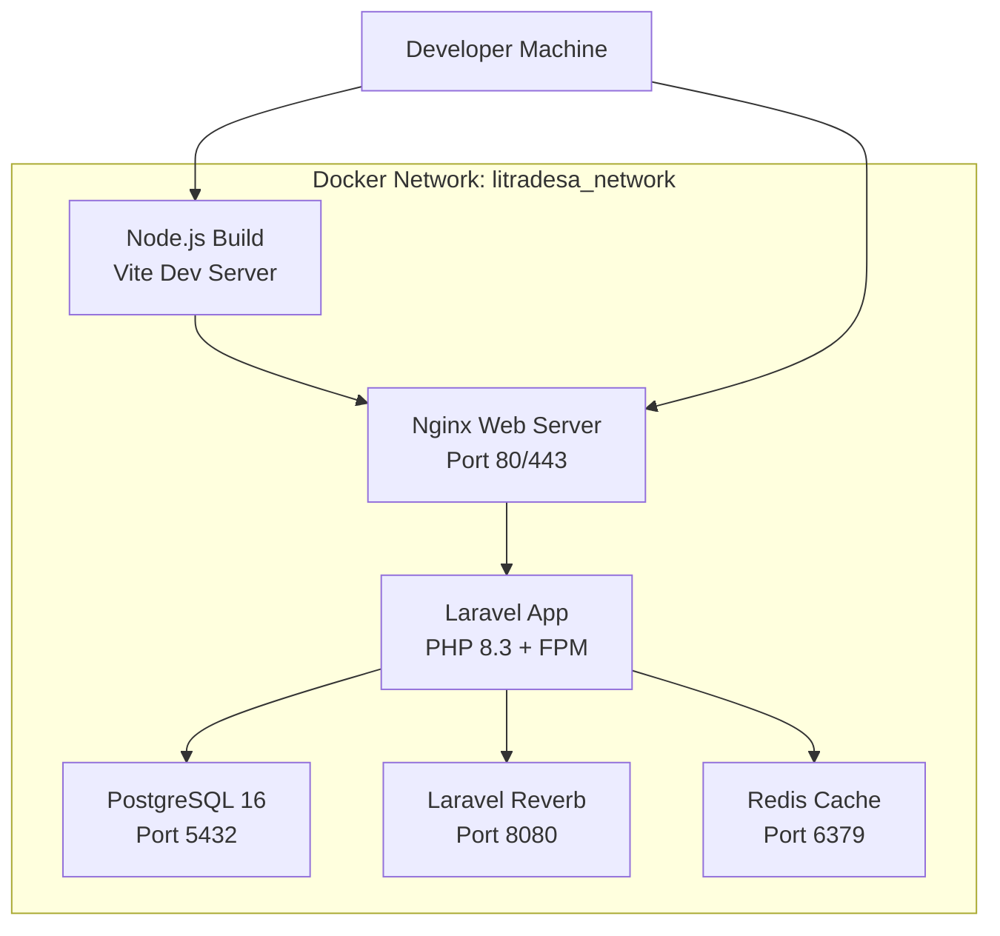

# LitraDesa Project Initialization Plan

## Overview
This document outlines the complete initialization strategy for the LitraDesa project, including Docker architecture, Laravel 11 setup with Inertia.js + React, PostgreSQL database, and Laravel Reverb for real-time notifications.

## Architecture Design

### Docker Services Architecture



### Service Breakdown

#### 1. **app** - Laravel Application Container
- **Base Image**: `php:8.3-fpm-alpine`
- **Purpose**: Run Laravel 11 application with PHP-FPM
- **Key Features**:
  - PHP 8.3 with required extensions (pdo_pgsql, redis, gd, zip, etc.)
  - Composer 2.x for dependency management
  - Auto-run migrations on startup
  - Volume mounts for hot-reload in development
- **Exposed Ports**: 9000 (PHP-FPM, internal only)

#### 2. **web** - Nginx Web Server
- **Base Image**: `nginx:alpine`
- **Purpose**: Serve static assets and proxy PHP requests
- **Key Features**:
  - Optimized nginx configuration for Laravel
  - SSL/TLS support (self-signed for dev, Let's Encrypt for prod)
  - Gzip compression
  - Static asset caching
- **Exposed Ports**: 80 (HTTP), 443 (HTTPS)

#### 3. **db** - PostgreSQL Database
- **Base Image**: `postgres:16-alpine`
- **Purpose**: Primary data storage
- **Key Features**:
  - Persistent volume for data
  - Auto-initialization with custom schema
  - Health checks
  - Backup-ready configuration
- **Exposed Ports**: 5432 (PostgreSQL)

#### 4. **reverb** - Laravel Reverb WebSocket Server
- **Base Image**: `php:8.3-cli-alpine`
- **Purpose**: Real-time notifications and updates
- **Key Features**:
  - WebSocket server for real-time features
  - Book availability updates
  - Admin notifications
  - Integrated with Laravel Broadcasting
- **Exposed Ports**: 8080 (WebSocket)

#### 5. **redis** - Redis Cache
- **Base Image**: `redis:7-alpine`
- **Purpose**: Session storage, cache, and queue backend
- **Key Features**:
  - Persistent storage for sessions
  - Cache for database queries
  - Queue driver for background jobs
- **Exposed Ports**: 6379 (Redis, internal only)

#### 6. **node** - Node.js Build Container (Development Only)
- **Base Image**: `node:20-alpine`
- **Purpose**: Frontend asset compilation with Vite
- **Key Features**:
  - Hot Module Replacement (HMR)
  - React + Inertia.js development server
  - Automatic asset rebuilding
- **Exposed Ports**: 5173 (Vite dev server)

## File Structure

```
LitraDesa/
├── docker/
│   ├── app/
│   │   ├── Dockerfile              # Laravel app container
│   │   └── php.ini                 # PHP configuration
│   ├── web/
│   │   ├── Dockerfile              # Nginx container
│   │   └── nginx.conf              # Nginx configuration
│   ├── reverb/
│   │   └── Dockerfile              # Reverb container
│   └── node/
│       └── Dockerfile              # Node.js container
├── docker-compose.yml              # Development configuration
├── docker-compose.prod.yml         # Production overrides
├── .env.example                    # Environment template
├── init.sh                         # Initial setup script
├── setup.sh                        # Quick start script
├── README.md                       # Setup documentation
└── src/                            # Laravel application (created by init.sh)
    ├── app/
    ├── resources/
    │   └── js/
    │       ├── Pages/              # Inertia.js React pages
    │       └── Components/         # React components
    ├── database/
    │   ├── migrations/
    │   └── seeders/
    └── ...
```

## Initialization Scripts

### 1. init.sh - Complete Project Initialization
**Purpose**: First-time setup of the entire project

**Steps**:
1. Check prerequisites (Docker, Docker Compose)
2. Create Laravel 11 project using Composer
3. Install Inertia.js server-side adapter
4. Install Laravel Breeze with Inertia + React stack
5. Install Laravel Reverb
6. Configure PostgreSQL connection
7. Set up environment variables
8. Create Docker configuration files
9. Build Docker images
10. Start containers
11. Run migrations and seeders
12. Display success message with URLs

### 2. setup.sh - Quick Start for Existing Project
**Purpose**: Start the project after initial setup

**Steps**:
1. Check if .env exists
2. Start Docker containers
3. Wait for database to be ready
4. Run pending migrations
5. Display application URLs

## Environment Configuration

### Development Environment (.env)
```env
APP_NAME=LitraDesa
APP_ENV=local
APP_DEBUG=true
APP_URL=http://localhost

DB_CONNECTION=pgsql
DB_HOST=db
DB_PORT=5432
DB_DATABASE=litradesa
DB_USERNAME=litradesa_user
DB_PASSWORD=litradesa_password

CACHE_DRIVER=redis
SESSION_DRIVER=redis
QUEUE_CONNECTION=redis

REDIS_HOST=redis
REDIS_PORT=6379

REVERB_HOST=reverb
REVERB_PORT=8080
REVERB_SCHEME=http

VITE_REVERB_HOST=localhost
VITE_REVERB_PORT=8080
VITE_REVERB_SCHEME=http
```

### Production Environment Differences
- `APP_ENV=production`
- `APP_DEBUG=false`
- Strong random `APP_KEY`
- Secure database credentials
- HTTPS URLs
- Production-grade Redis configuration

## Installation Commands Sequence

### First-Time Setup
```bash
# 1. Clone repository (if applicable)
git clone <repository-url> LitraDesa
cd LitraDesa

# 2. Run initialization script
chmod +x init.sh
./init.sh

# 3. Access application
# Web: http://localhost
# Reverb: ws://localhost:8080
# Database: localhost:5432
```

### Subsequent Starts
```bash
# Quick start
./setup.sh

# Or manually
docker-compose up -d
```

### Development Workflow
```bash
# Start all services
docker-compose up -d

# Watch logs
docker-compose logs -f app

# Run artisan commands
docker-compose exec app php artisan migrate
docker-compose exec app php artisan db:seed

# Install PHP dependencies
docker-compose exec app composer install

# Install Node dependencies
docker-compose exec node npm install

# Build frontend assets
docker-compose exec node npm run build

# Stop services
docker-compose down
```

## Key Features

### 1. Hot Reload Development
- **Backend**: Volume mounts allow instant PHP code changes
- **Frontend**: Vite HMR for instant React component updates
- **No rebuild required** for code changes

### 2. Database Persistence
- PostgreSQL data stored in named volume `litradesa_db_data`
- Survives container restarts
- Easy backup and restore

### 3. Auto-Migration on Startup
- Migrations run automatically when app container starts
- Ensures database schema is always up-to-date
- Safe for both development and production

### 4. Seed Data for Testing
- Initial admin user created automatically
- Sample books (hardbooks and softbooks)
- Test member accounts
- Configurable via seeders

### 5. Multi-Environment Support
- `docker-compose.yml` for development
- `docker-compose.prod.yml` for production overrides
- Environment-specific configurations
- Easy switching between environments

## Performance Optimizations

### Development Mode
- **No asset optimization**: Fast builds
- **Debug mode enabled**: Detailed error messages
- **Hot reload**: Instant feedback
- **Volume mounts**: No image rebuilds

### Production Mode
- **Asset minification**: Smaller bundle sizes
- **OPcache enabled**: Faster PHP execution
- **Redis caching**: Reduced database load
- **Gzip compression**: Faster page loads
- **CDN-ready**: Static assets can be served from CDN

## Security Considerations

### Development
- Default credentials (documented)
- Self-signed SSL certificates
- Debug mode enabled
- CORS permissive

### Production
- Strong random credentials
- Let's Encrypt SSL certificates
- Debug mode disabled
- CORS restricted to specific domains
- Rate limiting enabled
- Security headers configured

## Troubleshooting Guide

### Common Issues

#### 1. Port Already in Use
**Problem**: Port 80, 5432, or 8080 already in use
**Solution**: 
```bash
# Check what's using the port
lsof -i :80
# Stop the service or change port in docker-compose.yml
```

#### 2. Database Connection Failed
**Problem**: Laravel cannot connect to PostgreSQL
**Solution**:
```bash
# Check if database container is running
docker-compose ps db
# Check database logs
docker-compose logs db
# Restart database
docker-compose restart db
```

#### 3. Permission Denied
**Problem**: Cannot write to storage or cache directories
**Solution**:
```bash
# Fix permissions
docker-compose exec app chmod -R 775 storage bootstrap/cache
docker-compose exec app chown -R www-data:www-data storage bootstrap/cache
```

#### 4. Composer Install Fails
**Problem**: Composer dependencies cannot be installed
**Solution**:
```bash
# Clear composer cache
docker-compose exec app composer clear-cache
# Install with verbose output
docker-compose exec app composer install -vvv
```

#### 5. Frontend Assets Not Loading
**Problem**: React components not rendering
**Solution**:
```bash
# Rebuild frontend assets
docker-compose exec node npm run build
# Check Vite dev server
docker-compose logs node
```

## Next Steps After Initialization

1. **Verify Installation**
   - Access http://localhost
   - Check database connection
   - Test WebSocket connection

2. **Configure Application**
   - Update `.env` with specific settings
   - Configure mail settings for notifications
   - Set up WhatsApp API credentials

3. **Customize Seeders**
   - Add village-specific data
   - Create initial book catalog
   - Set up admin accounts

4. **Development Workflow**
   - Create feature branches
   - Run tests before commits
   - Use migrations for schema changes

5. **Deployment Preparation**
   - Review production environment variables
   - Set up SSL certificates
   - Configure backup strategy
   - Plan monitoring and logging

## Success Criteria

After successful initialization, you should have:

✅ Laravel 11 application running on PHP 8.3
✅ Inertia.js + React frontend with hot reload
✅ PostgreSQL database with initial schema
✅ Laravel Reverb WebSocket server running
✅ Redis cache and session storage
✅ All services communicating correctly
✅ Sample data loaded for testing
✅ Development environment ready for coding

## Timeline Estimate

- **Initial Setup**: 15-30 minutes (depending on internet speed)
- **Docker Build**: 10-15 minutes (first time)
- **Subsequent Starts**: 30-60 seconds

## Resources Required

- **Disk Space**: ~2GB for Docker images and dependencies
- **RAM**: Minimum 4GB, recommended 8GB
- **CPU**: Multi-core recommended for faster builds
- **Network**: Stable internet for downloading dependencies

## Maintenance

### Regular Tasks
- Update Docker images monthly
- Update Composer dependencies weekly
- Update NPM packages weekly
- Backup database daily (production)
- Review logs weekly

### Monitoring
- Container health checks
- Database performance metrics
- WebSocket connection status
- Application error logs
- Resource usage (CPU, RAM, disk)

---

**Document Version**: 1.0
**Last Updated**: May 16, 2026
**Maintained By**: Development Team