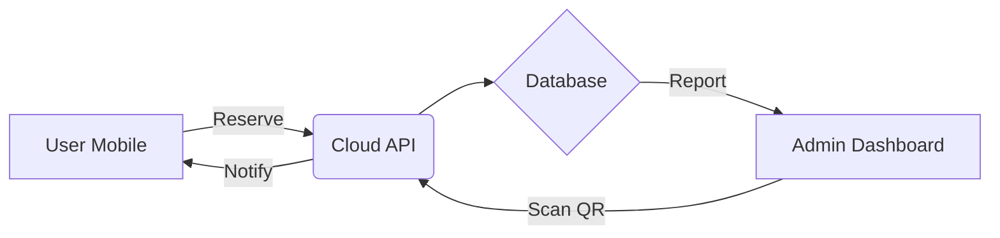

# Product Requirements Document (PRD): LitraDesa

## 1. Document Overview
| Version | Status | Date | Owner |
| :--- | :--- | :--- | :--- |
| v1.0 | Draft | May 16, 2026 | Germa-Studio / Development Team |

---

## 2. Executive Summary
**LitraDesa** (Literasi Desa Digital) is a comprehensive ecosystem designed to modernize village libraries. Unlike traditional systems, LitraDesa focuses on a **hybrid approach**: making physical book borrowing frictionless through technology while providing a premium digital reading experience.

### 2.1 The Problem
- **Low Engagement**: Residents find it difficult to check book availability without visiting the hall.
- **Administrative Burden**: Manual recording of loans leads to data loss and inventory errors.
- **Limited Access**: Physical books are only available during office hours.

### 2.2 The Solution
A unified platform that allows residents to browse, reserve, and read digitally from anywhere, while automating library operations via QR codes and real-time analytics.

---

## 3. Project Objectives & Success Metrics
| Objective | Key Result (KPI) |
| :--- | :--- |
| **Increase Literacy** | 30% increase in monthly book loans (digital + physical). |
| **Operational Speed** | Reduce book pickup/return time to under 10 seconds. |
| **User Growth** | Onboard 50% of the village residents within the first 6 months. |
| **Data Integrity** | 100% accuracy in inventory tracking through QR automation. |

---

## 4. Target Audience (User Personas)

### 4.1 The Enthusiastic Student (Ahmad, 17)
- **Need**: Needs access to reference books and novels for school and leisure.
- **Pain Point**: Books are often out of stock when he arrives at the library.
- **Goal**: Wants to reserve books online and read digital versions late at night.

### 4.2 The Busy Parent (Siti, 35)
- **Need**: Wants to find educational books for her children.
- **Pain Point**: Doesn't have much time to browse shelves.
- **Goal**: Quick search and QR-based "grab-and-go" pickup at the village hall.

### 4.3 The Village Admin (Pak Budi, 45)
- **Need**: Manage inventory and track who has which book.
- **Pain Point**: Paper logs are messy and hard to report to the Village Chief.
- **Goal**: An easy dashboard that generates monthly reports automatically.

---

## 5. Functional Requirements

### 5.1 Member Management
- **Digital Identity**: QR-based digital membership cards.
- **Automated Onboarding**: OCR technology to scan KTP for quick registration.
- **Verification Portal**: Admin dashboard to approve/reject new members.

### 5.2 Inventory Ecosystem
- **Dual-Mode Catalog**: Support for **Hardbooks** (physical) and **Softbooks** (PDF/EPUB).
- **QR Inventory**: Every physical book is tagged with a unique QR code.
- **Smart Search**: Search by title, author, category, or ISBN.

### 5.3 Borrowing & Logistics
- **One-Tap Reservation**: Reserve a book for 24 hours.
- **QR Transaction**: Scan member card + scan book = Loan started.
- **Automatic Waitlists**: Notify users when a reserved book becomes available.

### 5.4 Digital Reading Suite
- **In-App Reader**: Secure web-based PDF viewer with bookmarking.
- **Offline Mode**: Ability to "download" (cache) softbooks for reading without internet (PWA).

### 5.5 Community Hub
- **Review & Ratings**: Social proof for books.
- **Village News**: Blog system for announcements and community events.

---

## 6. Technical Stack & Architecture

### 6.1 Modern Tech Stack
- **Backend**: Laravel 11 (PHP 8.3) for robust API and business logic.
- **Frontend**: Next.js 14 or React via **Inertia.js** for an ultra-fast SPA experience.
- **Database**: PostgreSQL for relational data and search efficiency.
- **Real-time**: Laravel Reverb for instant notifications.
- **Infrastructure**: Dockerized environment for easy deployment in local village servers.

### 6.2 High-Level Workflow

---

## 7. Design & UX Principles
- **"Village Modern" Aesthetic**: Clean, high-contrast, and intuitive.
- **Mobile-First**: 90% of users will access via mobile devices.
- **Accessibility**: Support for larger fonts and high-contrast colors for elderly users.
- **Micro-interactions**: Subtle animations when a book is reserved or returned.

---

## 8. Roadmap & Phased Rollout

### Phase 1: Foundation (Months 1-2)
- Core Authentication & Member Profiles.
- Basic Inventory Management (Hardbooks).
- Manual Borrowing Flow.

### Phase 2: Automation (Months 3-4)
- QR Code Integration for Pickup/Return.
- Softbook Upload & Viewer.
- Automated WhatsApp/Push Notifications.

### Phase 3: Community (Months 5-6)
- Ratings, Reviews, and Discussion Forums.
- Analytics Dashboard for Village Officials.
- Offline Reading Support (PWA).

---

## 9. Future Considerations
- **AI Recommendations**: Suggest books based on reading history.
- **Multi-Village SaaS**: Allow other villages to spin up their own "LitraDesa" instance.
- **Integration**: Connect with national library databases for expanded catalogs.

